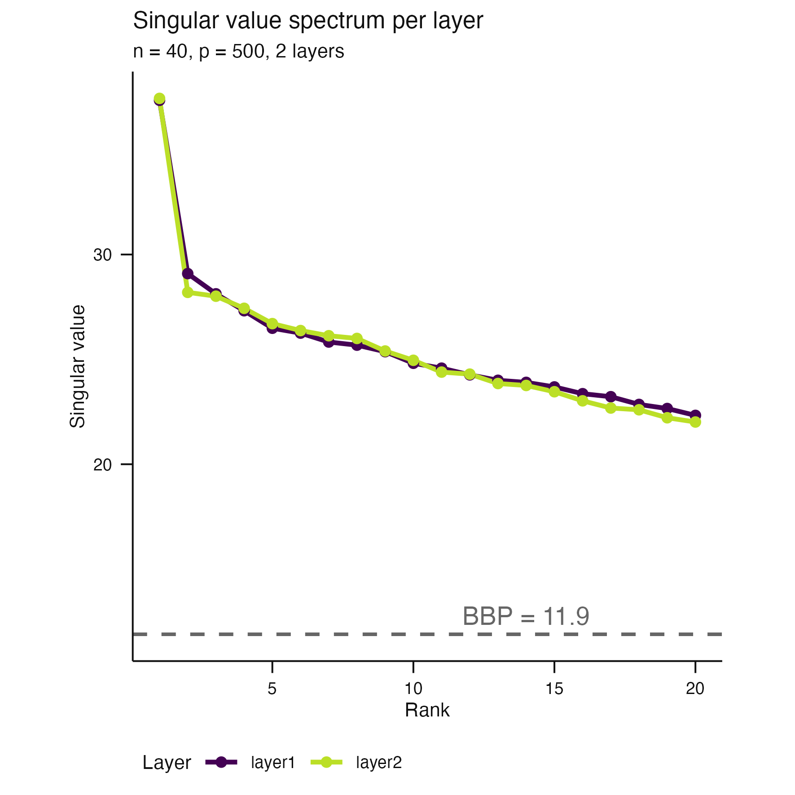
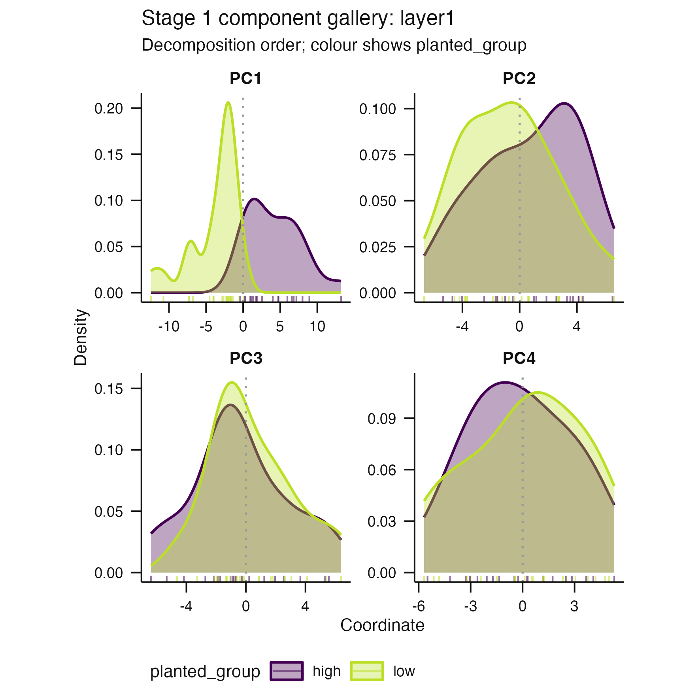
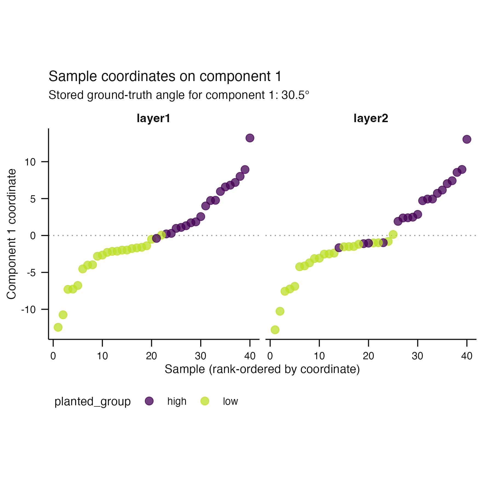
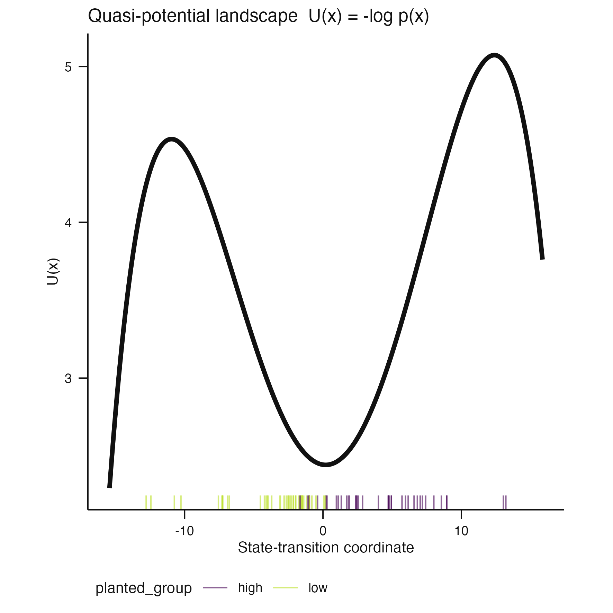
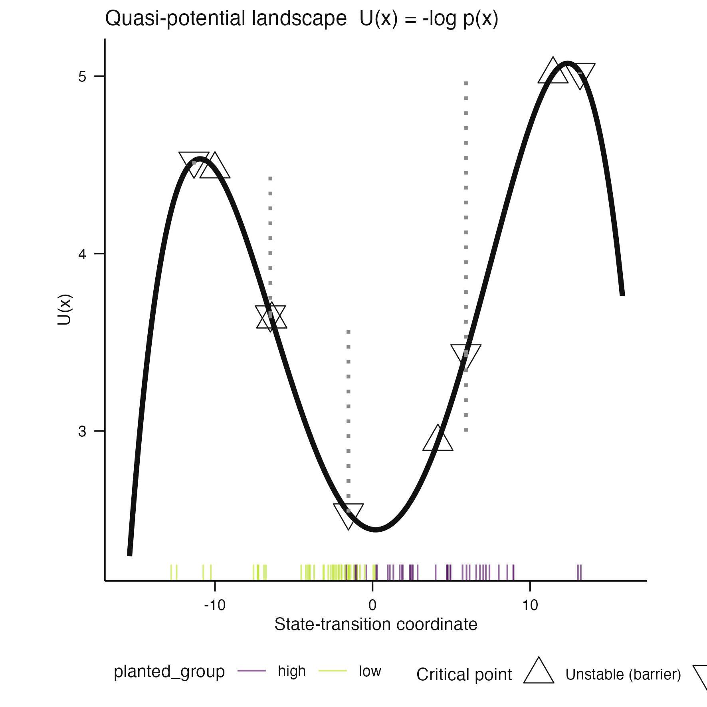

# Issue #107 visual landing proof

**Claim status:** rendering and caption-contract proof only. These synthetic
figures demonstrate publication-sized Stage 1 and Stage 2 graphics with
separate, state-derived scientific captions. They do not establish coordinate
recovery, biological validity, or calibrated decision thresholds.

## Stage 1

| Singular-value spectrum | Component gallery | Selected component display |
|---|---|---|
|  |  |  |

The spectrum caption states the assumptions and limitations of the BBP
reference. The component captions identify the actual molecular layer,
component range or selected component, metadata encoding, sampling unit, and
descriptive claim boundary. The synthetic ground-truth angle appears only
because the source object stores that truth.

## Stage 2

| Default quasi-potential | Explicit diagnostic overlay |
|---|---|
|  |  |

The default omits uncalibrated critical-point symbols. The opt-in diagnostic
identifies well and barrier symbols and point-estimate barrier segments, while
its caption states that uncertainty is unavailable. Both captions explain
`U(x) = -log p(x)`, the sample rug, selected component, metadata encoding, and
exploratory claim boundary.

Every PNG is the actual public plotting result inspected at the package default
100 mm square size. Each adjacent `*-caption.txt` file is the exact separate
caption returned by `scientific_caption()`. `caption-inspection.tsv` verifies
that none of the captions is embedded inside the graphics.

## Reproduction

```sh
Rscript scripts/render-issue-107-proof.R
Rscript -e 'devtools::test(filter = "(stage1-plots|stage2-plots|scientific-caption-contract)")'
```
