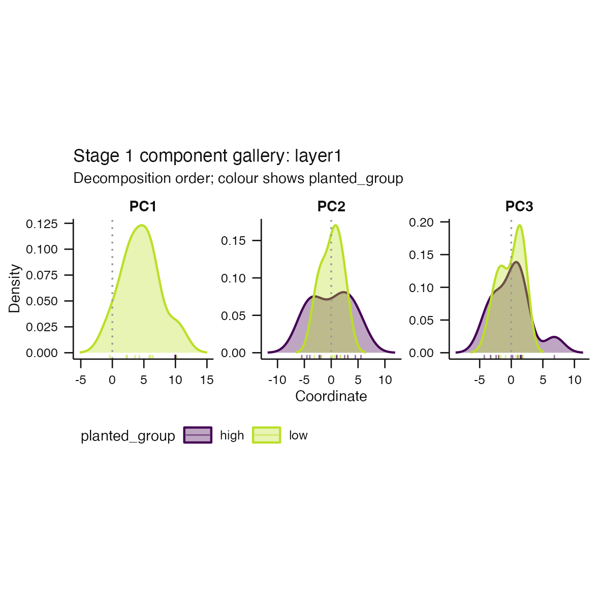

# Issue #109 verification proof



The first component contains one metadata-group slice whose coordinates differ
only below the declared numerical spread tolerance. Its kernel-density curve is
therefore omitted while its sample rugs remain visible. Other estimable group
and component densities remain plotted.

The external [scientific caption](degenerate-density-slice-caption.txt) names
the affected component and metadata group, defines the numerical tolerance,
and states that the affected slice is shown through rugs only. The exact typed
unavailable rows are retained in
[`unavailable-density-slices.tsv`](unavailable-density-slices.tsv).

Reproduce at the canonical 100 mm output size with:

```sh
Rscript scripts/render-issue-109-proof.R
```

This is implementation proof. It does not establish biological validity or a
calibrated component-selection threshold.
