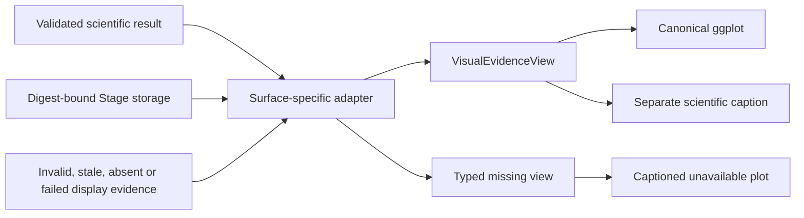
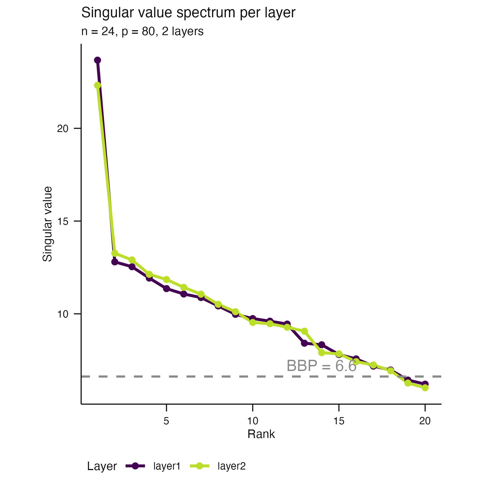
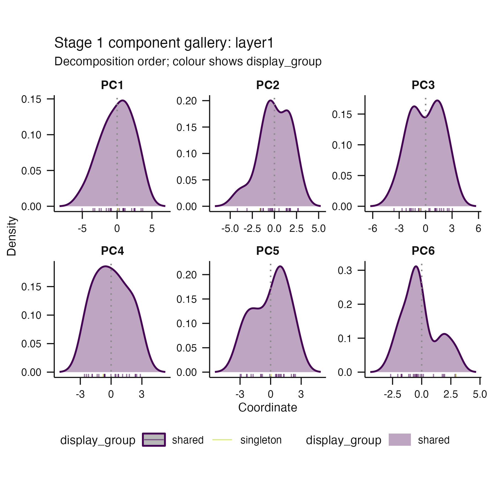
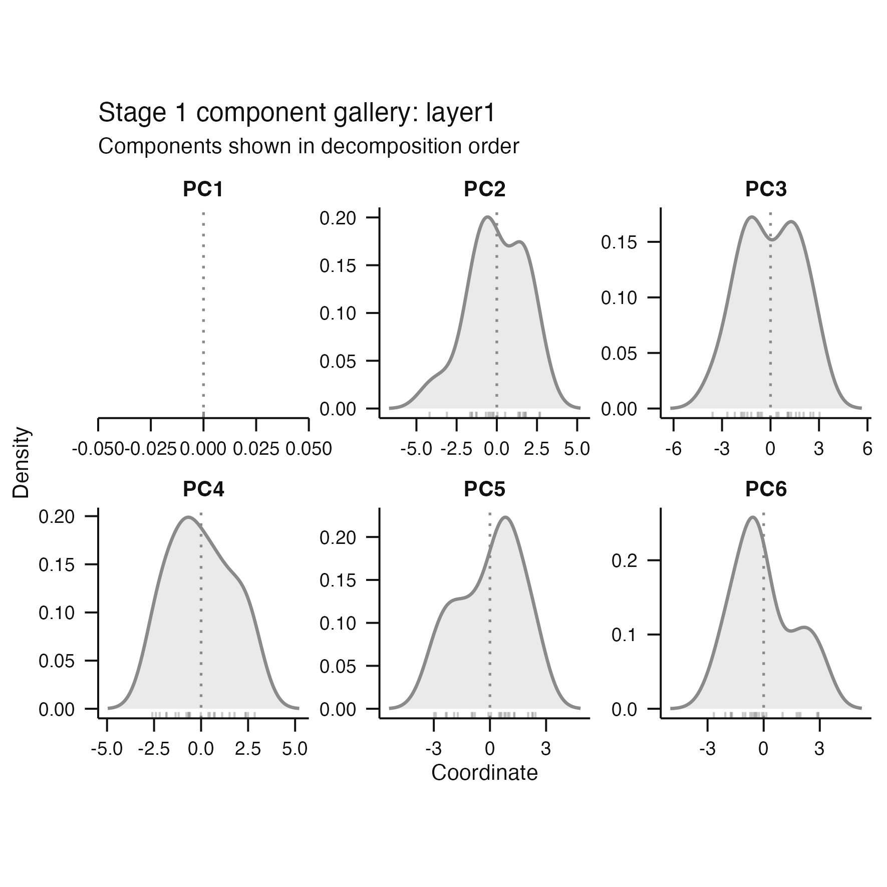
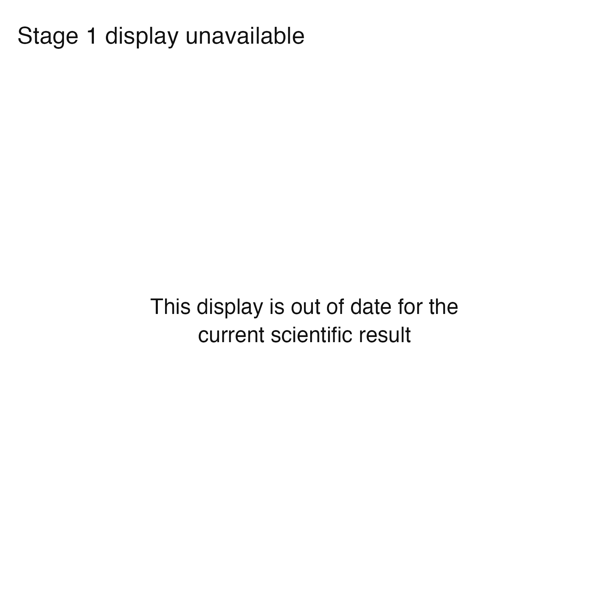
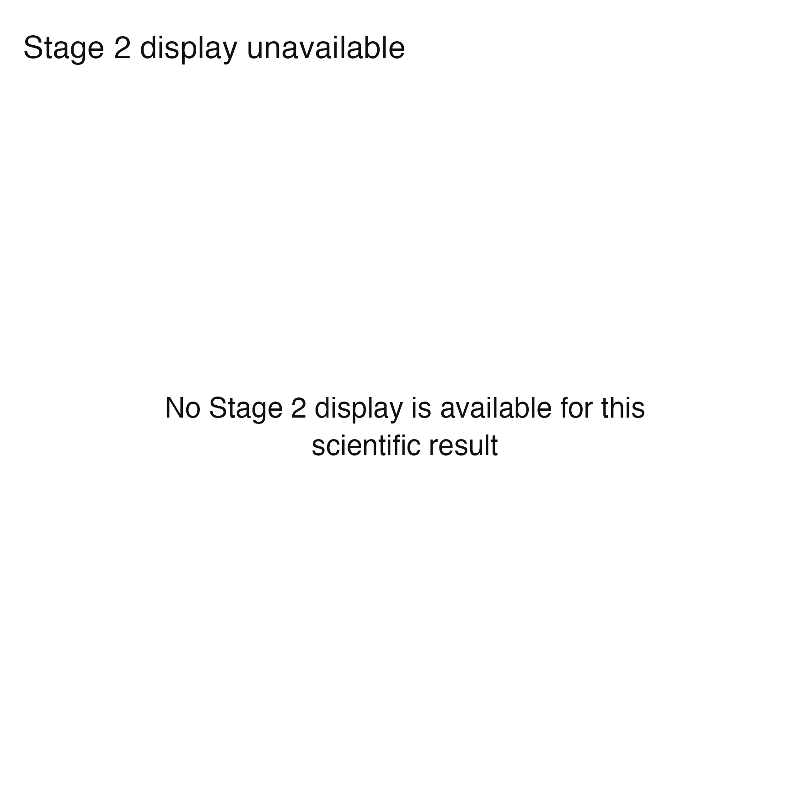

# Issue 118 typed visual-evidence proof

## Evidence flow



Before this change, Stage 1 and Stage 2 renderers consumed
`StagePlotEvidence` directly and missing or stale display evidence raised an
error. After the change, specialized Stage storage is validated and adapted to
the same `VisualEvidenceView` used by association and interpretation figures.
Display failure cannot reverse scientific success.

## Representative 100 mm outputs

| State | Render | Cold-reader conclusion |
|---|---|---|
| Available |  | Stored Stage 1 evidence renders normally. |
| Partial |  | Available groups remain visible while a singleton slice is retained as unavailable. |
| Degenerate |  | A constant coordinate is represented without inventing a density. |
| Stale |  | Scientific mutation invalidates the display digest and produces an explicit unavailable surface. |
| Unavailable |  | An absent Stage 2 result is a captioned display state, not a scientific-stage failure. |

Each PNG is paired with a separate `*-caption.txt` produced by
`scientific_caption()`. Captions are not drawn inside the figures.

## Reproduction

```sh
Rscript .github/landing-proof/issue-118/render-proof.R
```

These are architecture and rendering-contract proofs on synthetic data. They
do not accept a new estimator, threshold, or biological claim.
