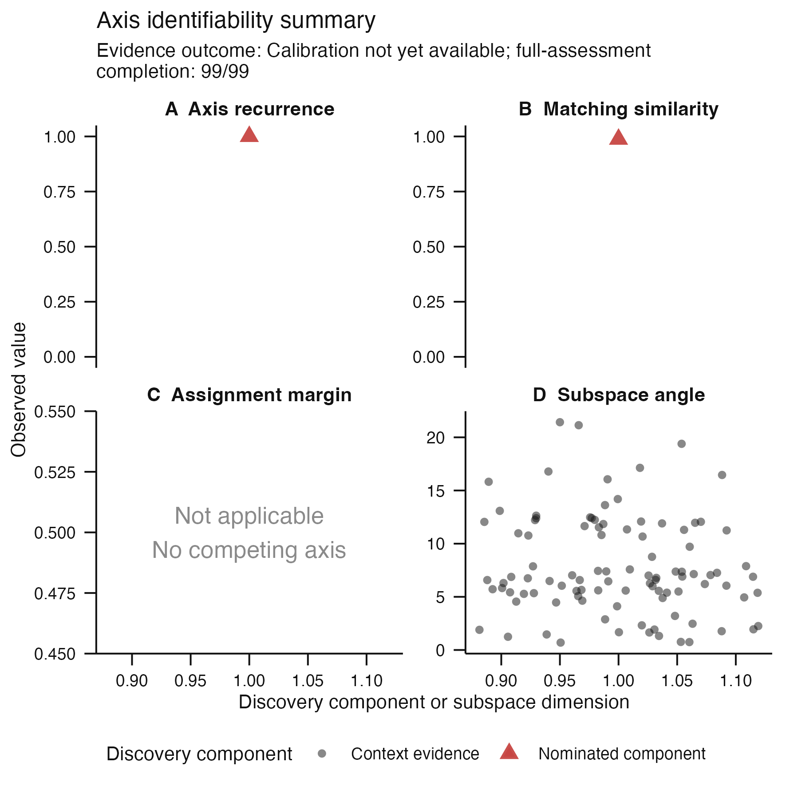
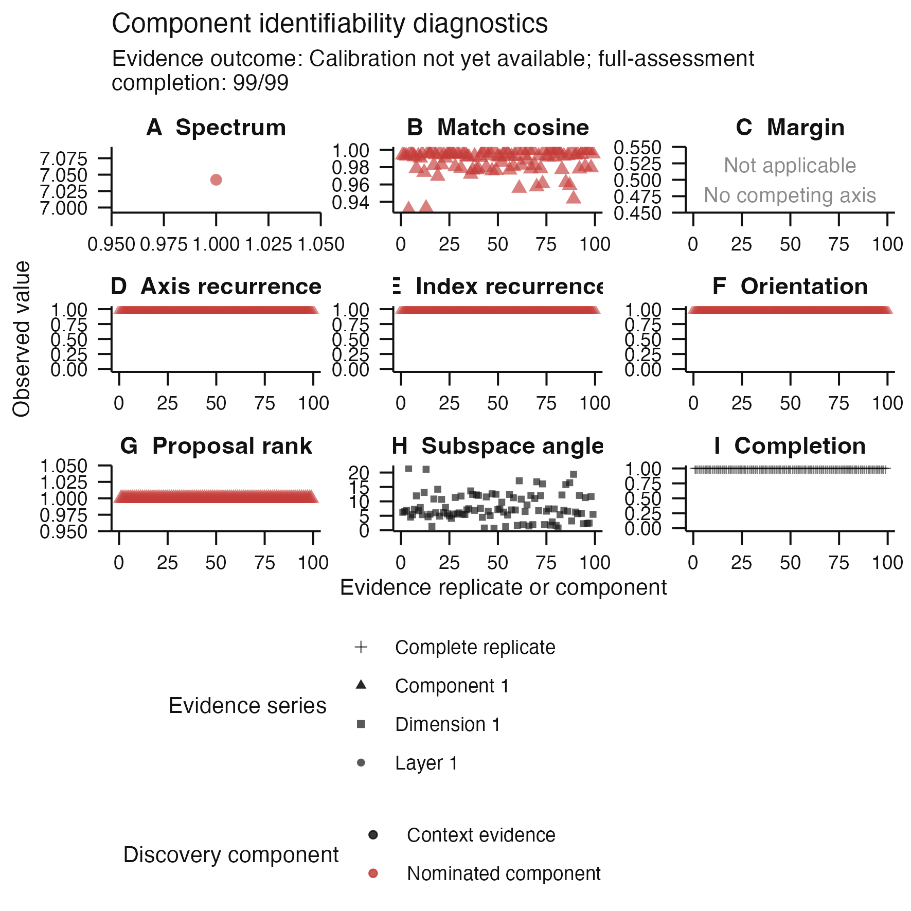

# Issue #126 visual landing proof

**Claim status:** implementation proof only. These synthetic figures show the
typed K=1 identifiability contract and its public primary and diagnostic views.
They do not establish biological validity, coordinate recovery, or an
acceptance threshold.

| Primary decision surface | Complete diagnostic surface |
|---|---|
|  |  |

The sole component is matched without fabricating a competitor. Its orientation,
axis recurrence, and dimension-1 subspace evidence remain available; assignment
margins are undefined because no alternative assignment exists. The captions
are stored separately in `primary-caption.txt` and `diagnostic-caption.txt`.
`typed-status.tsv` records the typed status, structured outcome, complete
resample accounting, absent competitor count, and undefined margins.

## Reproduction

```sh
Rscript scripts/render-issue-126-proof.R
Rscript -e 'devtools::load_all(quiet = TRUE); testthat::test_file("tests/testthat/test-axis-identifiability.R")'
```
