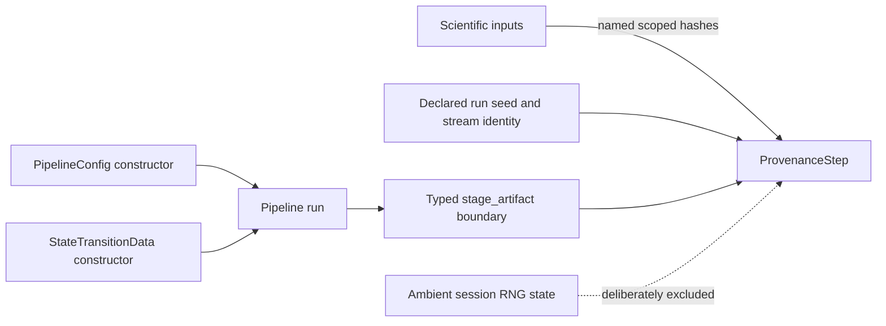

# Issue 127 construction and provenance proof

This change is an internal architecture and reproducibility surface. It does
not alter a user-facing scientific figure, so ADR 0017's visual-output proof is
represented by the workflow and invalid-case table below.



| Boundary | Valid case | Invalid case | Enforced outcome |
|---|---|---|---|
| Pipeline configuration | Named strategies and parameter lists with an explicit analysis specification | Unnamed strategies, scalar parameters, or empty dataset identity | Typed validation error before execution |
| Container defaults | Constructor and MAE coercion use the same schema defaults | A future default is changed in only one path | One internal defaults authority prevents drift |
| Stage access | Stage 1 is a `DecompositionResult`; Stage 2 is present | Stage absent or Stage 1 stored with the wrong type | Optional `NULL` or typed validation error, as requested |
| Scientific hashes | Caller supplies named pre-stage input hashes | Hash boundary omitted or unnamed | Provenance construction is rejected |
| RNG identity | Caller supplies declared seed/stream identity | Incidental `.Random.seed` happens to exist | Ambient state is ignored; legacy slot remains empty |
| Decomposition validity | Dimensions agree with declared `k`, features and layers | Empty loading, invalid `k`, or mismatched matrix/list dimensions | Each validity branch is directly tested |

The proof is reproducible through the focused test file:

```sh
Rscript -e 'devtools::test(filter="core-construction-provenance")'
```

**Cold-reader conclusion:** construction, stored-stage access, scientific input
hashing, and random-stream identity now cross explicit validated boundaries;
invalid inputs fail before they can be mistaken for successful provenance.

**Claim status:** implementation proof for architecture and reproducibility
contracts only. This does not validate a scientific estimator or acceptance
threshold.
