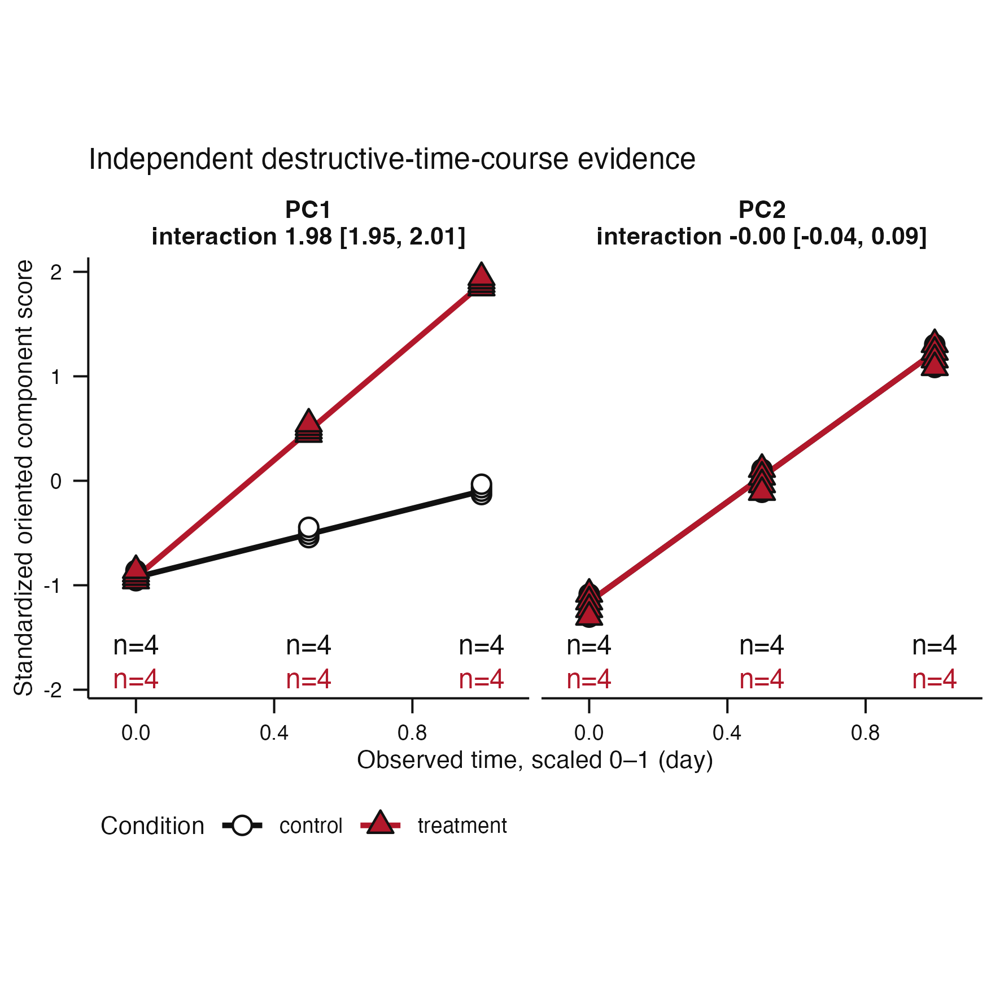
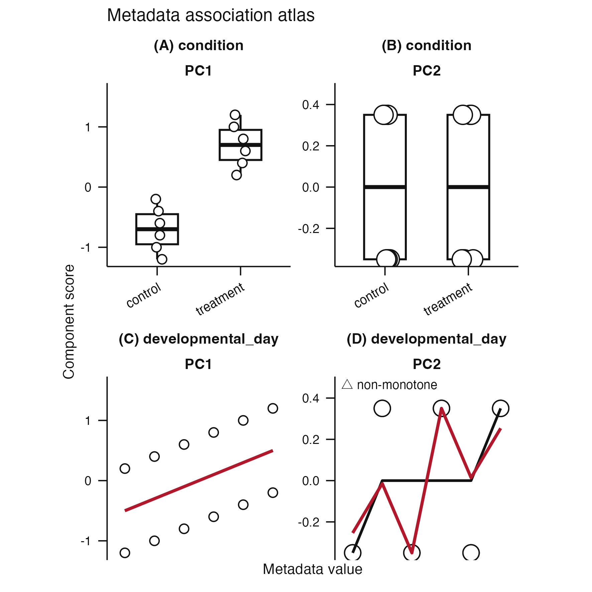
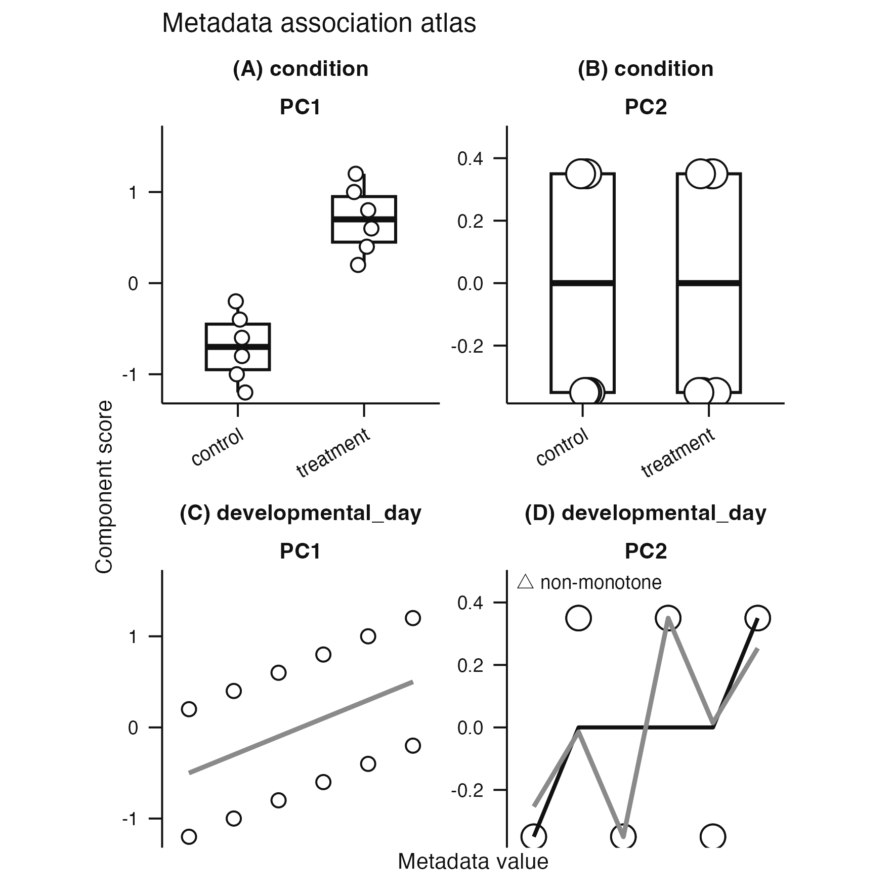
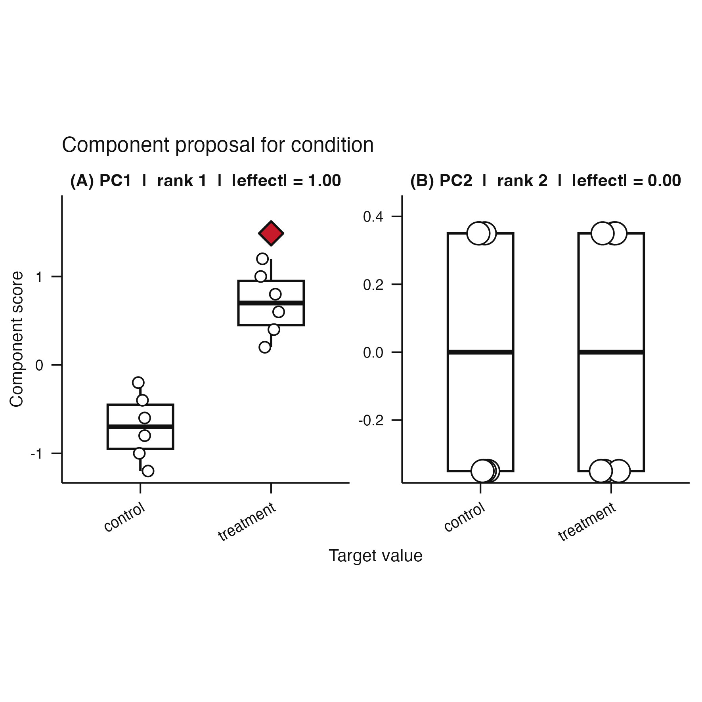

# Issue #128 visual landing proof

## Cold-reader conclusion

The revised figures use one restrained publication grammar across independent
time courses, association atlases, and component proposals. Black, white, and
grey carry structure. The canonical red `#C43C39` appears only for the declared
treatment contrast or the nominated component. Flexible comparison fits and
missingness marks no longer borrow focal red.

## Before and after at 100 mm

| Plot family | Before | After |
|---|---|---|
| Independent time course |  |  |
| Association atlas |  |  |
| Component proposal |  |  |

The before panels reconstruct the concrete divergent literals removed by this
change. The after panels are outputs from the package renderers. Figure captions
are stored beside the images and remain separate from the graphics.

## Reproduction

From the repository root, run:

```sh
Rscript scripts/render-issue-128-proof.R
```

The script uses fixed seeds and writes six 100 mm square PNG files plus the
three dynamic caption files to this directory.

## Claim status

This is publication-grammar implementation proof. It verifies colour semantics,
theme consistency, final-size legibility, and caption availability. It is not
scientific validation of coordinate recovery or biological interpretation.
