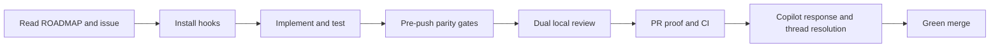

# Issue #131 landing proof: repository authorities and safeguards

## Cold-reader conclusion

A new contributor now has one route from repository orientation to current
work, module architecture, local safeguards, and merge gates. Mutable stage
status and next-work instructions no longer compete with `ROADMAP.md`.

## Repository authority map

| Question | Authoritative source | Explicitly not authoritative |
|---|---|---|
| What is next, blocked, or complete? | `ROADMAP.md` | `CLAUDE.md`, session notes, issues, plans |
| What does one deliverable require? | GitHub issue | Issue labels as schedule |
| Why was an algorithm or architecture chosen? | `decisions/` | Architecture summaries |
| Which module owns an invariant or dependency? | `docs/architecture/` | ADR replacement or current status |
| Which scientific protocol is frozen? | `docs/specs/` and immutable evidence | Pull-request proof |
| Which gates must precede merge? | `docs/agents/review-ratchet.md` | Session memory |

## Contributor workflow

The contributor guide names the exact hook installation and manual parity
commands. The architecture index now covers core construction/provenance,
stages, resampling/execution, component interpretation, and visual evidence.

## Before and after

Before, `CLAUDE.md` duplicated mutable stage status and open decisions, a hidden
session note retained stale imperative next-work instructions, hook discovery
was split across a hygiene document, and stage plus execution architecture had
no module records. After, `CLAUDE.md` points to the owning sources, the session
note is an explicit archive with its stale sections removed, one contributor
guide exposes safeguards, and the authority table links all module records.

## Reproduction

Read `CLAUDE.md`, `docs/README.md`, `docs/agents/contributor-workflow.md`, and
the linked architecture documents. Run `bash install-hooks.sh`, then inspect
`hooks/pre-push` or execute the manual parity commands from the guide.

## Claim boundary

This is governance and developer-workflow proof. It changes no scientific
algorithm, acceptance threshold, package result, or scheduler default.
