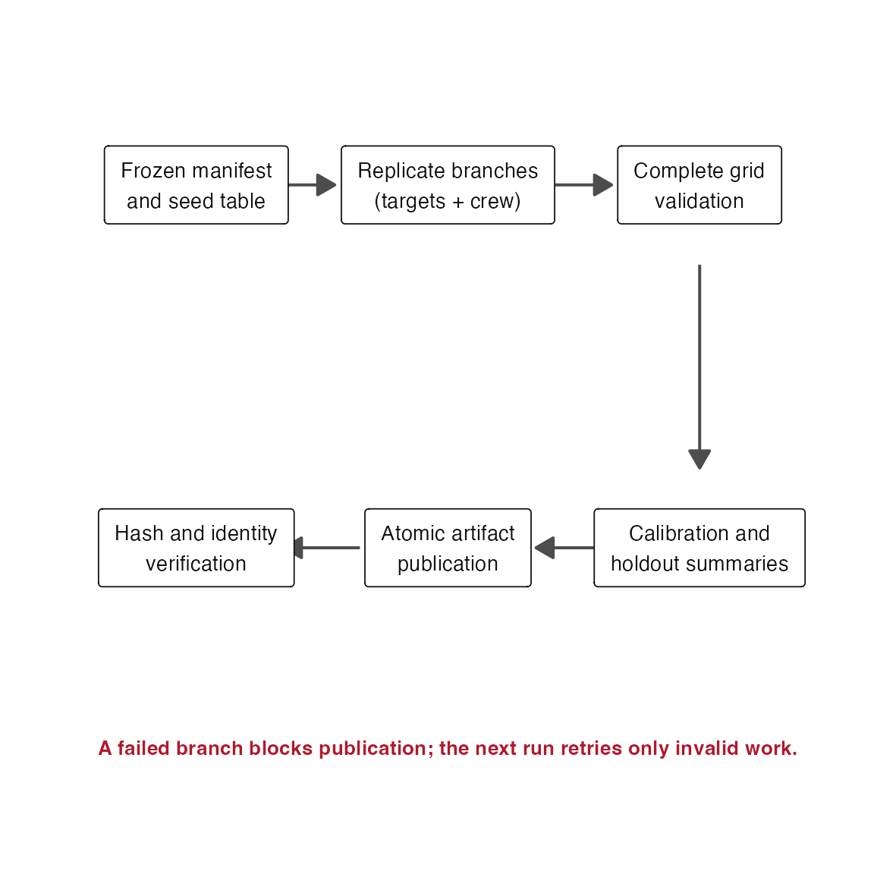

# Issue #135 landing proof: durable evidence orchestration

## Claim boundary

This is operational orchestration proof. It does not choose a scheduler,
project, queue, worker count, memory request, wall time, or scientific
acceptance threshold. The package graph and controller factories expose the
same scientific commands for local and scheduler execution; this proof checks
that structural contract, while the retry demonstration checks the durable
publication/verification boundary. It does not claim that a scheduler queue
was run in this repository checkout.

## Cold-reader conclusion

The full Stage 1 evidence protocol is now represented as a targets graph. Crew
changes where eligible targets execute without changing their scientific
commands. Failed or invalid branches can be rerun from durable target state,
while content-addressed artifact publication and verification remain downstream
controller-only operations.



## Retry and invalidation

The reproduction deliberately fails branch 2 on its first attempt. Branch 1
completes, but the artifact target remains blocked and no file is published.
The second make retains branch 1, retries branch 2, and publishes only after
both exist. Explicit upstream invalidation then reruns both branches and their
downstream verification.

| Phase | Successful branch attempts | Failed-then-retried branch attempts | Published | Verified |
|---|---:|---:|---|---|
| First run | 1 | 1 | no | no |
| Retry | 1 | 2 | yes | yes |
| Explicit invalidation | 2 | 3 | yes | yes |

The exact rows are retained in
[`retry-invalidation-proof.csv`](retry-invalidation-proof.csv). The compact
artifact is [`retry-artifact.rds`](retry-artifact.rds).

The reproduction also constructs the real `stage1_evidence_targets()` graph and
publishes/verifies a representative artifact through
`.stage1_target_publication()` and `.stage1_target_verified()`. The full frozen
40,960-task benchmark is intentionally not rerun by this fast landing proof.

## One parallelism layer

| Workflow part | Execution location | Internal future policy |
|---|---|---|
| Benchmark replicate branches | crew worker | not used |
| Calibration and holdout summaries | crew worker | current worker, sequential |
| Artifact publication | controller | not used |
| Artifact verification | controller | not used |

The package test suite also starts with an ambient parallel future plan and
proves that `sequential_internal = TRUE` executes repetitions in the current
worker rather than launching nested futures.

## Cross-backend identity

Controller identity exists only in target resources and artifact execution
provenance. Unit tests compare every scientific target command across local and
scheduler controller names and require exact equality. Each dynamic replicate
branch independently reads the installed landscapeR revision and checks the R
and package versions against the controller target before computation. Runtime
measurements are retained as operational diagnostics only; they cannot alter
candidate selection or the scientific digest.

## Reproduction

From the repository root:

```sh
Rscript .github/landing-proof/issue-135/reproduce.R
```

The script keeps the targets store and retry markers under `.scratch/` and
regenerates only the governed proof outputs in this directory.
