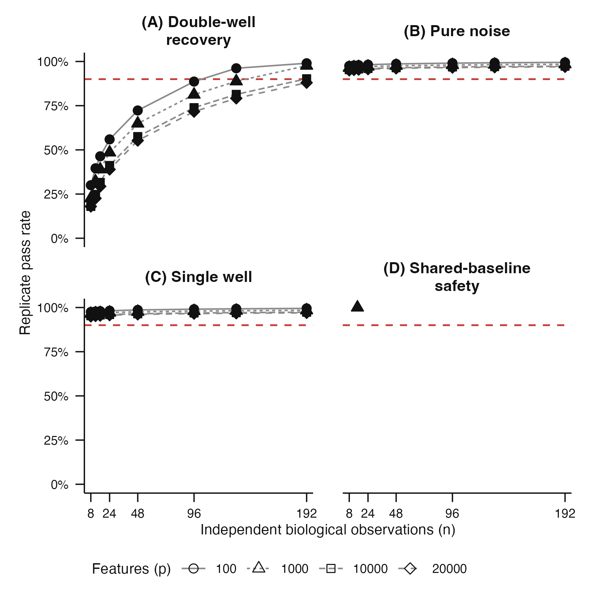
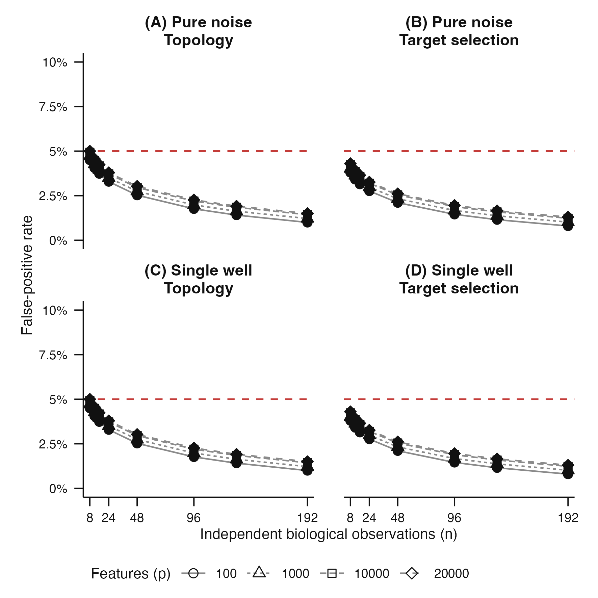
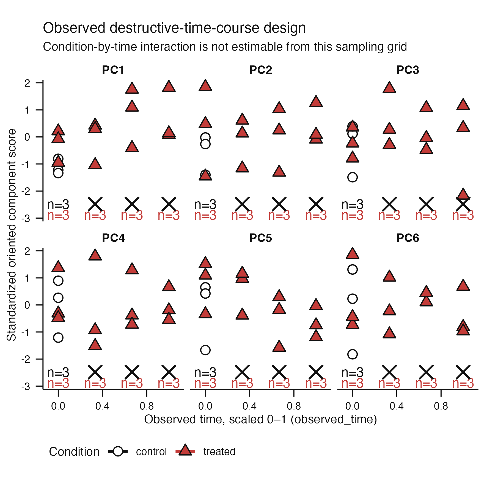

# Issue #177 landing proof: K=1 acceptance protocol version 2

## Claim boundary

This is implementation proof. The lower-tail rates are an explicitly
fabricated fixture used only to inspect the reporting surface. The
shared-baseline figure is a development-only execution with fixed disclosed
seeds. No production manifest or production seed has been derived, no
acceptance outcome has been observed, and no sample-size claim is made.

## Lower-tail reporting surface



The generic positive and both negative controls now share sample counts from 8
through 192 at four feature counts from 100 through 20,000. The fabricated
positive curve deliberately degrades in the sparse lower tail so the figure
demonstrates how an eventual supported boundary would be visible. The exact
publication-style caption is stored separately in
[`lower-tail-pass-rate-caption.txt`](lower-tail-pass-rate-caption.txt).



The negative-control panels retain their frozen 5% maximum. These values are
not evidence. The caption is in
[`lower-tail-false-positive-caption.txt`](lower-tail-false-positive-caption.txt).

## Shared-baseline missing-cell safety



Three independent controls are observed at time 0. Three independent treated
samples are observed at each of four times. Crosses mark the three later
control-time cells that do not exist. The package does not copy baseline
controls into those cells and does not draw a group trajectory. It returns a
typed `non-identifiable-design` abstention. The separate scientific caption is
in
[`shared-baseline-missing-cell-caption.txt`](shared-baseline-missing-cell-caption.txt),
and the machine-readable result is in
[`shared-baseline-safety-result.tsv`](shared-baseline-safety-result.tsv).

## Workload

| Control | Grid cells | Replicates per cell | Tasks |
|---|---:|---:|---:|
| Double-well recovery | 32 | 100 | 3,200 |
| Pure noise | 32 | 200 | 6,400 |
| Single well | 32 | 200 | 6,400 |
| Shared-baseline safety | 1 | 100 | 100 |
| Synchronized AML | 9 | 100 | 900 |
| **Total** | **106** |  | **17,000** |

The full task table is
[`version-2-workload.tsv`](version-2-workload.tsv). Version 2 assigns one
collision-free four-integer seed block to each canonical task, but the real
block start cannot be known until the reviewed version 2 merge exists.

## Gemini development pilot

Five fixed-seed development tasks completed through the Gemini `hprcc` Slurm
controller. They covered lower-tail and largest-cell generic recovery, both
largest-cell negative controls, and the shared-baseline safety control. hprcc
measured 1.57 GB peak memory, 5.3% peak CPU, and 5.5 minutes and recommended its
`tiny` resource class. The existing 2 CPU, 8 GB, 60 minute request remains
appropriate. Protocol v2 phase B1 has 16,100 branches, 91.7% more than version
1, so the operational change is greater scheduler throughput rather than a
larger worker. The machine-readable pilot summary is
[`gemini-development-pilot.tsv`](gemini-development-pilot.tsv).

## Version boundary

Version 1 remains readable historical evidence with its original 9,300-task
manifest and seed derivation. New runs default to version 2. Validators reject
protocol mutation, version relabelling, seed collisions, and results whose
artifact version differs from their protocol.

## Reproduction

```sh
Rscript scripts/render-issue-177-proof.R
Rscript -e 'devtools::test(filter = "k1-stage0-acceptance")'
```
