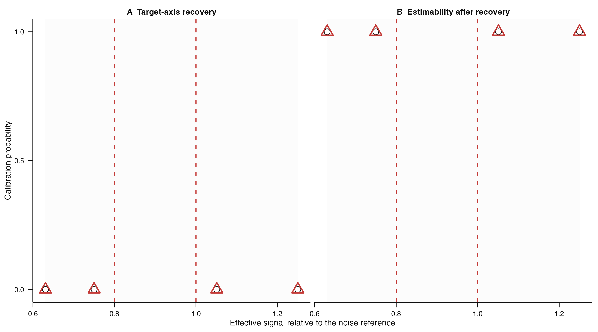
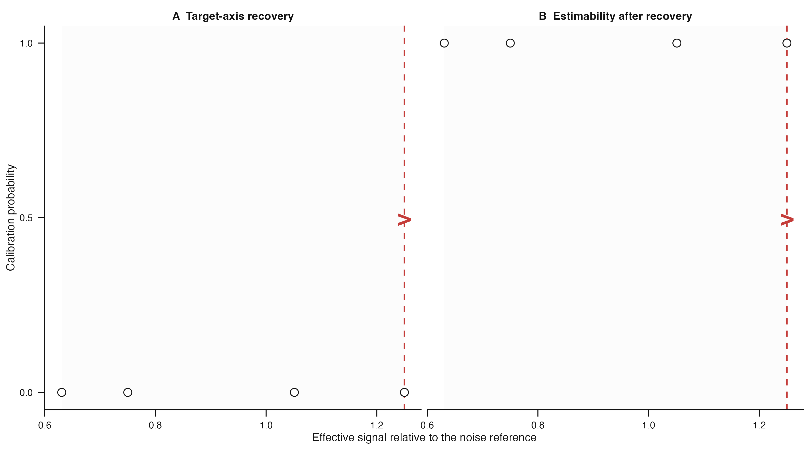

# Issue #192 landing proof: real-experiment operating-domain locator

## Cold-reader conclusion

The locator shows where declared experiment diagnostics fall relative to the
compatible calibration domain. It retains the exact cells that bracket a point
or uncertainty interval. When the declared signal/noise position lies outside
that domain, it shows the experiment position but does not invent a recovery
probability.

## Justified uncertainty region



Black circles show all compatible calibration-cell summaries. The pale grey
band is the calibrated signal/noise domain. Red dashed lines delimit the
experiment interval, and red open triangles identify the exact calibration
cells retained as support. The full dynamic caption is in
[`located-region-caption.txt`](located-region-caption.txt), and the exact red
triangle rows are in
[`located-region-supporting-cells.csv`](located-region-supporting-cells.csv).

## Explicit refusal to extrapolate



The red dashed line and arrow mark the nearest calibrated boundary in the
direction of the out-of-range experiment; the exact experiment ratio remains
in the plot data and caption. No red supporting triangles or experiment
probability are shown. The typed result is `out_of_domain` with reason
`signal_noise_out_of_range`. The full caption is in
[`out-of-domain-caption.txt`](out-of-domain-caption.txt), and the compatible
domain cells are retained in
[`out-of-domain-compatible-domain.csv`](out-of-domain-compatible-domain.csv).

## Reproduction

From the repository root, run:

```sh
Rscript scripts/render-issue-192-proof.R
```

## Claim boundary

These are disclosed synthetic implementation fixtures. They demonstrate
placement and refusal semantics, not an accepted biological operating range,
sample-size recommendation, biological state-space projection, or
quasi-potential landscape.
