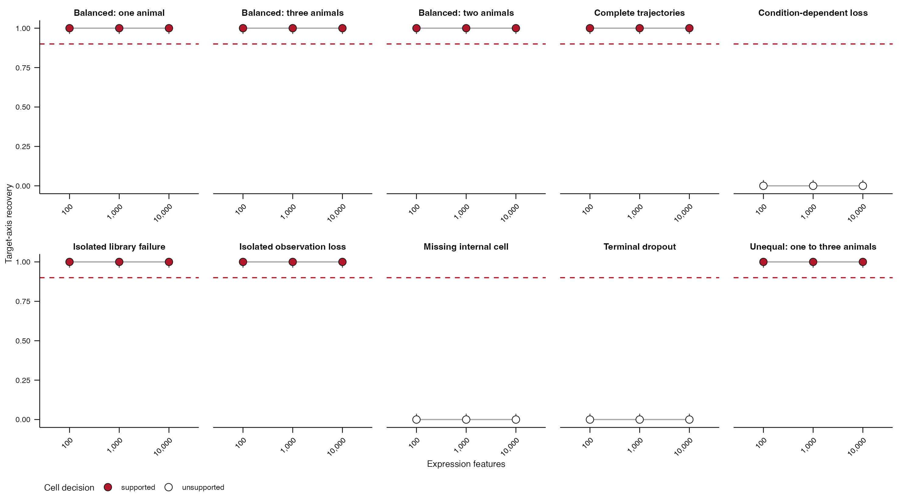
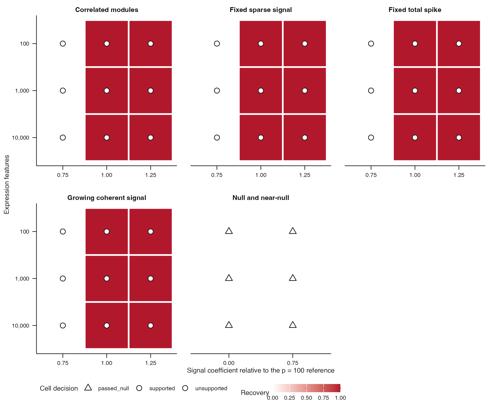

# Issue #193 runner landing proof

These are fabricated implementation-proof fixtures. They demonstrate the
revised acceptance publication surface without executing or claiming any
acceptance replicate. Regenerate them with:

```sh
Rscript scripts/render-issue-193-runner-proof.R
```

## Sampling-design map



## Signal-regime map



The cold-reader conclusion is limited to software behavior: the runner can
summarize complete typed accounting into the established longitudinal and
high-dimensional visual language, and each figure has exact displayed data and
a separate scientific caption. These figures do not show scientific results.
