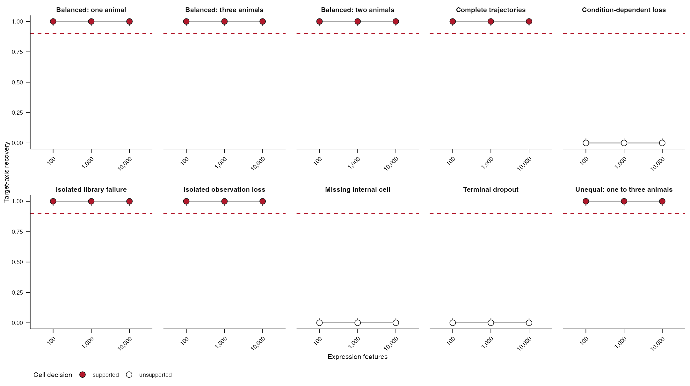
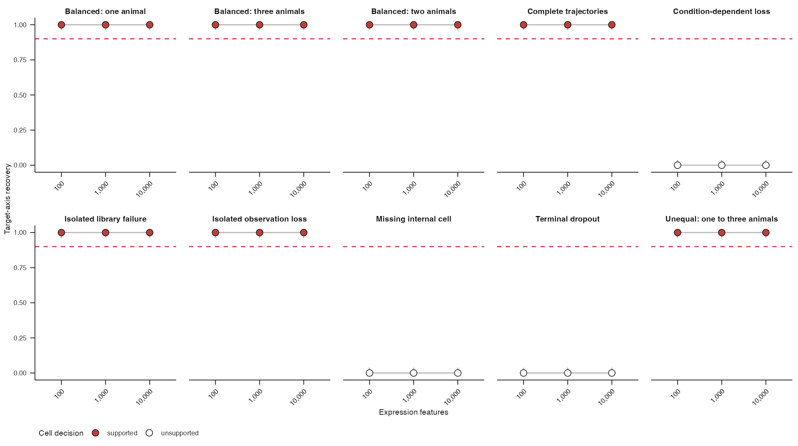
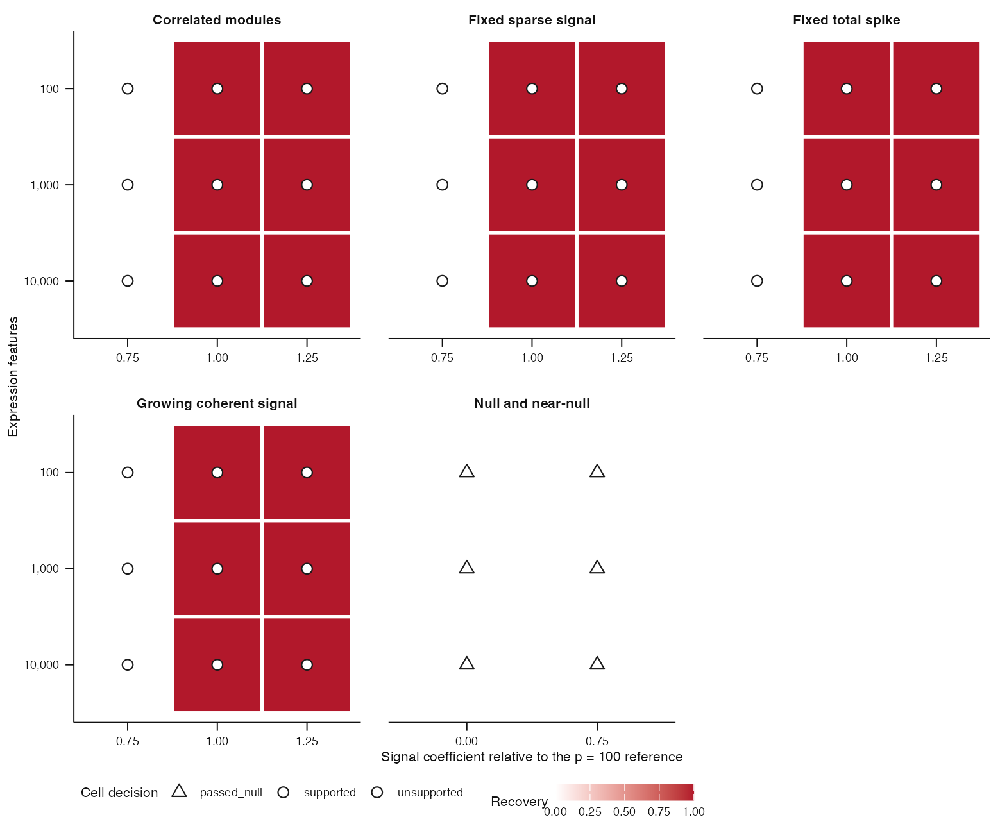
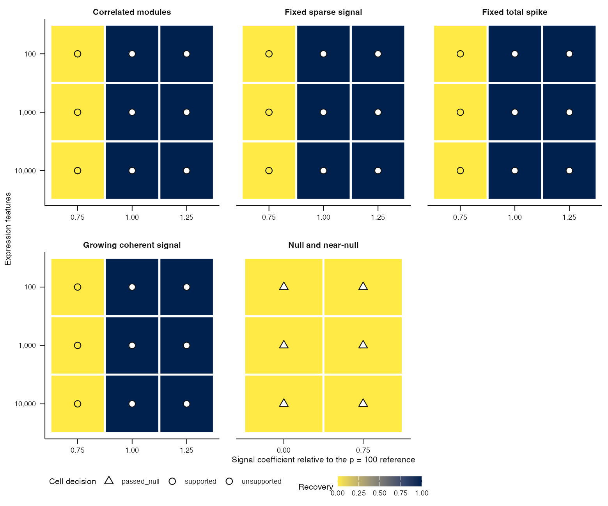

# Issue #204 visual landing proof

The revised K=1 acceptance maps now obtain ink, paper, structure, nuisance, and
focal colours from the package semantic palette. Plot geometry, labels,
thresholds, decisions, and fabricated proof data are unchanged.

## Sampling-design map

| Before | After |
|---|---|
|  |  |

## Signal-regime map

| Before | After |
|---|---|
|  |  |

Cold-reader conclusion: both public views retain identical scientific
encodings while using package-owned semantic roles. The signal-map change is
visible as the colour-vision-robust Cividis scale for continuous recovery; the
sampling map uses focal red only for supported cells and is intentionally a
subtler correction.

Reproduce with `Rscript scripts/render-issue-204-proof.R before` on the parent
revision and `Rscript scripts/render-issue-204-proof.R after` on this revision.
The fixture is fabricated implementation proof only. It does not execute an
acceptance task or support an operating region.
