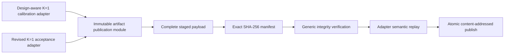

# Issue 209 landing proof

Both scientific workflows now enter one filesystem publication module while
retaining separate scientific adapters.



The module rejects missing, duplicate, altered, and undeclared files. The
adapters still own scientific validation, claim status, input identity, RNG
identity, plots, captions, and semantic replay. Runtime telemetry remains
outside the scientific digest.

[`publication-verification.tsv`](publication-verification.tsv) records a
reproducible publication, deterministic address reuse, and rejection of a
mutated payload. Regenerate it from the repository root with:

```sh
Rscript scripts/render-issue-209-proof.R
```

This is architecture and implementation proof. It does not establish or alter
any scientific acceptance threshold.
