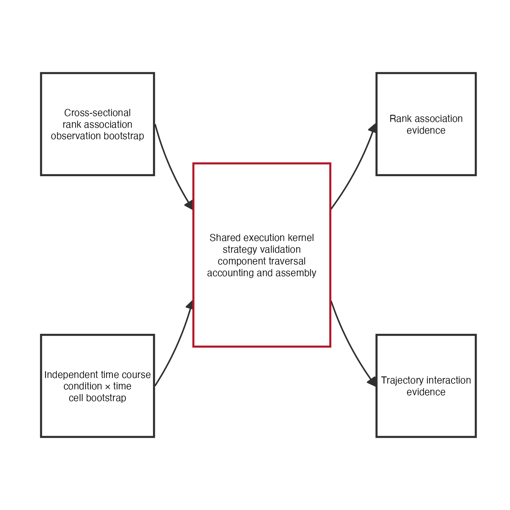

# Issue 210 landing proof

Cross-sectional and independent destructive-time-course interpretation now
cross one normalized execution kernel while retaining different scientific
estimands, cohort rules, diagnostics, and resampling designs.



**Figure. Shared execution without scientific homogenization.** The upper lane
shows cross-sectional rank association and independent-observation bootstrap.
The lower lane shows the condition-by-time interaction and condition-by-time
cell bootstrap. Both lanes use the same validated strategy resolution,
component traversal, accounting, multiplicity, abstention propagation, and
atlas assembly. The kernel does not choose an estimand or exchangeability rule.

[`evidence-equivalence.tsv`](evidence-equivalence.tsv) records exact atlas
digests for the rank-only cross-sectional fixtures and portable scientific
fingerprints for the fitted time-course fixtures, plus the typed
non-identifiable outcome. The portable fingerprint retains the complete
scientific provenance tree, evidence tables, cohort membership, fitted model
summaries, rankings, resampling plan, and identity fields. Only the original
raw evidence digests, repetition-result byte digests, and runtime model-engine
version are removed. Their normalized underlying evidence, repetition values,
declared model engine, RNG identity, and scientific summaries remain in the
fingerprint. Numeric values are quantized by rounding to six decimal places.
This is not a distance tolerance:
even a very small change can alter the fingerprint when it crosses a rounding
boundary, and the tests make that behavior explicit. The supported Linux and
macOS CI jobs independently recompute the fixtures and must place every value
in the same six-decimal bin before the frozen fingerprint can pass. CI exposed
the original raw-byte divergence; this transparent quantization rule, rather
than an opaque raw digest difference, defines the portable comparison.
Regenerate both artifacts from the repository root with:

```sh
Rscript scripts/render-issue-210-proof.R
```

This is architecture and implementation proof. It does not establish
scientific recovery, component identifiability, or an acceptance threshold.
