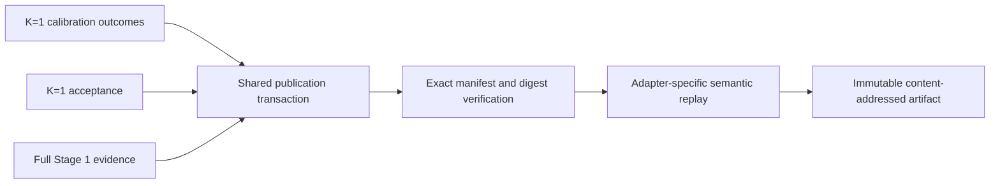

# Issue 211 landing proof

All immutable scientific-artifact families now publish through the shared
filesystem transaction while retaining separate scientific adapters.



[`publication-matrix.tsv`](publication-matrix.tsv) names each publisher,
verifier, and focused test that creates and verifies its reproducible artifact.
Regenerate the matrix from the repository root with:

```sh
Rscript scripts/render-issue-211-proof.R
```

The tests also cover deterministic address reuse and rejection of incomplete,
altered, interrupted, or semantically invalid artifacts. Historical Stage 1
artifacts keep their original `hashes.csv` verification path; new Stage 1
artifacts use the exact shared `MANIFEST.tsv` contract.

This proof establishes publication behavior only. It does not establish a
scientific recovery threshold or acceptance result.
