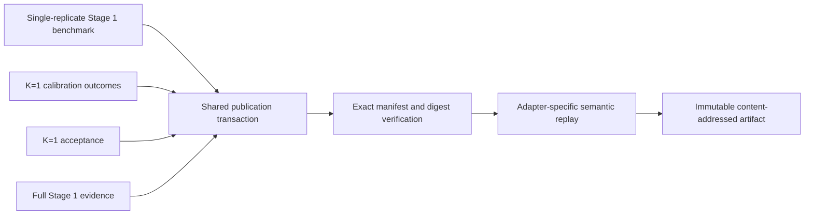

# Issue 211 landing proof

All immutable scientific-artifact families now publish through the shared
filesystem transaction while retaining separate scientific adapters.



[`publication-matrix.tsv`](publication-matrix.tsv) names each publisher,
verifier, immutable address, and retained manifest. The four files in
[`examples/`](examples/) are the exact governed inventories from deterministic
artifacts constructed and semantically replayed by the proof script.
Regenerate the matrix from the repository root with:

```sh
Rscript scripts/render-issue-211-proof.R
```

The default command verifies byte-for-byte agreement with the retained files
and fails on drift. After an intentional publication-contract change, regenerate
them explicitly with `Rscript scripts/render-issue-211-proof.R --update`, review
the diff, then rerun the default verification command.

The focused tests cover deterministic address reuse and rejection of
incomplete, altered, interrupted, or semantically invalid artifacts in every
migrated family. Historical Stage 1 artifacts keep their original `hashes.csv`
verification path; new Stage 1 artifacts use the exact shared `MANIFEST.tsv`
contract.

This proof establishes publication behavior only. It does not establish a
scientific recovery threshold or acceptance result.
