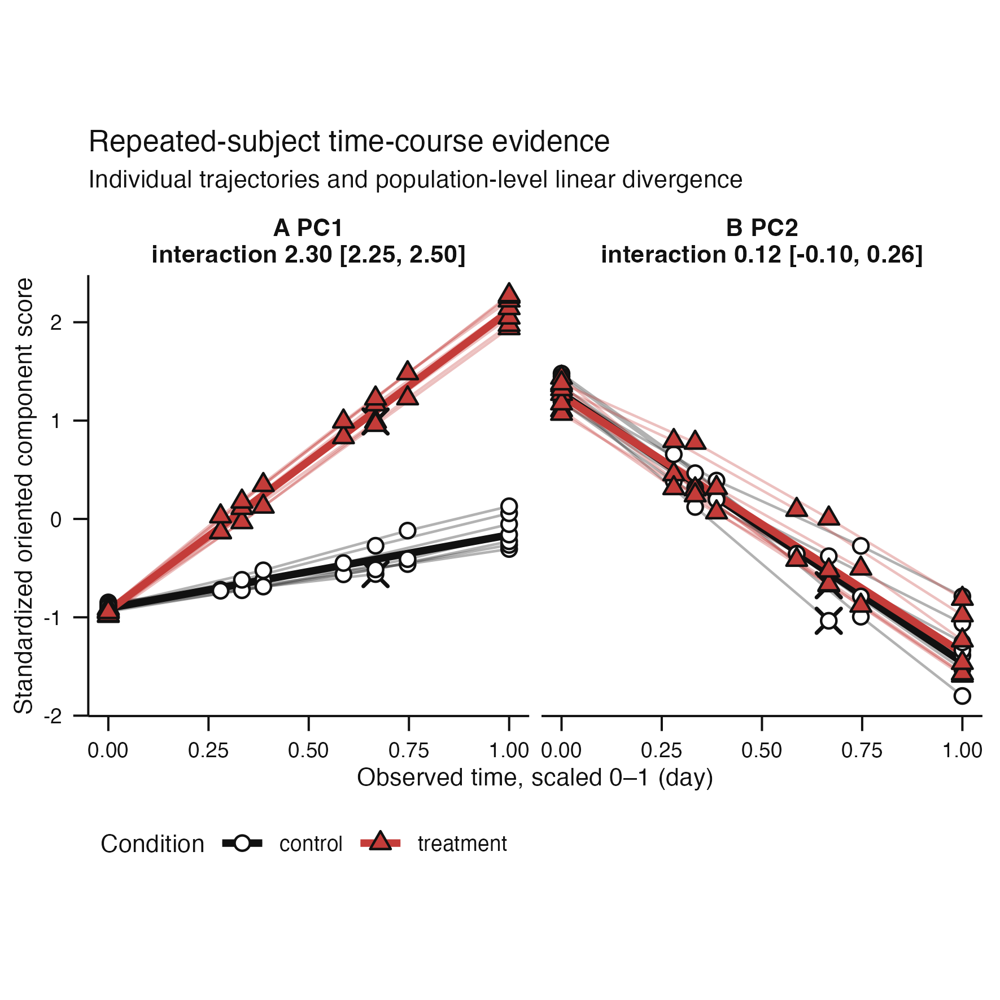
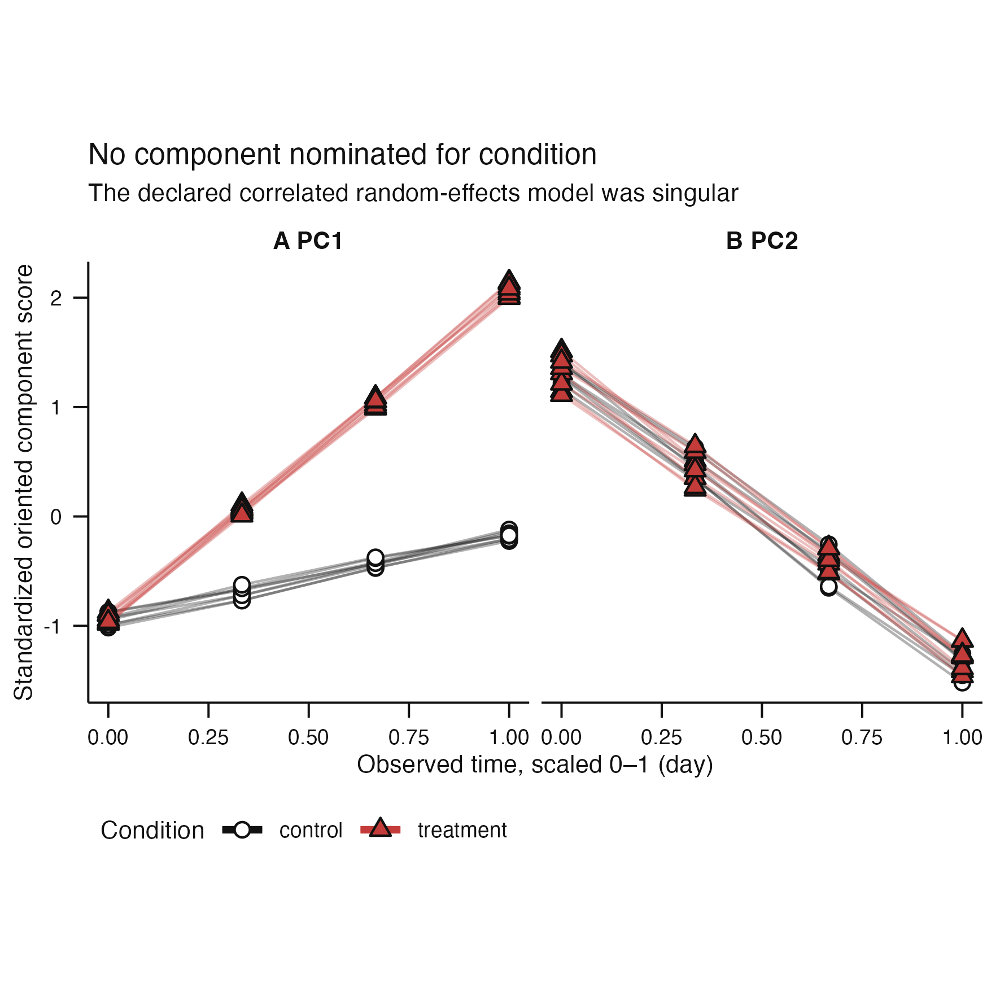

# Issue #212 visual landing proof

**Claim status:** execution migration and visible diagnostic proof only. These
synthetic repeated-subject examples demonstrate that the shared association
kernel preserves the declared random-slope analysis and its abstention boundary.
They do not establish biological validity, universal sample-size requirements,
or a calibrated stability threshold.

| Estimable repeated trajectories | Singular-model abstention |
|---|---|
|  |  |

The estimable panel retains complete subject trajectories, irregular observation
times, terminal dropout, adjusted condition-by-time effects, and trajectory-level
bootstrap accounting. The abstention panel shows the public outcome when the
declared random-intercept and random-slope covariance is singular. The package
does not substitute a simpler model.

Both results now pass through the shared association execution kernel for
component traversal, normalized evidence accounting, multiplicity adjustment,
and typed atlas assembly. Model fitting, exchangeability, trajectory resampling,
subject-level permutation, and scientific diagnostics remain owned by the
repeated-design adapter.

Each PNG is the actual public plotting result at the package default 100 mm
square size. Its adjacent `*-caption.txt` file is the exact separate caption
returned by `scientific_caption()`. `inspection.tsv` verifies that captions are
not embedded in the graphic. `evidence.tsv` records the sampling unit, execution
path, refit completion, and typed singular outcome.

## Reproduction

```sh
Rscript scripts/render-issue-212-proof.R
Rscript -e 'devtools::test(filter = "repeated-(association-execution-kernel|time-course)")'
```
