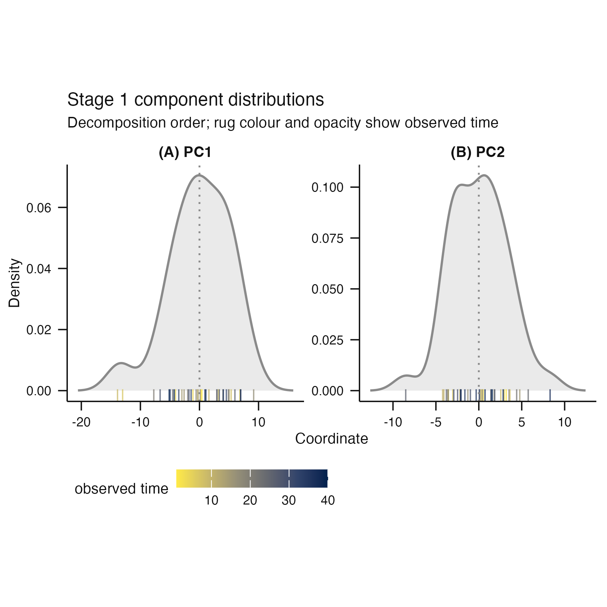
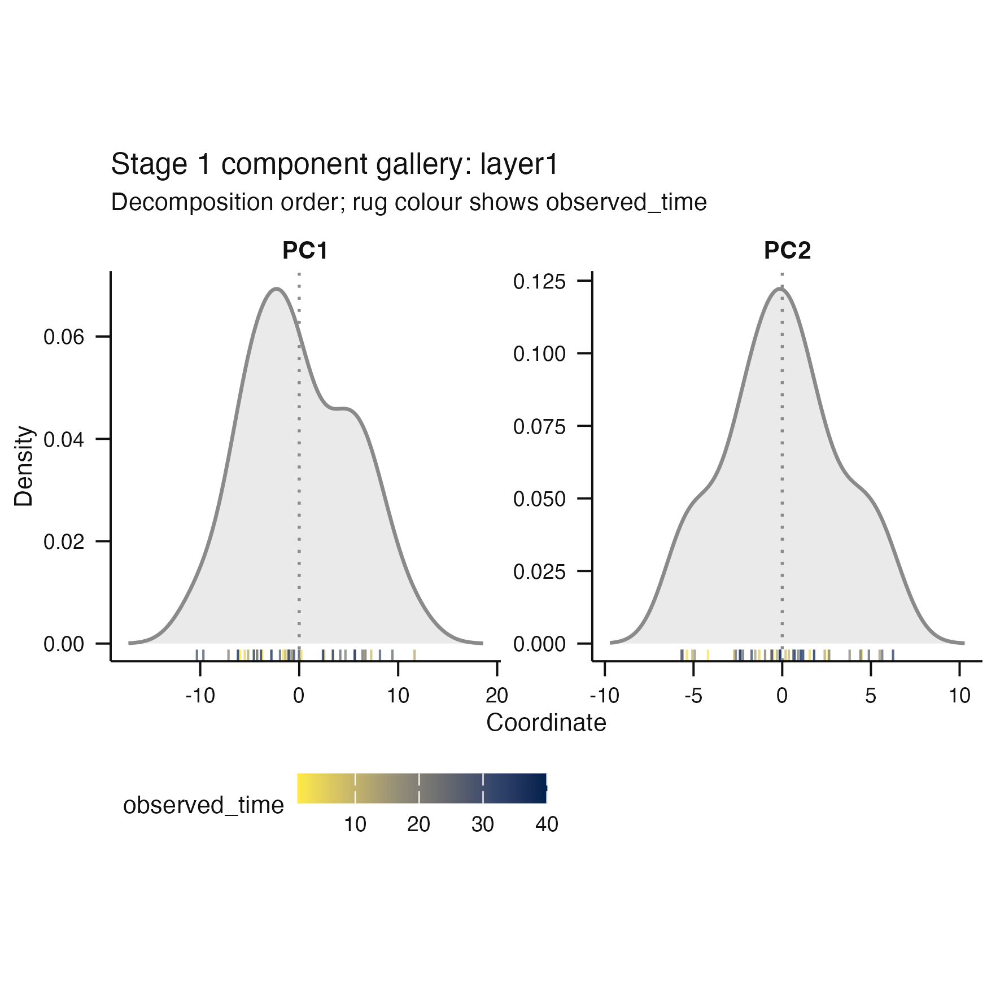
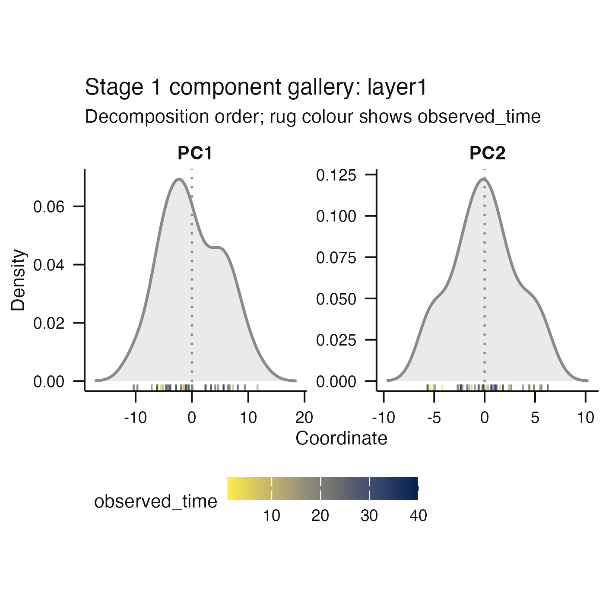

# Issue #228 visual landing proof

This packet demonstrates that `plot_components()` renders a valid continuous
metadata field without an unknown-scale warning under strict warning handling.
The before image is the retained issue #226 rendering that emitted
`Ignoring unknown labels: fill: "observed_time"`; the after image is regenerated
from the current source with `options(warn = 2)`.

## Reproduce

```sh
Rscript scripts/render-issue-228-proof.R
```

The script writes native 100 mm and reduced 80 mm PNGs plus their separate
scientific caption. The categorical and missing-metadata cases are covered by
the focused `test-stage1-plots.R` regression test.

## Before and after

Before, the issue-226 audit rendering emitted an unknown-fill-scale warning:



After, the same valid continuous encoding renders cleanly under strict warning
handling, with a colour legend and no fill label:



The reduced-size rendering remains legible under the same canonical save
helper:



The scientific caption is kept separately in
[`continuous-component-caption.txt`](continuous-component-caption.txt).
