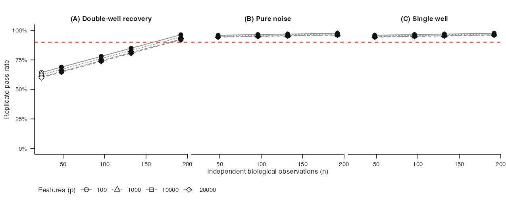
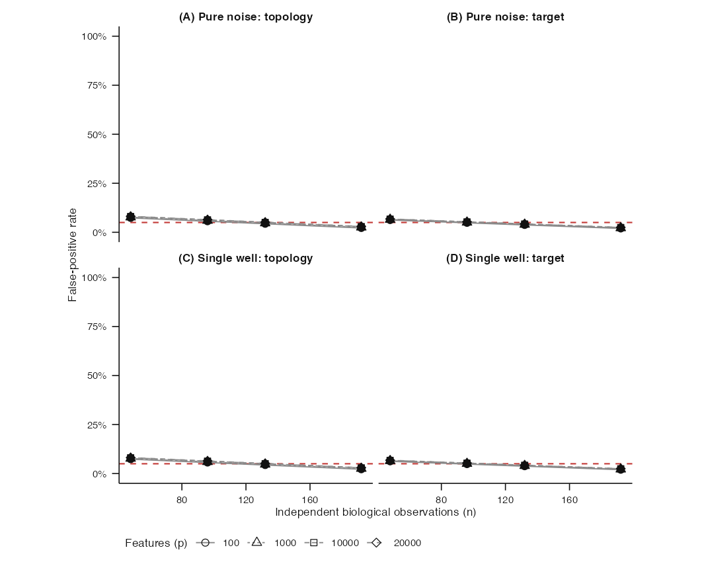

# Issue #51 phase-B1 landing proof: independent acceptance runner

## Claim boundary

This is implementation proof only. The plotted values are an explicitly
fabricated visual fixture used to inspect the publication surface. No frozen
acceptance seed has been derived or executed, no pass rate has been observed,
and no supported sample range has been claimed.

## Cold-reader conclusion

The runner now expands the complete frozen 9,300-task manifest after the phase-A
merge identity is supplied. Phase B1 selects 8,400 generic recovery and negative
control tasks, assigns one complete replicate to each scheduler branch, forces
all resampling inside that branch to remain sequential, retains failed tasks in
the denominator, and publishes only a semantically verified content-addressed
artifact. The later 900-task synchronized AML lane remains blocked on issue
#67 acceptance.

## Recovery and thinness surface



The red line is read from the frozen protocol, not a plotting default. Each
panel exposes the sample-count and feature-count grid. Open points demonstrate
how an incomplete frozen cell remains visible and cannot pass. The scientific
caption used by downstream documents is stored separately in
[`pass-rate-caption.txt`](pass-rate-caption.txt).

## Negative-control surface



The four panels separate false topology from false metadata-target selection in
each negative control. The red maximum and open-cell encoding are derived from
the same typed summary as the graphic. The separate publication caption is in
[`false-positive-caption.txt`](false-positive-caption.txt).

## Frozen workload and supported-range boundary

| Lane | Grid cells | Replicates per cell | Tasks | Current status |
|---|---:|---:|---:|---|
| Double-well recovery | 20 | 100 | 2,000 | runner implemented; not executed |
| Pure noise | 16 | 200 | 3,200 | runner implemented; not executed |
| Single well | 16 | 200 | 3,200 | runner implemented; not executed |
| Synchronized AML | 9 | 100 | 900 | blocked until issue #67 acceptance |

The supported minimum can be emitted only after all 52 phase-B1 grid cells are
complete and the positive and negative gates pass at the same sample count.
Until then it is structurally `NA`, not inferred from partial execution.

## Execution and verification flow

```text
reviewed phase-A merge
        |
        v
9,300-task deterministic manifest
        |
        +--> 8,400 phase-B1 scheduler branches
                  |
                  v
          sequential work within each branch
                  |
                  v
       all successes and failures collected
                  |
                  v
   recomputed summary + runtime-bound content address
                  |
                  v
       immutable files and semantic verification
```

Changing a stored summary while merely regenerating its file checksum fails
verification. The verifier reconstructs task membership from the frozen
manifest, validates every typed replicate, recomputes the summary and payload
address, and cross-checks runtime revision provenance.

## Gemini operations

The supplied Gemini profile creates a dedicated hprcc controller. Its resource
request is provisional until a development-only largest-cell pilot is measured
with `hprcc::summarize_resource_usage()`. Native hprcc CPU, memory, and duration
measurements may tune only controller resources; they cannot enter the
scientific digest or change the frozen protocol.

## Reproduction

```sh
Rscript scripts/render-issue-51-phase-b1-proof.R
Rscript -e 'devtools::test(filter = "k1-stage0-acceptance")'
```
