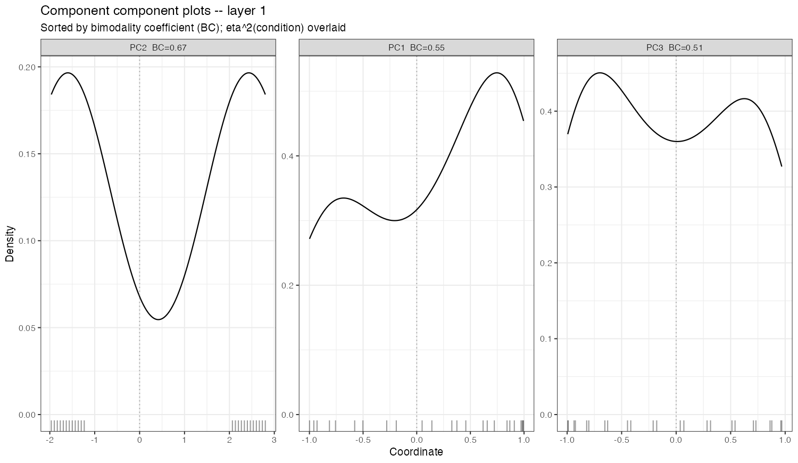
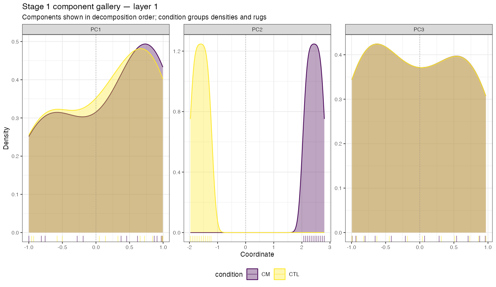
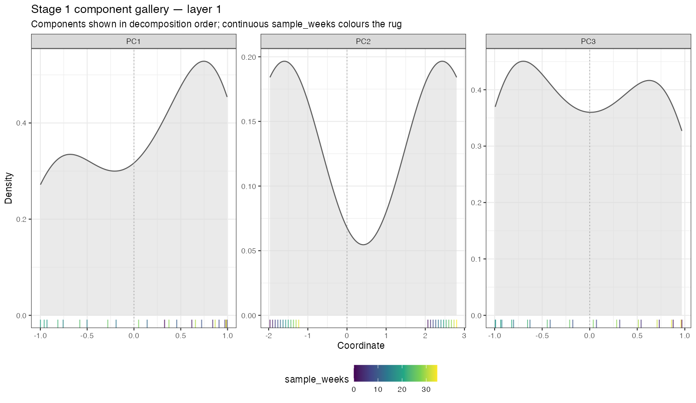

# Issue #54 visual landing proof

**Claim status:** plotting implementation proof only. These synthetic component
distributions do not select, rank, confirm, or validate a biological axis.

## Before: metadata silently absent and panels privately ranked



The deterministic fixture deliberately places assay columns and MAE-level
metadata rows in different orders. Before the repair, `plot_components()` looked
only in per-experiment `colData`, so the requested `condition` colour vanished.
It also displayed the duplicated title and reordered PC2 ahead of PC1 using a
private bimodality score.

## After: categorical metadata



The categorical gallery resolves each assay column through `sampleMap` to its
MAE primary observation. CM and CTL distributions and rugs are visibly distinct,
while panels remain PC1, PC2, PC3.

## After: continuous metadata



Continuous metadata use a gradient rug beneath the unconditioned descriptive
density. This keeps the observation distribution visible without turning the
plot into an association model.

## Observable contract

| Behavior | Before | After |
|---|---|---|
| Metadata source | Per-experiment `colData`; MAE metadata silently missed | MAE-level `colData` aligned through canonical `sampleMap` |
| Categorical colour | Absent | Discrete grouped densities and rugs |
| Continuous colour | Unsupported by the discrete scale | Continuous gradient rug with overall density retained |
| Panel order | Private BC ranking (`PC2`, `PC1`, `PC3` in the fixture) | Decomposition order (`PC1`, `PC2`, `PC3`) |
| Title | `Component component plots -- layer 1` | `Stage 1 component gallery — layer 1` |
| Missing/ambiguous identity | Silent colour removal | Typed `landscapeR_validation_error` |
| Scientific score/rank | BC plus eta-squared/correlation labels | None; atlas/proposal work remains #55 |

## Canonical alignment check

The fixture uses 24 synthetic primary observations. Its assay order begins with
even-numbered samples, while MAE `colData` begins in reverse order. Tests compare
the plotted metadata against an independent `sampleMap` lookup and recover all
24 categorical and continuous values exactly.

## Reproduction

```sh
Rscript scripts/render-issue-54-landing-proof.R
Rscript -e 'devtools::test(filter = "stage1-plots")'
```

`before.png` is the archival render from `origin/main` before the repair using
the same deterministic fixture. The render script regenerates both current
after images.
