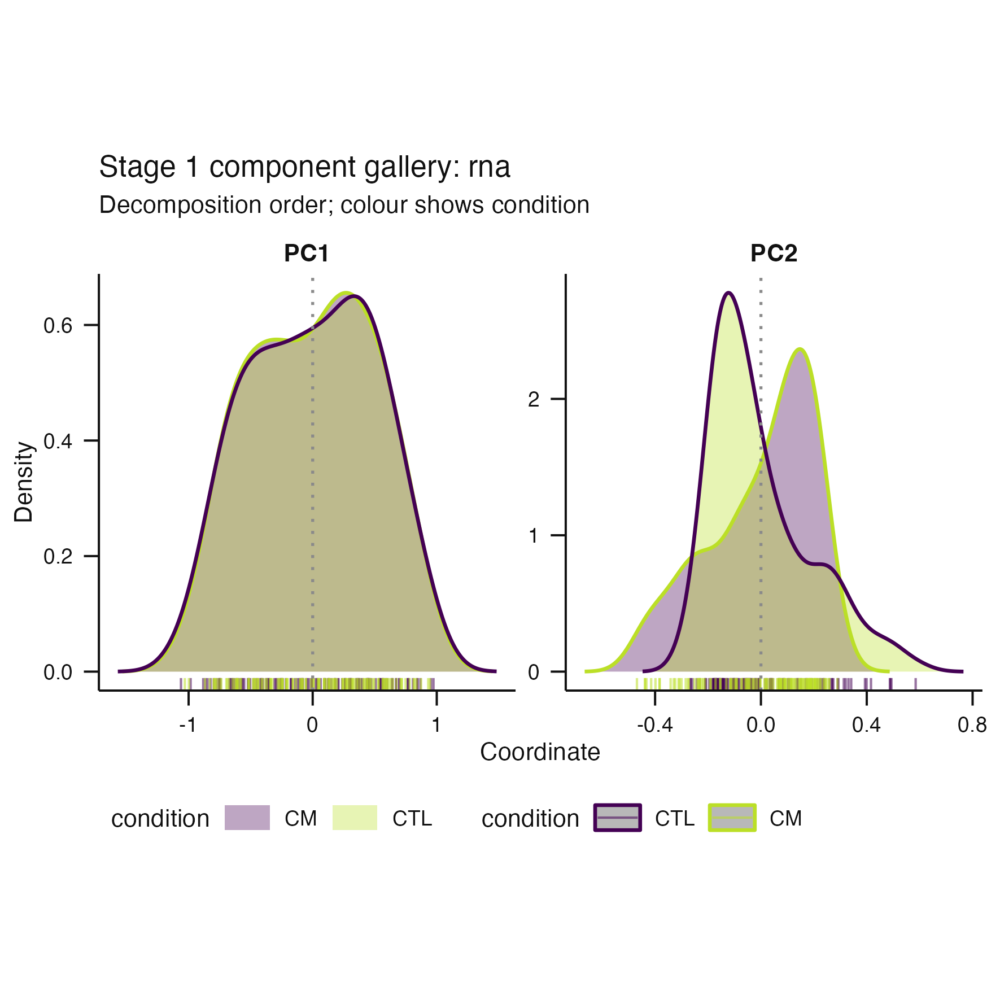
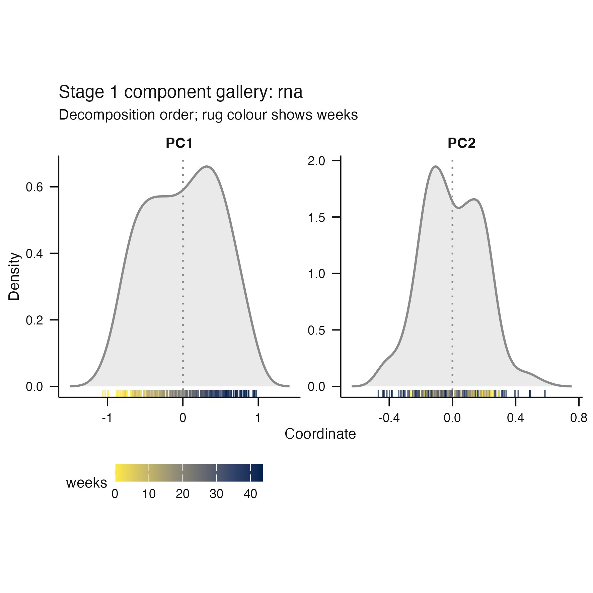
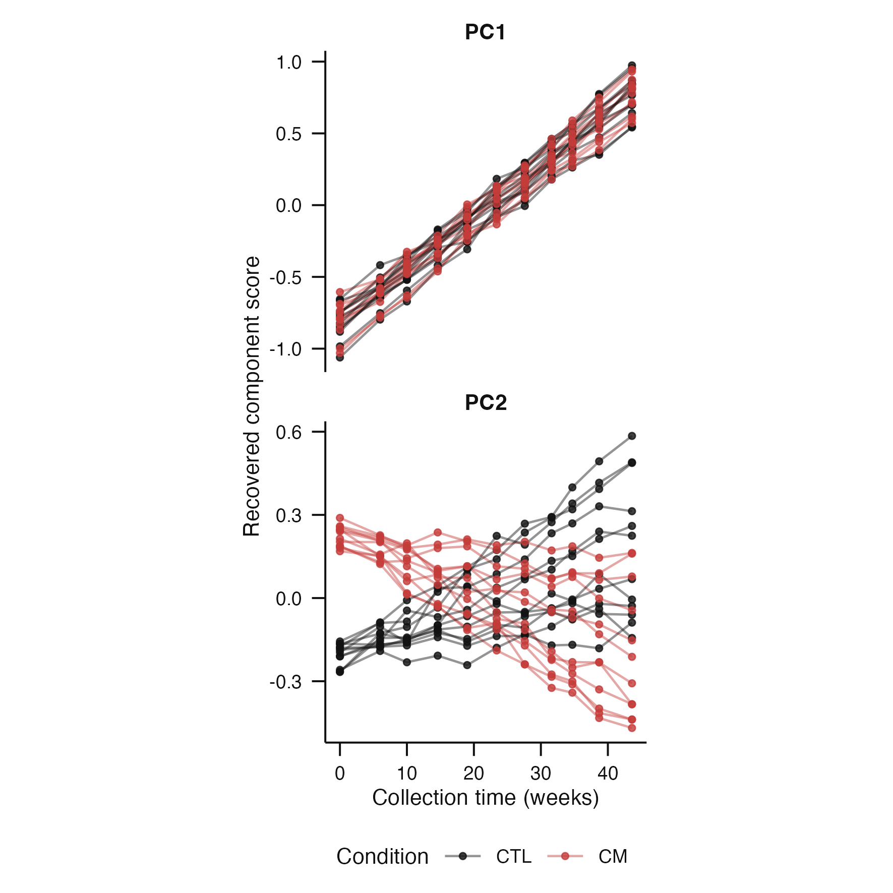
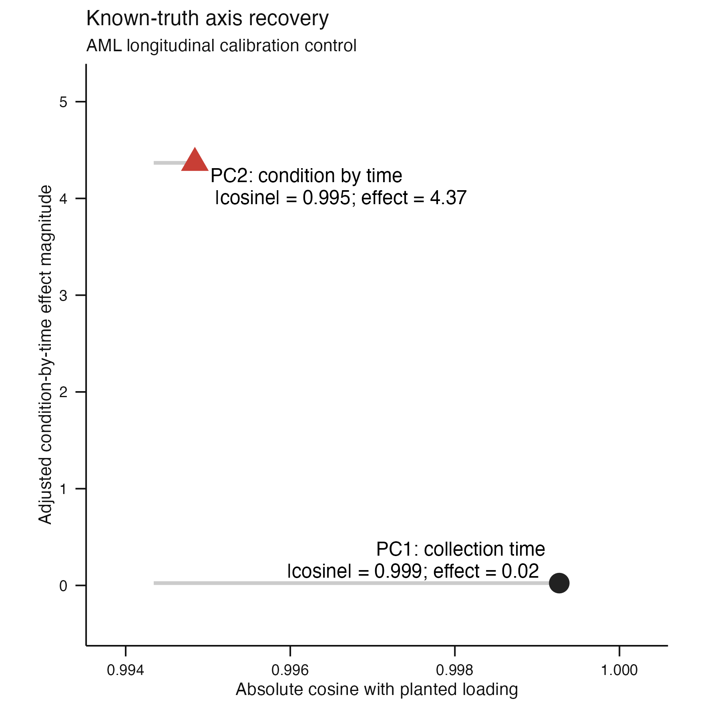
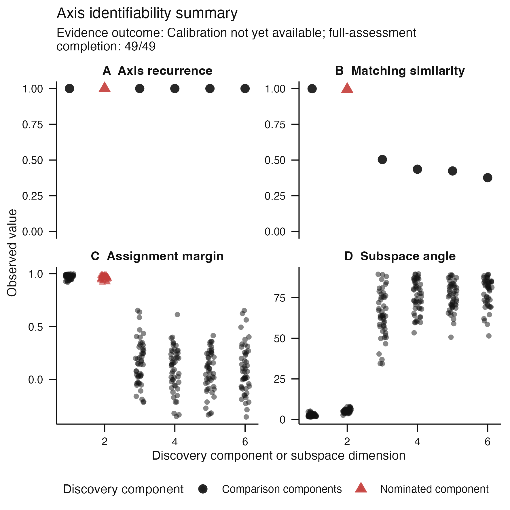

# Issue #67 visual landing proof

**Claim status:** calibration-only. These renders show that the AML-shaped
longitudinal control exercises the intended package contracts. They do not
freeze acceptance thresholds, consume the independent acceptance seeds from
issue #51, or close issue #67.

## Recovered components

| Condition encoding | Collection-time encoding |
|---|---|
|  |  |

The same two recovered components are shown with different declared metadata
encodings. Condition separates primarily on the non-dominant planted target,
while collection time changes primarily along the dominant nuisance direction.
The adjacent `*-caption.txt` files contain the exact separate captions returned
by `scientific_caption()`.

## Longitudinal structure and known-truth recovery

| Repeated synthetic mice | Target and nuisance recovery |
|---|---|
|  |  |

The trajectory render makes the repeated-subject design visible: every line is
one synthetic mouse, with 12 CTL and 12 CM mice sampled at the irregular
AML-informed weeks. The recovery map then separates two questions: whether an
axis recovers its planted loading and whether it carries the declared
condition-by-time effect. PC1 accurately recovers the stronger collection-time
nuisance axis but carries negligible biological effect; PC2 accurately recovers
the planted condition-by-time axis and is nominated. Its exact separate caption
is stored in `calibration-recovery-map-caption.txt`.

## Complete identifiability audit



The package's complete multi-axis surface retains recurrence, matching
similarity, assignment margin, and enclosing-subspace evidence after 49
complete-subject bootstrap refits. It remains the detailed audit view rather
than the first scientific result a reader must decode. Its exact dynamic caption
is stored in `identifiability-caption.txt`.

## Numerical and capability evidence

| Proposal rank | Component | Adjusted effect magnitude |
|---:|---:|---:|
| 1 | PC2 | 4.3675 |
| 2 | PC1 | 0.0240 |

The planted disease-divergence component is nominated ahead of the dominant
collection-time component. Components 3–6 are retained as non-estimable noise
comparisons in `proposal-ranking.tsv`, rather than silently removed.

| Component | Unadjusted effect | Batch-adjusted effect |
|---:|---:|---:|
| PC1 | 0.0240 | 0.0240 |
| PC2 | 4.3675 | 4.3675 |

Raw and adjusted repeated-time-course associations remain separately
inspectable in `unadjusted-component-effects.tsv` and
`adjusted-component-effects.tsv`. They agree here because the planted nuisance
is balanced: `batch-structure.tsv` records 66 observations in every
condition-by-batch cell (`CTL`/`CM` by `run_a`/`run_b`). The adjustment is still
executed and retained rather than inferred unnecessary from the balance.

| Target stability quantity | Observed fraction or mean |
|---|---:|
| Matched across refits | 1.000 |
| Mean absolute loading similarity | 0.995 |
| Same raw orientation | 0.388 |
| Same component index | 1.000 |
| Ranked first by repeated effect | 0.735 |

These quantities are deliberately separate. In particular, component identity
and loading agreement are highly recurrent while raw SVD sign orientation and
proposal rank recur less often. `target-stability.tsv` is the exact generated
table; no one quantity substitutes for another and no threshold is applied.

`adjusted-component-effects.tsv` records the repeated-time-course adjusted
effects used by the proposal. `loading-recovery.tsv` and
`subspace-recovery.tsv` compare the recovered loadings and enclosing subspace
with the disclosed planted truth without applying an acceptance threshold.
`stage2-boundary.txt` records the typed refusal to apply the cross-sectional KDE
landscape estimator to longitudinal observations. `calibration-result.rds`
retains the complete classed, digest-bearing result and provenance.

## Cold-reader conclusion

The package can generate a deterministic repeated-mouse AML-shaped control,
recover and distinguish its dominant collection-time direction from its weaker
condition-by-time direction, rank the declared biological effect, expose axis
and subspace recurrence, and stop at the declared Stage 2 capability boundary.
This is a visible implementation and calibration check, not scientific
acceptance evidence.

## Reproduction

```sh
Rscript scripts/render-issue-67-proof.R
Rscript -e 'devtools::test(filter = "stage0-aml-control")'
```
