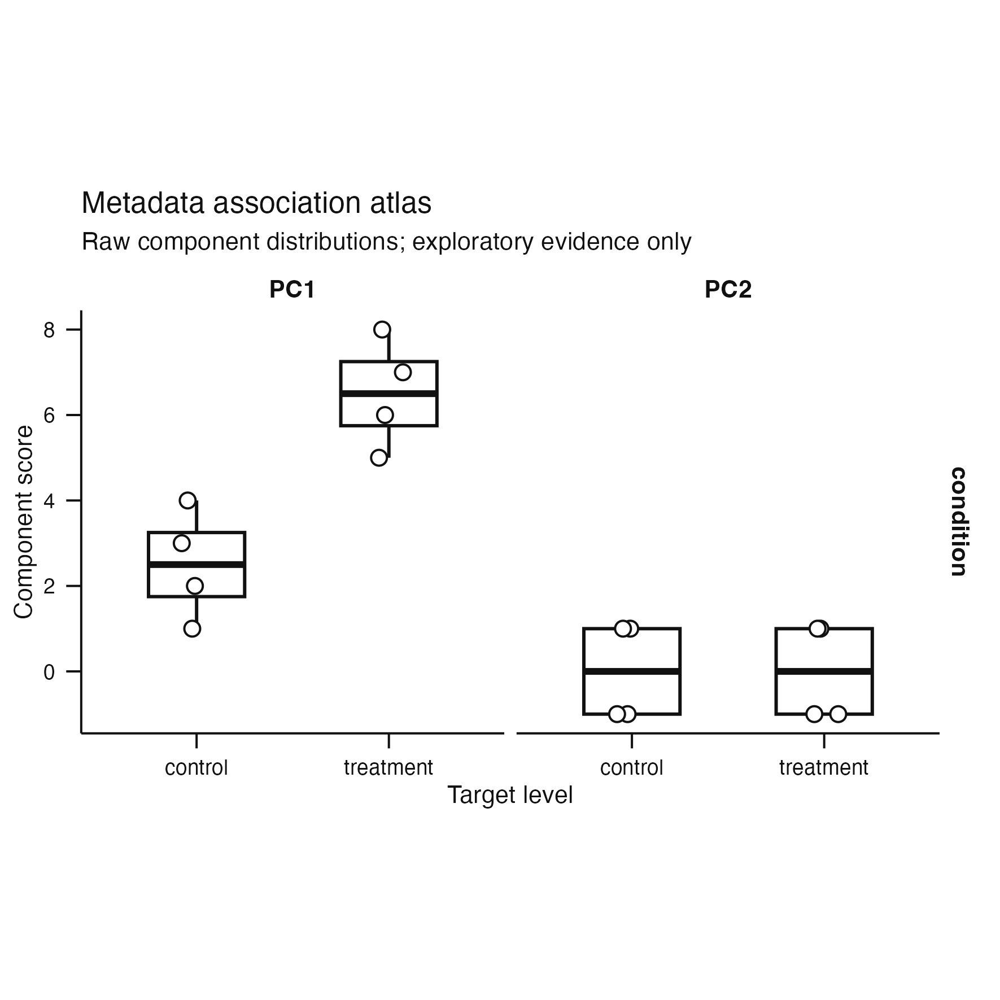
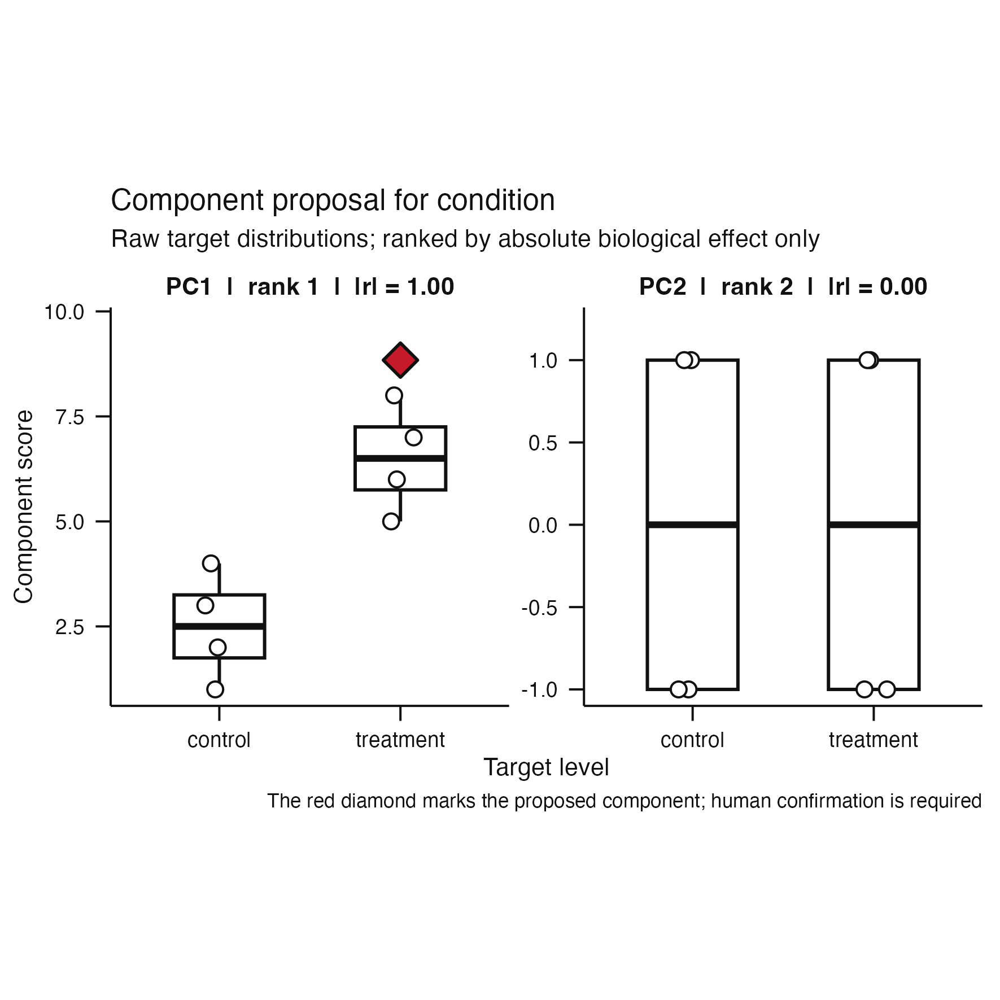
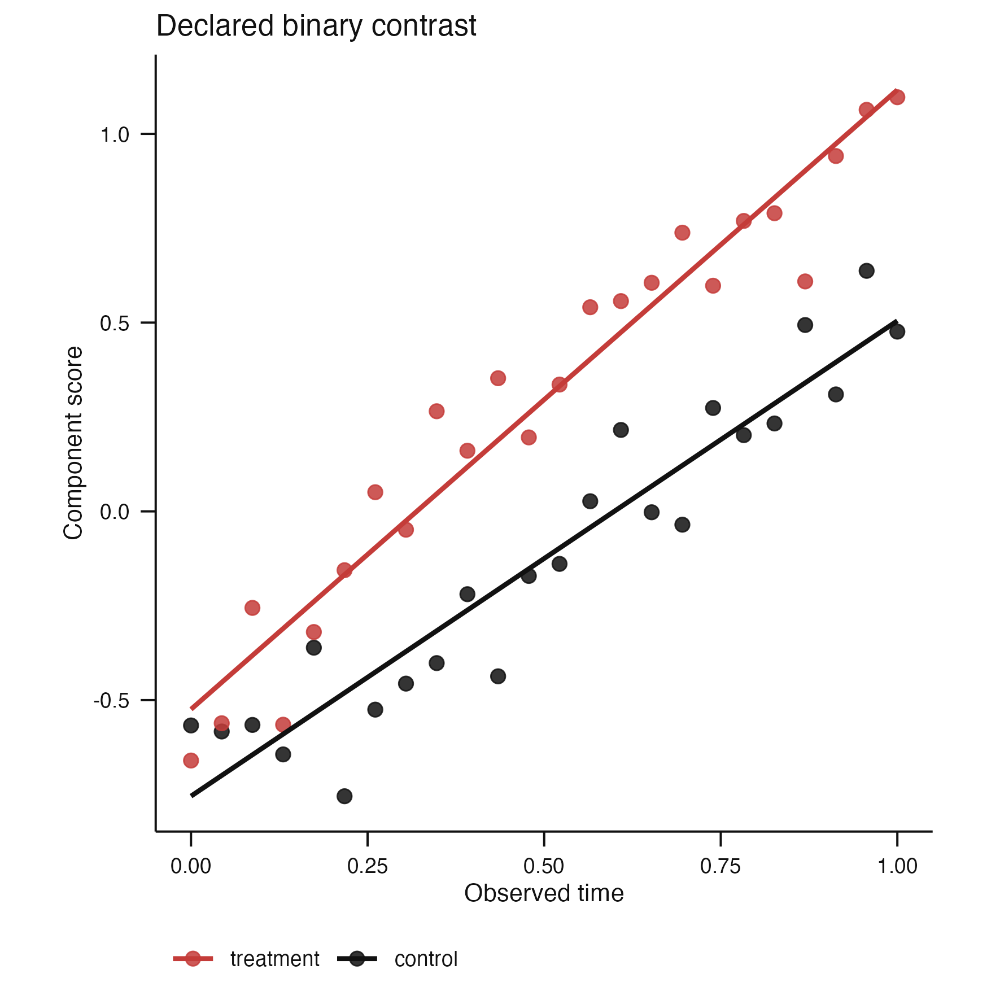
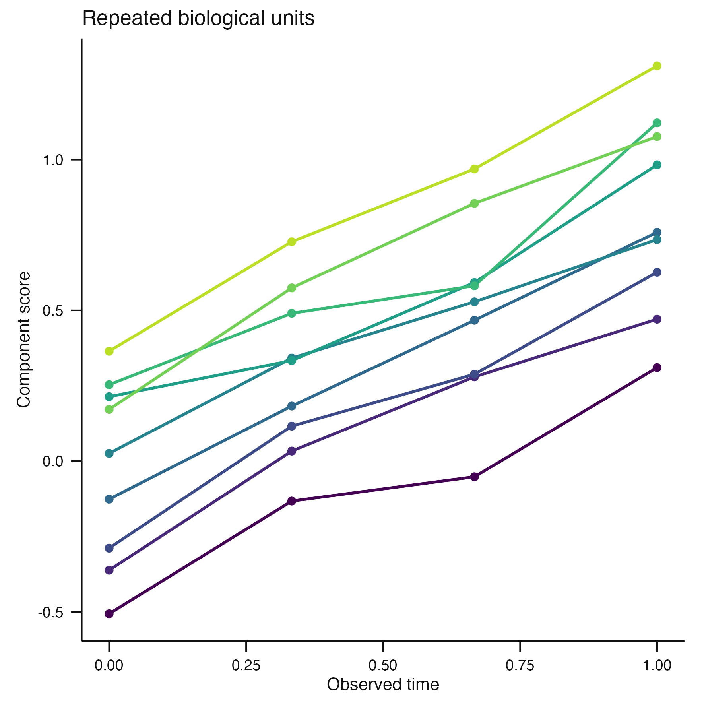
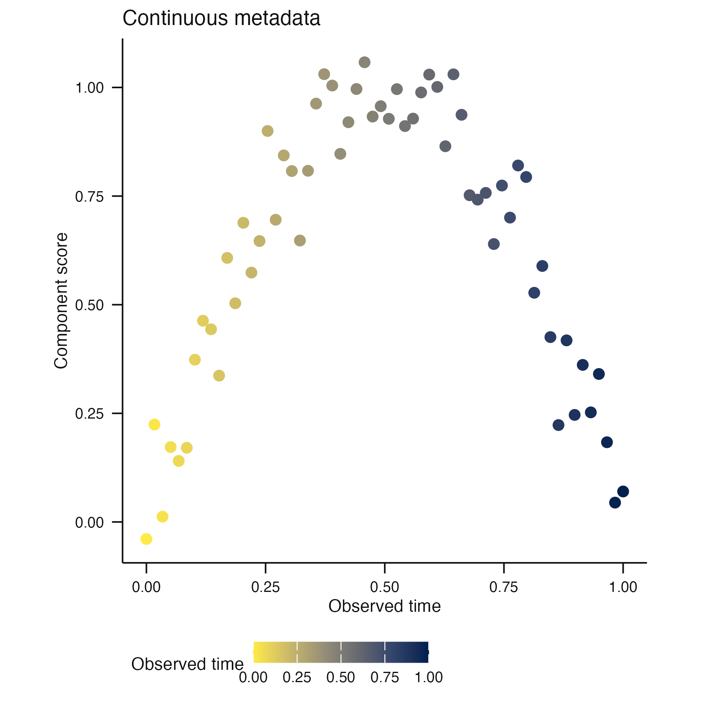
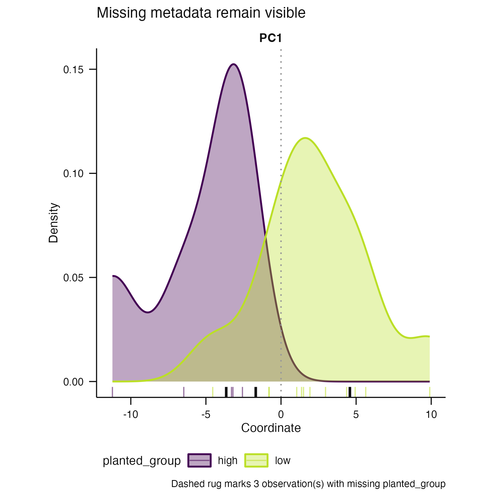

# Issue #79 publication visual grammar

**Claim status:** implementation proof only. These deterministic synthetic
figures demonstrate the visual API and complete binary interpretation path.
They do not validate a biological axis or establish a calibrated selection
rule.

## Metadata association atlas



The atlas displays only raw distributions stored as typed evidence by
`associate_metadata()`. The direction, overlap, and ambiguity of each binary
contrast remain visible without relying on colour. Supporting p-values do not
alter the display.

## Exploratory component proposal



The proposal consumes the atlas without refitting. A red diamond marks the
unique effect-first nomination by colour and shape. The proposal remains
exploratory and cannot become an `AnalysisSpecification` until a person calls
`confirm_component()` with an explicit decision and non-empty rationale.

## Declared binary contrast



For this palette demonstration, the caller explicitly declares the reference
and focal levels, so factor order does not decide which group receives the
restrained red highlight. In the association workflow, binary factor order
deterministically declares reference then comparison.

## Repeated biological units



The categorical scale remains legible beyond eight levels and does not reuse
the focal red as a claim about biological importance.

## Continuous metadata



Continuous metadata use a perceptually ordered, colour-vision-deficiency-aware
scale. All four figures share the same 100 mm square, minimal publication
grammar with visible axes and ticks.

## Missing metadata



Missing metadata remain present in the scientific distribution and are marked
with a separate dashed black rug plus an explicit count in the caption. They
cannot be mistaken for a level on the categorical colour scale.

## Observable contract

| Role | Visual contract |
|---|---|
| Structural marks | Black, white, and grey |
| Declared focal binary level | Restrained red |
| Categorical metadata | Unbounded discrete Viridis scale |
| Continuous metadata | Sequential Cividis scale |
| Missing metadata | Dashed black rug plus explicit caption |
| Default export | 100 mm square at 450 dpi |

## Reproduction

```sh
Rscript scripts/render-issue-79-theme-proof.R
Rscript -e 'devtools::test(filter = "plot-theme|component-interpretation")'
```
