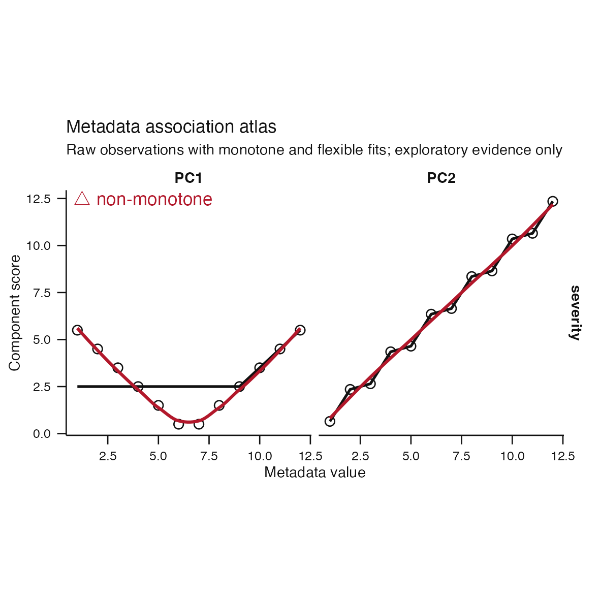
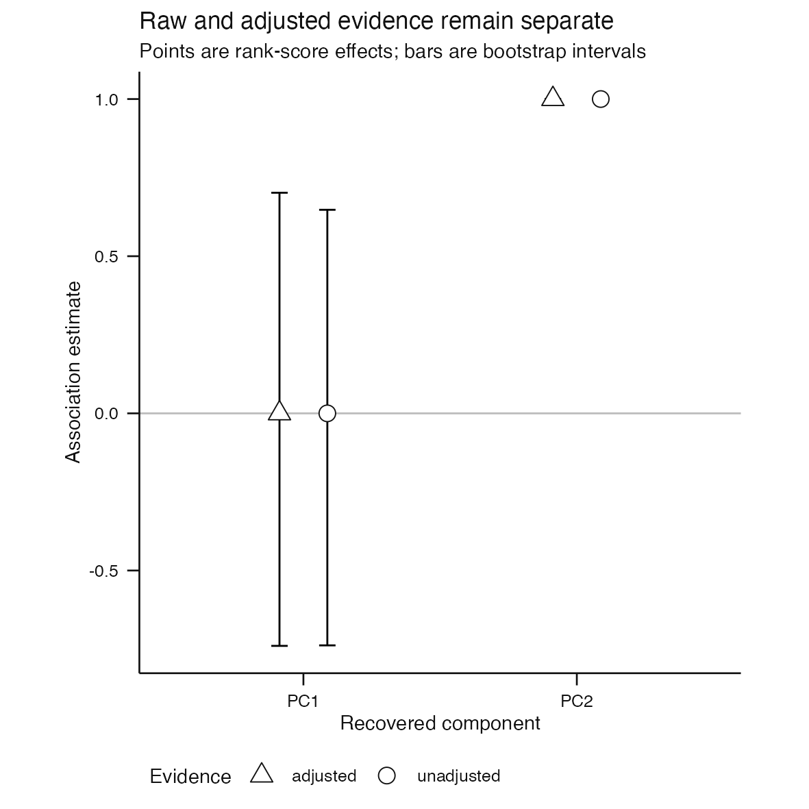
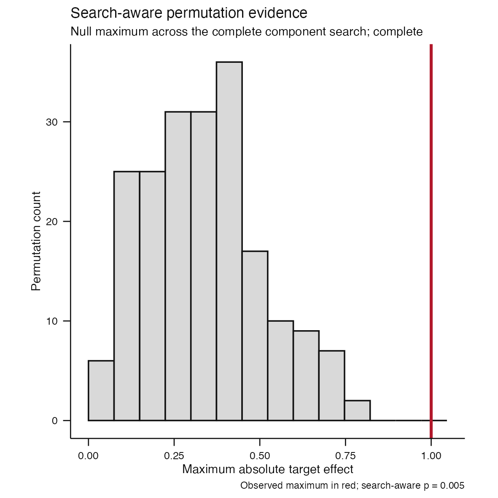
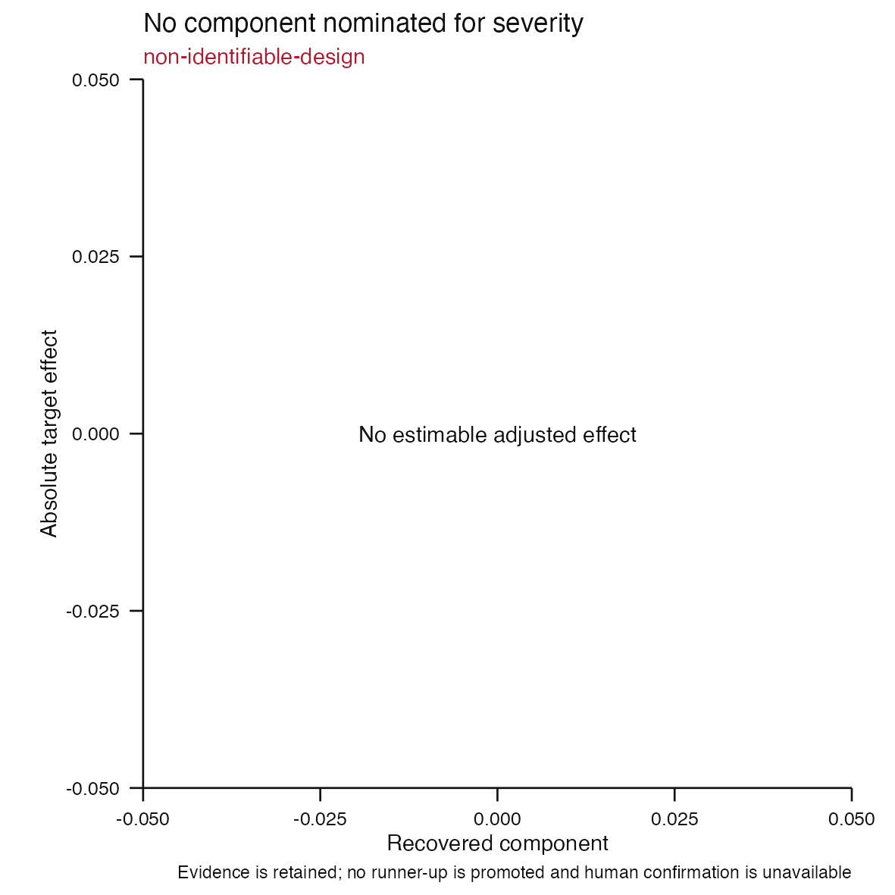
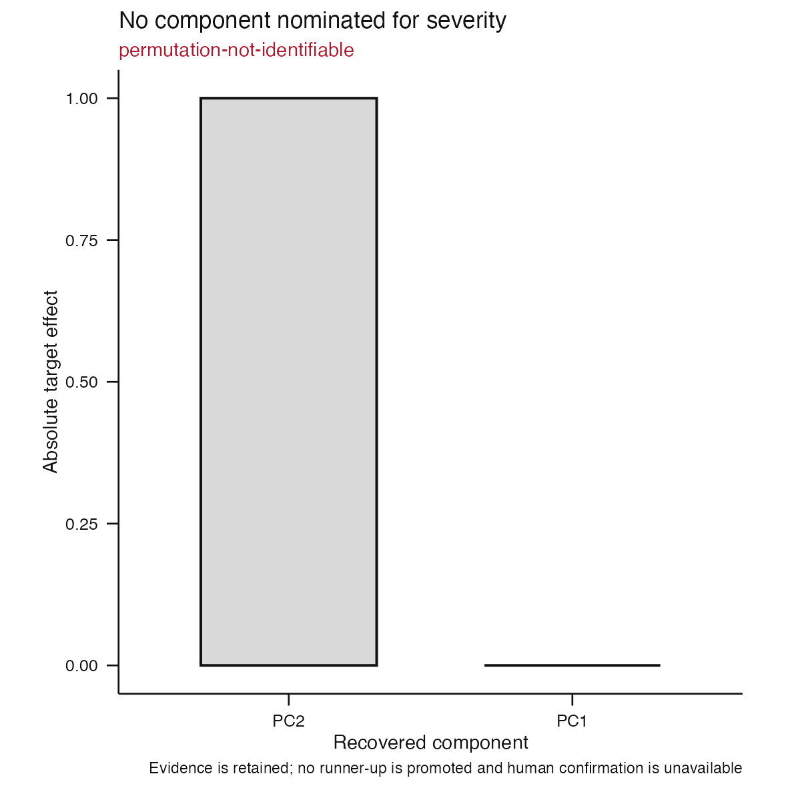

# Issue #80 visual landing proof

**Claim status:** implementation proof only. These deterministic synthetic
figures demonstrate the cross-sectional continuous, adjusted, resampled, and
search-aware permutation APIs. They do not validate a biological axis or
establish calibrated acceptance thresholds.

## Monotone and flexible decision surface



The atlas keeps raw observations visible. The black line represents the
predeclared monotone question using a constrained fit, and the red smoother is
descriptive only. PC1 has reversing level-wise medians and is marked
`possible-nonmonotone-association`; the warning cannot change ranking.

## Raw and adjusted evidence



Unadjusted and adjusted effects remain separate rows. Intervals resample whole
independent biological samples while preserving discrete target and nuisance
cells. The complete cohort, nuisance design, resampling plan, and failures are
recorded in typed evidence.

## Complete-search permutation null



Every nuisance-only residual permutation reconstructs null component scores and
repeats the complete eligible-component search. The red line is the observed
maximum. The reported p-value is search-aware supporting evidence and cannot
promote another component.

## Typed abstentions remain visible

| Adjustment failure | Permutation failure |
|---|---|
|  |  |

A target-confounded nuisance design retains raw evidence but has no estimable
adjusted effect. Missing declared target intent retains the point ranking but
cannot produce a search-aware p-value. Both are typed
`ComponentAbstention` objects and neither can cross the human-confirmation
boundary.

## Observable contract

| Decision point | Visible evidence | Structural boundary |
|---|---|---|
| Monotone target adequacy | Raw points, constrained monotone fit, flexible smoother, warning | Diagnostic cannot rerank |
| Nuisance adjustment | Raw and adjusted rows, cohort/design digests | Invalid design returns typed abstention |
| Association uncertainty | Bootstrap intervals and failure count | Stage 1 basis remains fixed |
| Search multiplicity | Null maxima and observed maximum | Invalid exchangeability returns no p-value |

## Reproduction

```sh
Rscript scripts/render-issue-80-proof.R
Rscript -e 'devtools::test(filter = "component-interpretation")'
```
