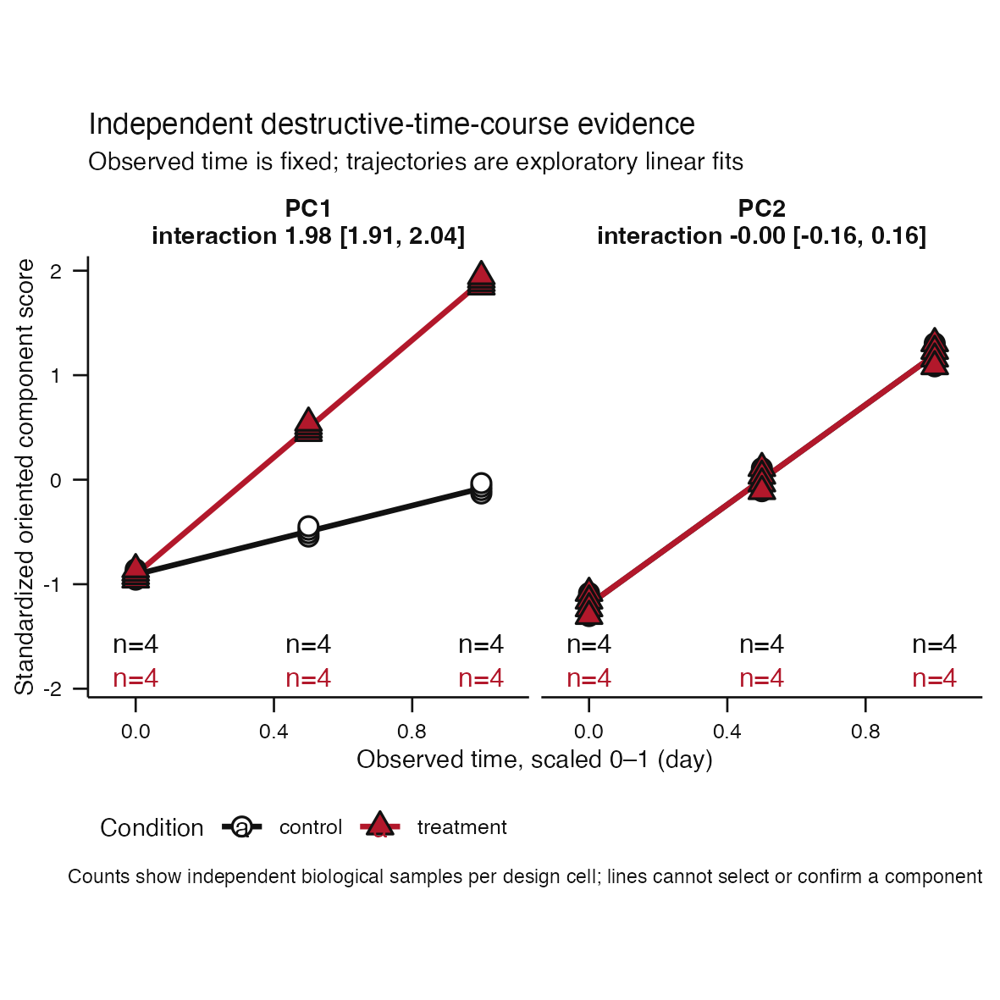
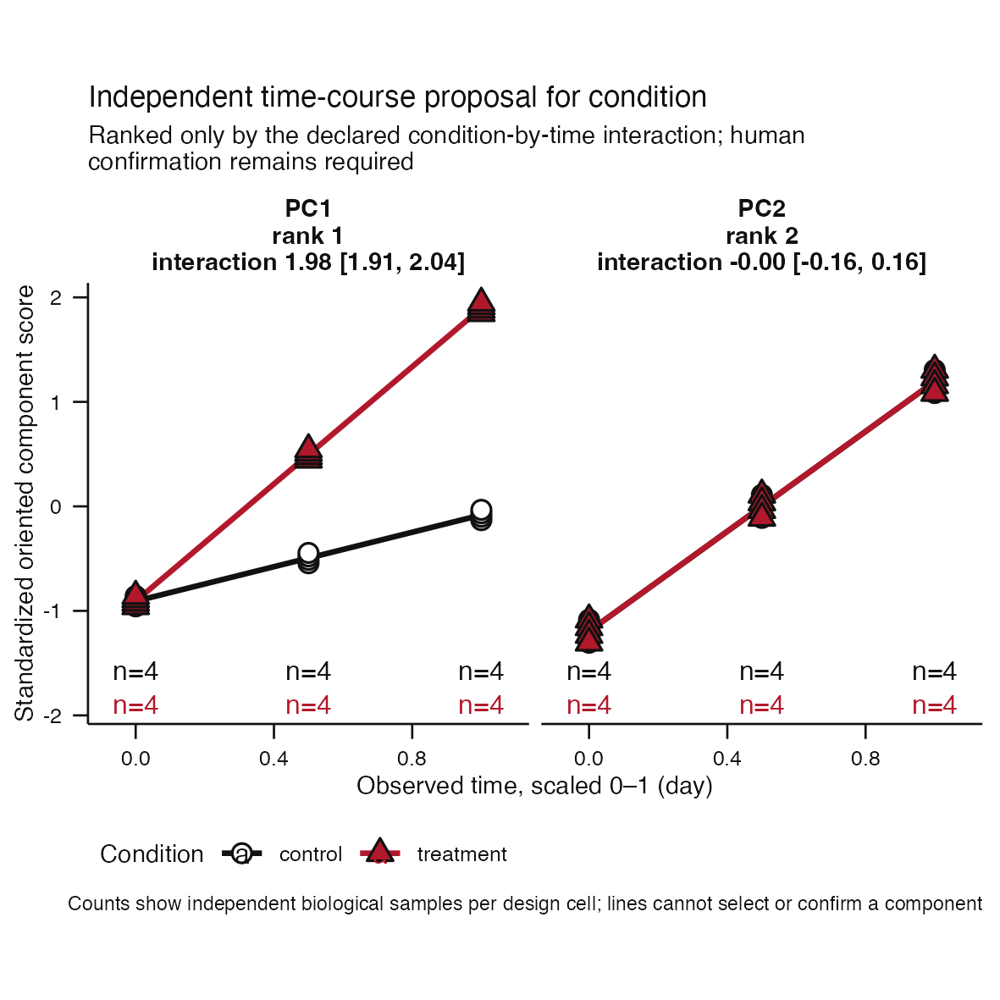
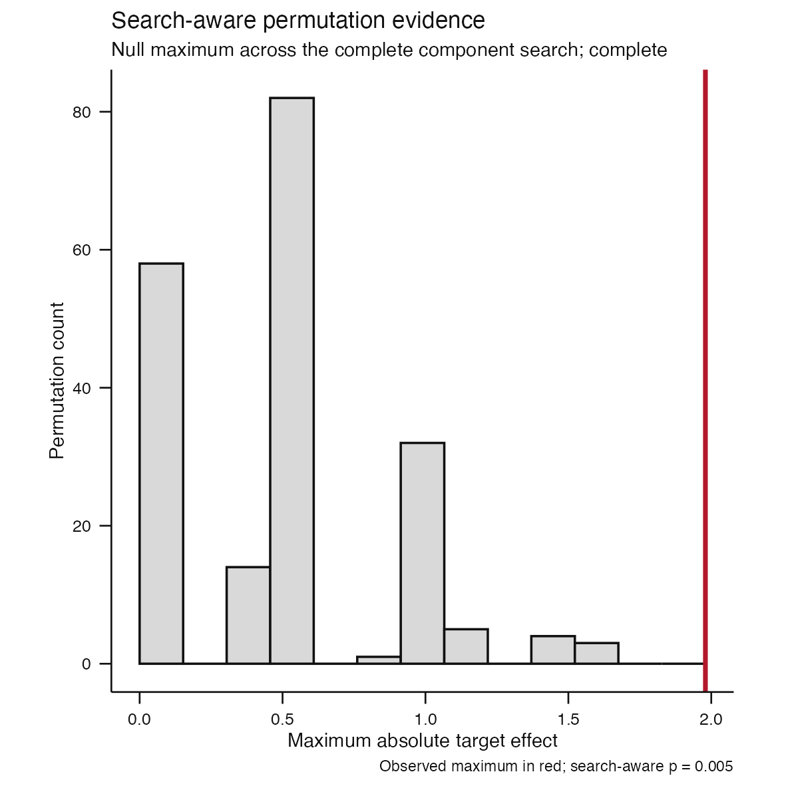
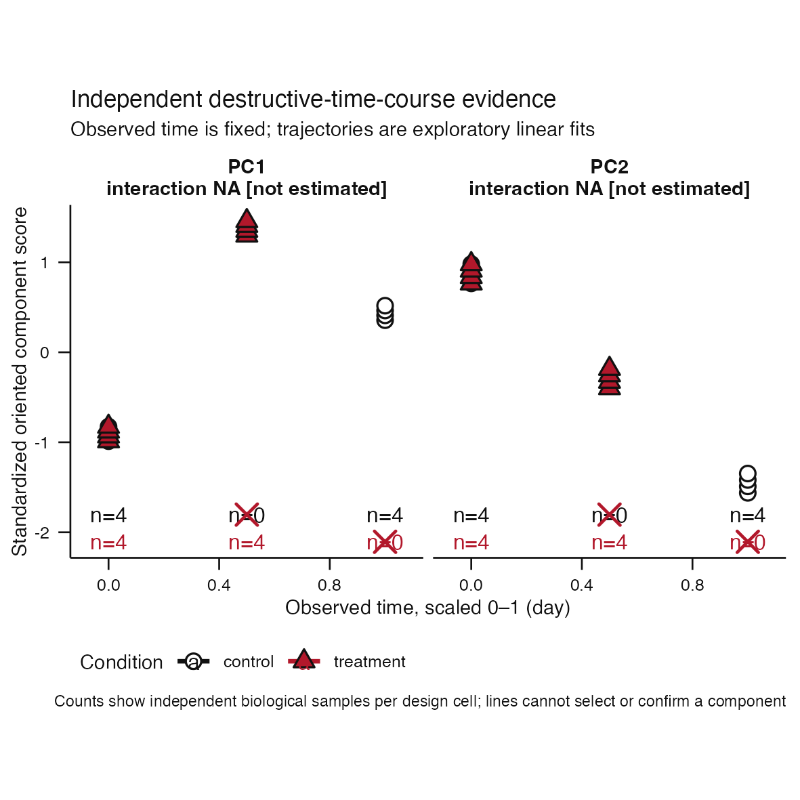
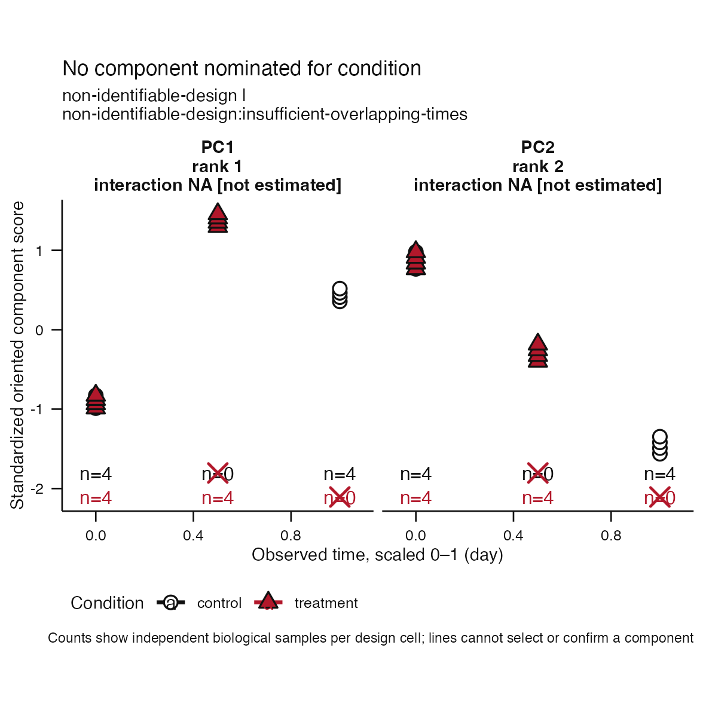

# Issue #81 visual landing proof

**Claim status:** implementation proof only. These deterministic synthetic
figures demonstrate the independent destructive-time-course association,
resampling, proposal, and abstention contracts. They do not validate a
biological axis or establish calibrated acceptance thresholds.

## Destructive-sampling trajectory evidence

| Complete atlas | Proposal |
|---|---|
|  |  |

Each point is a different canonical biological sample. Black and red identify
the declared reference and comparison conditions. The plot exposes the
observed condition-by-time cells, fitted trajectories, and stored uncertainty;
it does not infer a within-subject trajectory.

Scores are deterministically oriented and standardized to SD units. Observed
time is transformed to the recorded study-level 0--1 interval. The
proposal-eligible effect is the ordinary fixed-model condition-by-time
interaction, not a significance-selected coordinate.

## Search-aware evidence



The adjusted proposal uses nuisance-only residual permutation within fixed
observed-time blocks. Times are never permuted. Every permutation repeats the
complete eligible-component search, and the result remains exploratory.

## Invalid design remains visible

| Missing condition-by-time cells | Typed proposal abstention |
|---|---|
|  |  |

Both conditions must have independent replication at two or more overlapping
observed times. Missing cells remain visible in typed atlas provenance and the
canonical plot. The invalid design produces `non-identifiable-design`; no
runner-up can cross the separate human-confirmation boundary.

## Observable contract

| Decision point | Visible evidence | Structural boundary |
|---|---|---|
| Destructive sampling | Independent points, observed-time grid, cell counts | No invented subject trajectories |
| Trajectory divergence | Stored fixed-model lines and standardized interaction | Full-rank replicated overlap required |
| Association uncertainty | Condition-by-time-cell bootstrap intervals and failures | Failed resamples are counted |
| Search multiplicity | Null maxima and observed maximum | Fixed times are never permuted |
| Human decision | Separate proposal object | Abstention cannot be confirmed |

## Reproduction

```sh
Rscript scripts/render-issue-81-proof.R
Rscript -e 'devtools::test(filter = "independent-time-course")'
```
