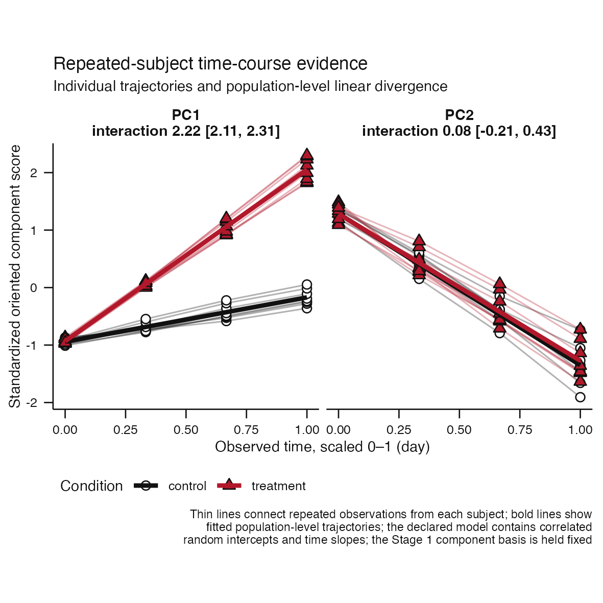
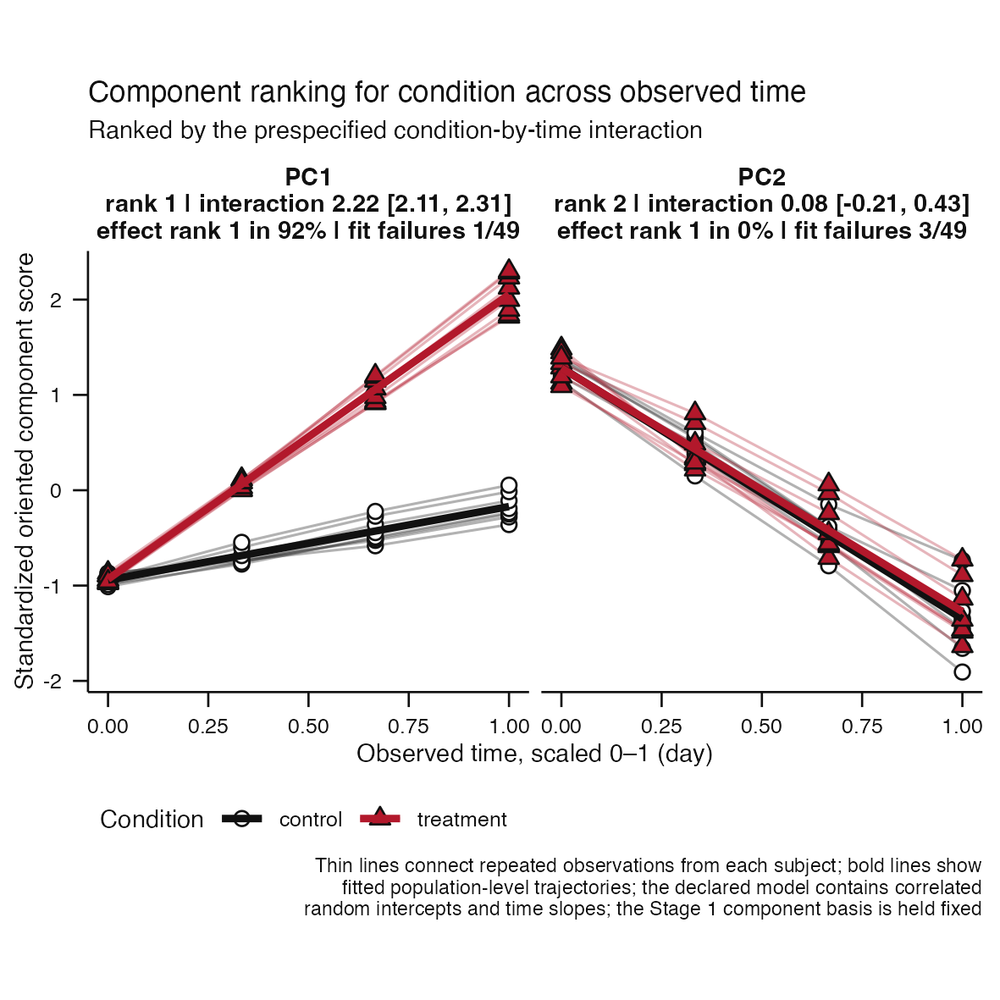
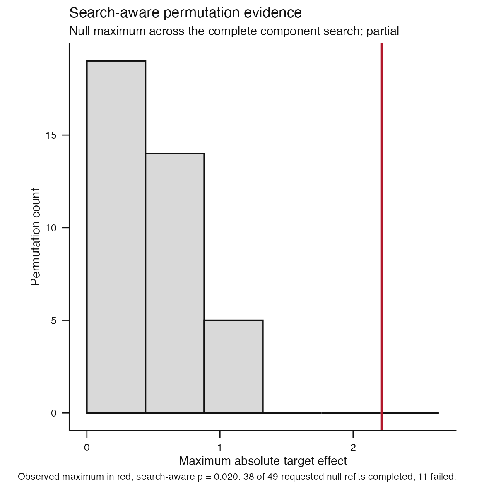
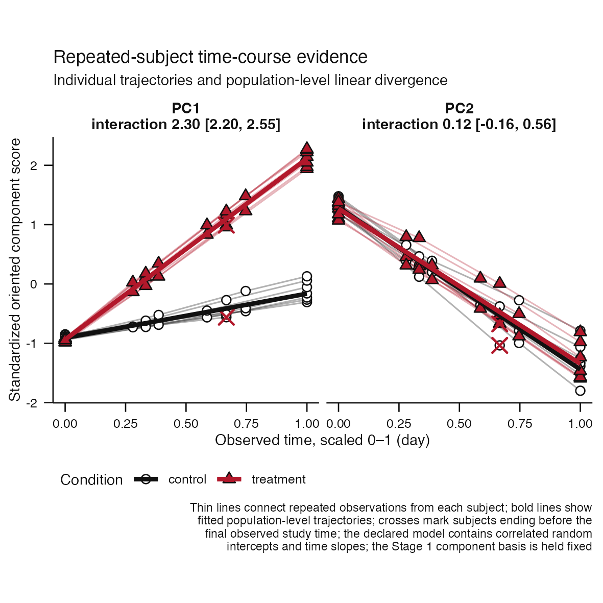
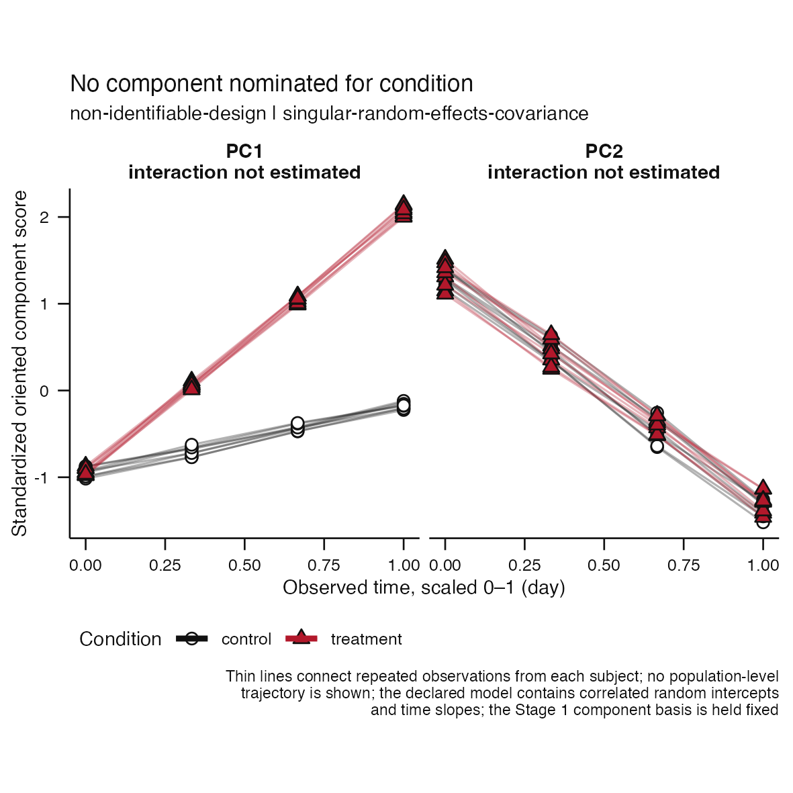

# Issue #82 visual landing proof

**Claim status:** implementation proof only. These deterministic synthetic
figures demonstrate repeated-subject association, whole-trajectory resampling,
proposal, and abstention contracts. They do not validate a biological axis or
establish calibrated acceptance thresholds.

## Repeated-subject trajectory evidence

| Complete atlas | Proposal |
|---|---|
|  |  |

Thin lines connect observations from the same synthetic subject. Black and red
identify the declared reference and comparison conditions. Bold lines are
fixed-effect population trajectories from a model containing correlated
subject-specific random intercepts and time slopes. The observed points remain
visible; the display does not replace them with model output.

Scores are deterministically oriented and standardized to SD units. Observed
time is transformed to the recorded study-level 0--1 interval. The
proposal-eligible effect is the condition-by-time interaction. It is not chosen
by significance.

## Subject-level search-aware evidence



Condition labels are reassigned only at the subject level and observed times
remain fixed. Every valid permutation repeats the complete eligible-component
search. Failed fits remain in the requested denominator, and the result remains
exploratory.

## Sampling and model limitations remain visible

| Irregular sampling and dropout | Singular-model abstention |
|---|---|
|  |  |

Crosses mark subjects whose last observation precedes the final observed study
time. Fitted condition lines stop at the observed support of each condition.
A singular random-effects covariance produces a typed abstention with native
diagnostics. The strategy does not simplify to a random-intercept-only or
independent-observation model.

## Observable contract

| Decision point | Visible evidence | Structural boundary |
|---|---|---|
| Repeated sampling | Individual trajectories and observed times | Subject identity is a design field, never a target |
| Trajectory divergence | Population lines and standardized interaction | Correlated random intercept and time slope required |
| Association uncertainty | Whole-trajectory bootstrap interval and failures | Duplicate draws receive fresh subject identifiers |
| Search multiplicity | Null maxima and observed maximum | Condition moves only between complete subjects |
| Model adequacy | Native convergence and singularity diagnostics | No silent model simplification |
| Analyst decision | Separate proposal or typed abstention | Exploratory evidence is not biological truth |

## Reproduction

```sh
Rscript scripts/render-issue-82-proof.R
Rscript -e 'devtools::test(filter = "repeated-time-course")'
```
