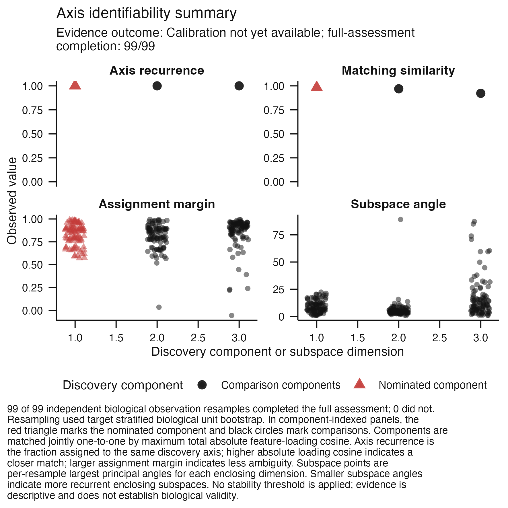

# Issue #83 visual landing proof

**Claim status:** implementation proof only. This synthetic example shows the
complete evidence workflow and public 100 mm decision surface. Its structured
outcome is `not-calibrated`; it does not establish a universal stability
threshold, axis recovery, or biological support.



The red triangles identify the uniquely nominated discovery component; black
circles retain the remaining search set. The primary surface exposes
individual-axis recurrence, mean loading-match similarity, assignment
ambiguity, and enclosing-subspace angles. Its dynamic caption defines the
encodings, biological resampling unit, joint one-to-one matching rule,
completion status, and uncalibrated claim boundary. The complete nine-panel
audit surface remains available through
`plot_component_identifiability(proposal, view = "diagnostic")`, where
component identity, per-resample recurrence, proposal rank, orientation,
spectrum, and completion remain visible.

The exact per-replicate assignments and rank recurrence remain available in
[`component-recurrence.tsv`](component-recurrence.tsv);
[`recurrence-summary.tsv`](recurrence-summary.tsv) provides one row per frozen
reference component. [`assessed-proposal.rds`](assessed-proposal.rds) preserves
the complete digest-bound evidence, including similarity matrices, competing
assignments, sampling draws, failures, and provenance.

## Reproduction

```sh
Rscript scripts/render-issue-83-proof.R
Rscript -e 'devtools::test(filter = "axis-identifiability")'
```
