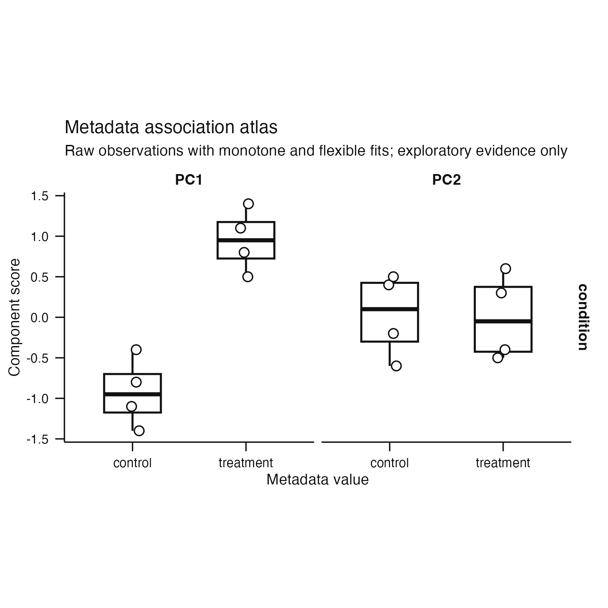
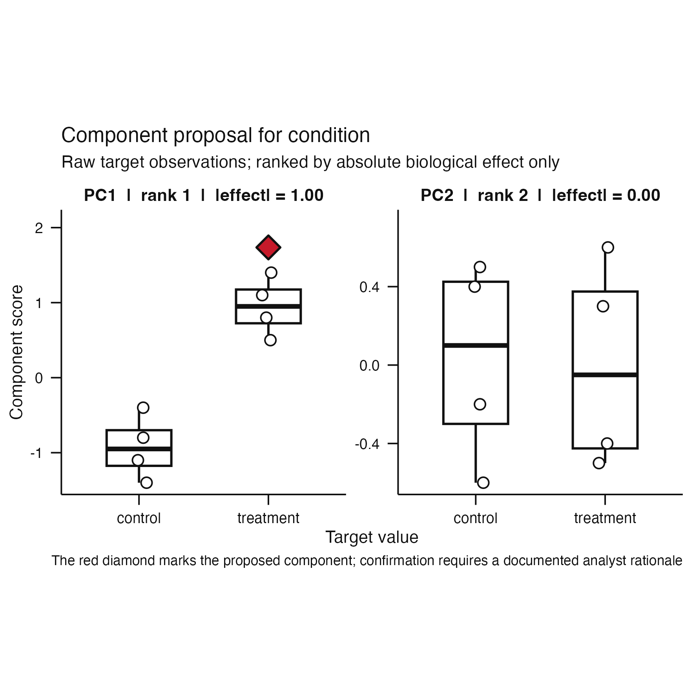
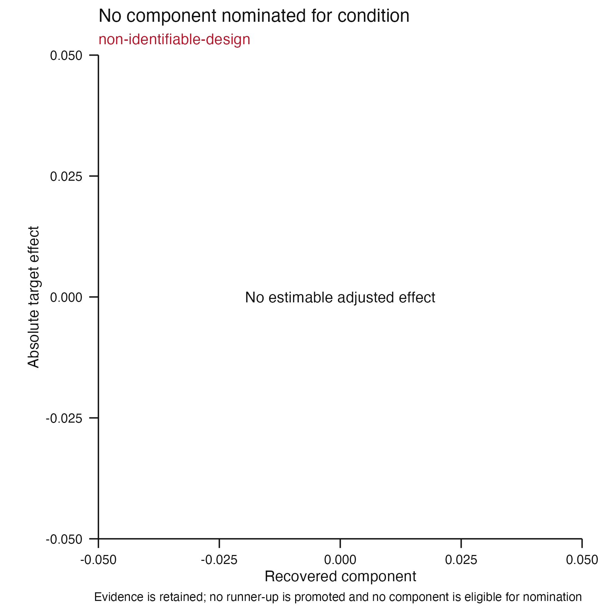

# Issue #91 visual landing proof

**Claim status:** architecture and implementation proof only. These
deterministic synthetic artifacts show that the established cross-sectional
workflow still produces its public atlas, proposal, and typed abstention while
the package owns and validates their complete evidence contract. They do not
establish component identifiability, biological recovery, or an acceptance
threshold.

## Unchanged public workflow

| Metadata-association atlas | Component-selection proposal |
|---|---|
|  |  |

Registered cross-sectional strategies retain the ADR 0020 estimands. Public
plotting and effect-first proposal behavior are unchanged. The atlas artifact
is rendered directly through `plot(atlas)` and all raster artifacts use the
package's 100 mm square, 450 dpi publication export contract.

## Typed non-identifiability remains visible



Raw evidence remains available when adjustment is non-identifiable, but the
workflow does not substitute a weaker adjusted estimate or nominate another
component.

## Inspectable evidence contract

[`evidence-contract.txt`](evidence-contract.txt) records the normalized
association, observation, and exclusion counts; deterministic table and
cohort-membership digests; and available-case cohort summaries. The same values
are available through the inspection-friendly `atlas_evidence_contract()`
summary and checked by `MetadataAssociationAtlas` validity.

## Reproduction

```sh
Rscript scripts/render-issue-91-proof.R
Rscript -e 'devtools::test(filter = "cross-sectional-evidence-contract|component-interpretation")'
```
