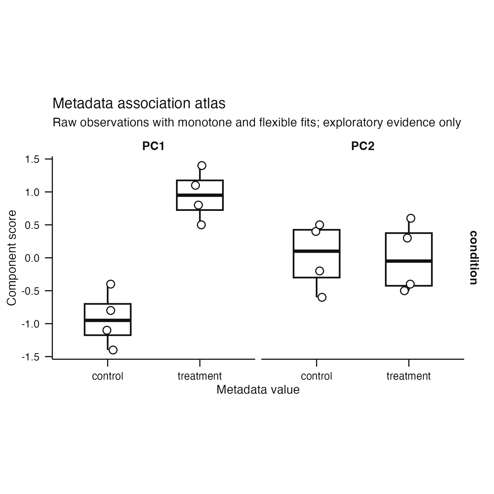
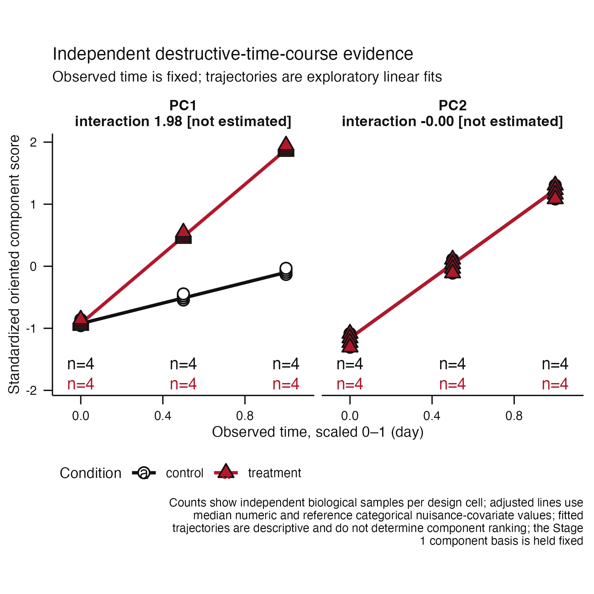
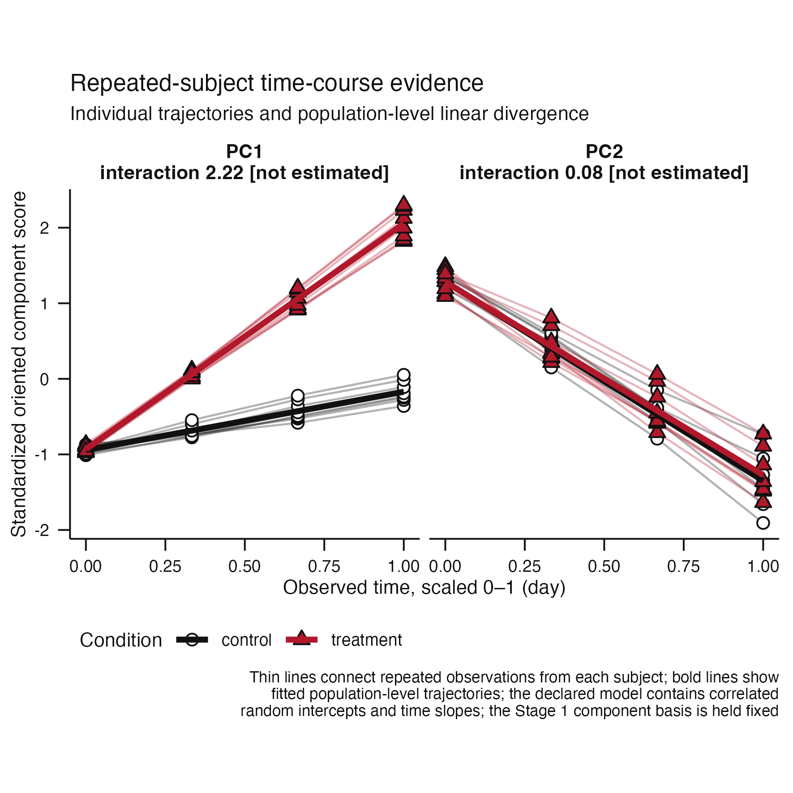

# Issue #92 visual landing proof

**Claim status:** architecture and implementation proof only. These synthetic
outputs demonstrate that all supported interpretation workflows cross one
validated evidence boundary while retaining their distinct public scientific
displays. They do not establish axis identifiability, biological recovery, or
an acceptance threshold.

## One evidence shape, three sampling designs

| Cross-sectional samples | Independent destructive time course | Repeated subjects |
|---|---|---|
|  |  |  |

Each image is the actual `plot(atlas)` result, exported through the package's
100 mm square, 450 dpi publication helper. The displays remain intentionally
different: independent samples show condition-by-time support, whereas
repeated observations retain subject trajectories, dropout, and mixed-model
diagnostics.

[`evidence-contracts.tsv`](evidence-contracts.tsv) compares the shared public
contract fields and normalized row counts. The module versions remain distinct
because the sampling units, exchangeability rules, models, and abstention
conditions are not interchangeable.

## Reproduction

```sh
Rscript scripts/render-issue-92-proof.R
Rscript -e 'devtools::test(filter = "(cross-sectional-evidence-contract|independent-time-course-interpretation|repeated-time-course-interpretation)")'
```
