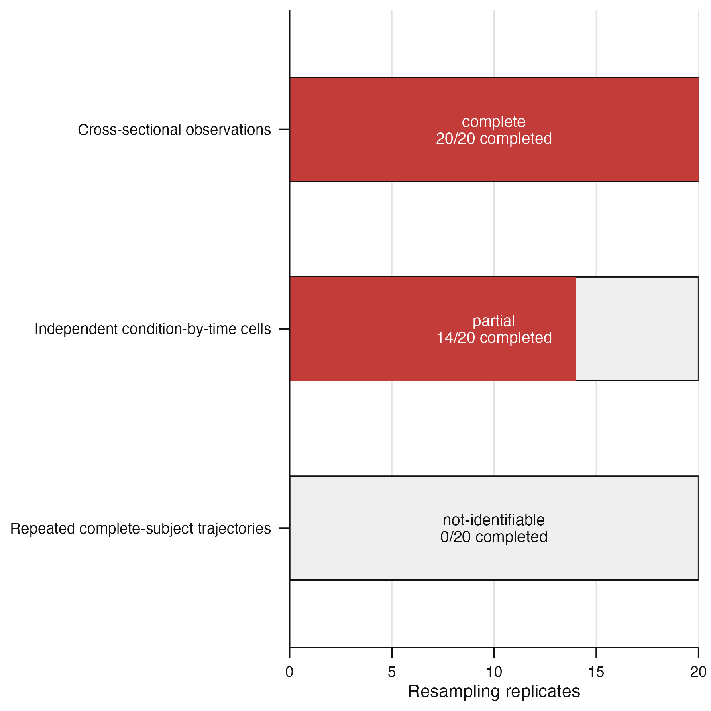

# Issue #93 visual landing proof

**Claim status:** architecture and implementation proof only. These synthetic
outcomes demonstrate the package-owned accounting contract across the three
supported sampling designs. They do not establish a stability threshold or a
biological result.



*Figure caption.* **Design-preserving resampling outcomes under a shared package
policy.** Bars show 20 requested bootstrap replicates for representative
cross-sectional, independent time-course, and repeated-subject designs; red
segments show completed refits, black outlines mark the fixed requested
denominator, and labels report status and completion. The cross-sectional plan
completed all 20 refits, the
condition-by-time-cell plan retained six failed refits and therefore reported
partial evidence, and the complete-subject-trajectory plan retained all 20
failed refits and reported a non-identifiable outcome. These synthetic outcomes
demonstrate deterministic accounting and typed failure semantics only; no
scientific stability threshold is applied.

[`resampling-policy-summary.tsv`](resampling-policy-summary.tsv) records the
method, biological unit, requested, completed, and failed counts, status, plan
digest, and accounting digest for each design. The serialized
[`resampling-policy-accounts.rds`](resampling-policy-accounts.rds) retains the
normalized typed accounting records.

## Reproduction

```sh
Rscript scripts/render-issue-93-proof.R
Rscript -e 'devtools::test(filter = "resampling-policy")'
```
