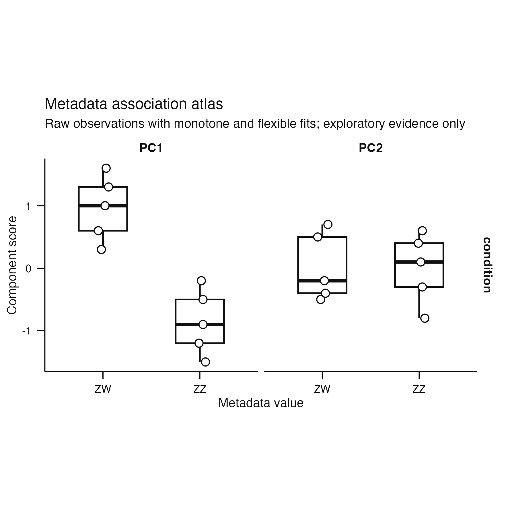
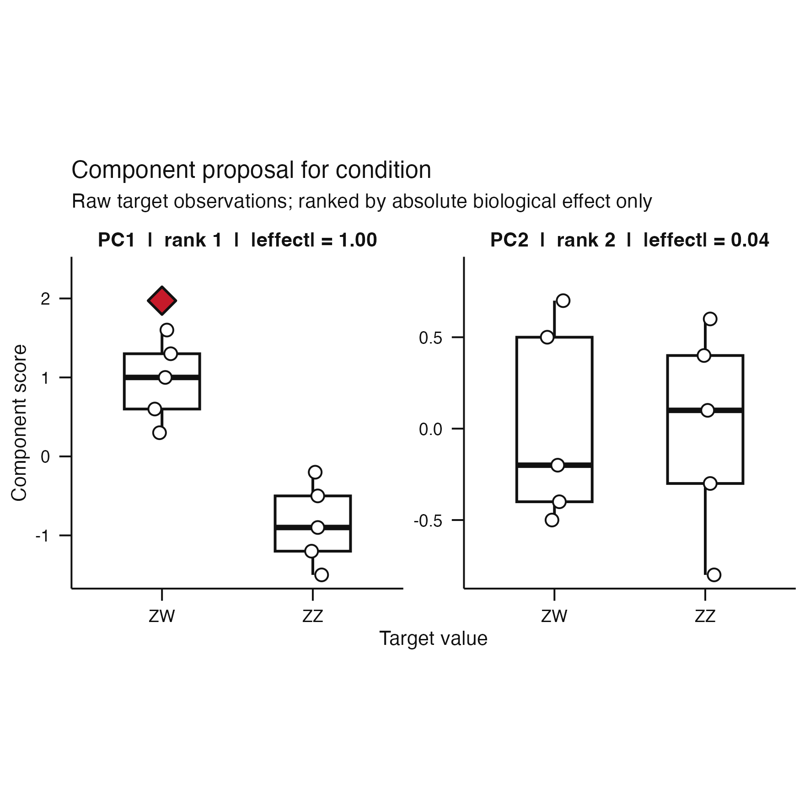
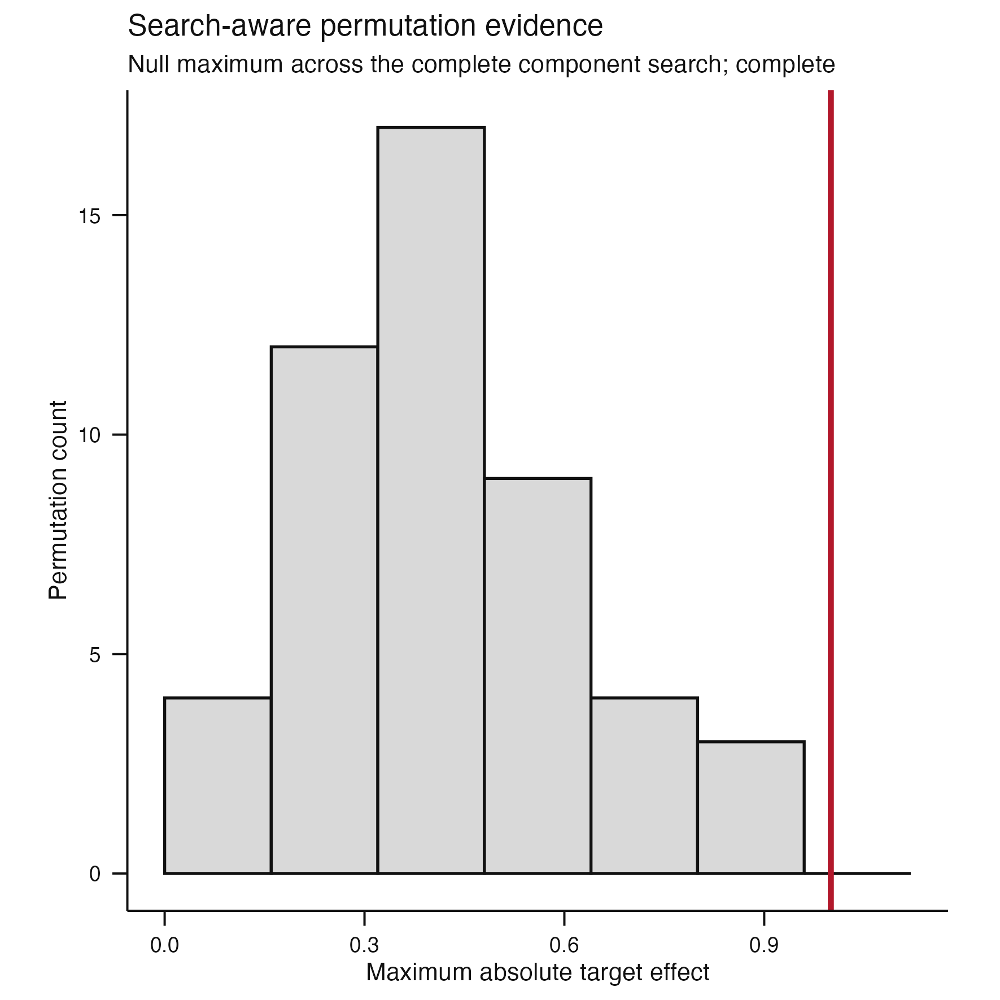
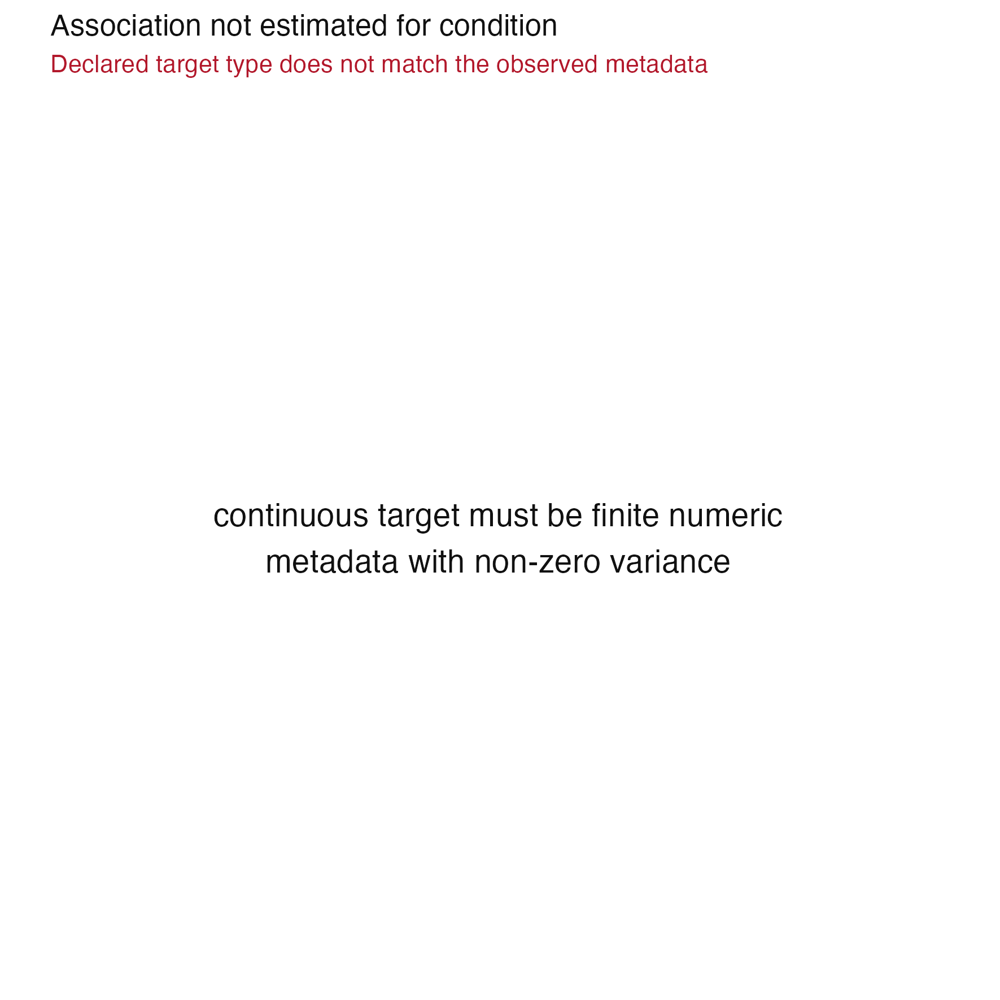
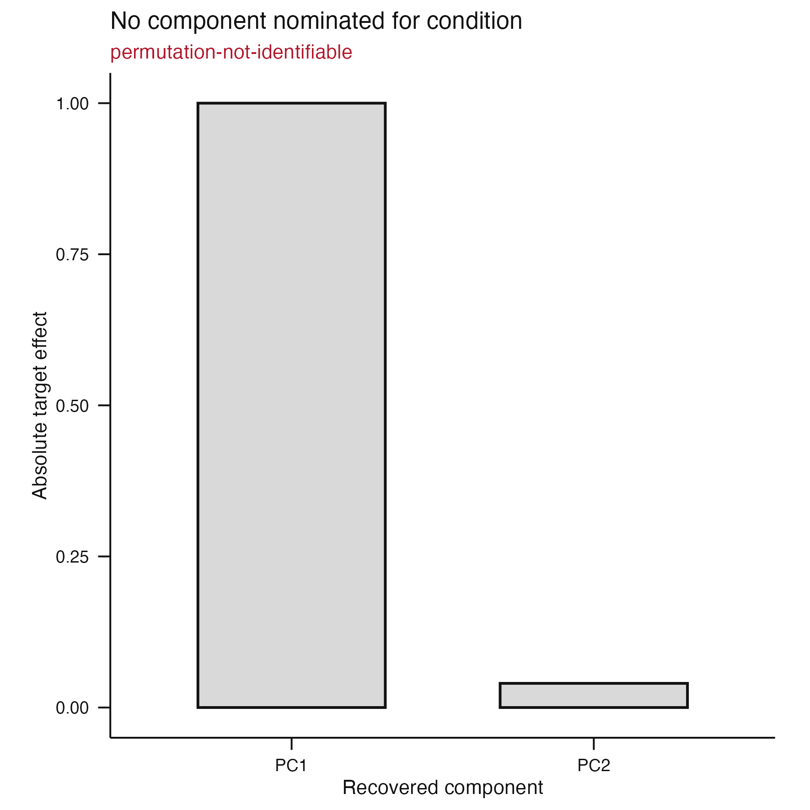
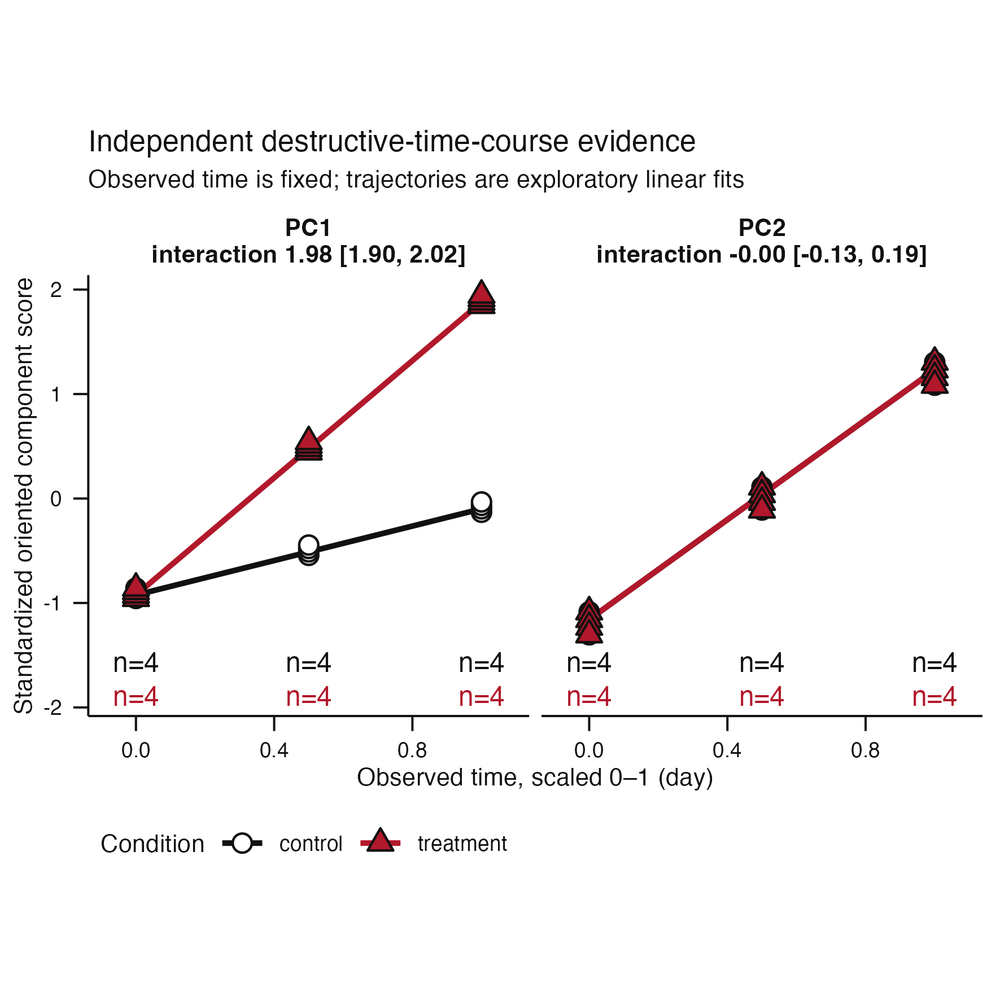
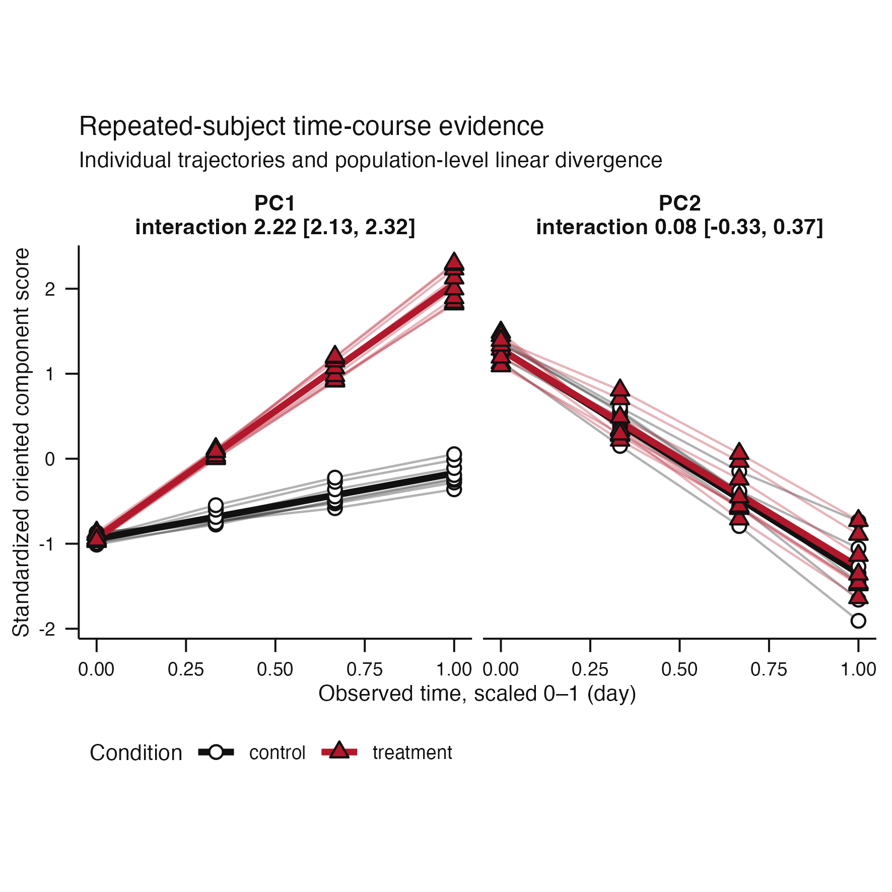

# Issue #94 visual landing proof

**Claim status:** architecture and rendering proof only. These synthetic
figures show that canonical ggplot outputs and separate captions consume one
validated typed evidence view. They do not establish biological validity,
coordinate recovery, or an acceptance threshold.

## Cross-sectional decision sequence

| Atlas | Proposal | Search-aware uncertainty |
|---|---|---|
|  |  |  |

The corresponding pre-migration atlas is retained in the
[#92 proof](../issue-92/cross_sectional-atlas.png), and the earlier proposal is
retained in the [#91 proof](../issue-91/component-proposal.png). The new figures
preserve ordinary ggplot output while flexible and monotone fits, ranks,
nomination markers, null maxima, and caption facts arrive through
`VisualEvidenceView`.

## Structured non-results

| Association unavailable | Nomination unavailable |
|---|---|
|  |  |

Both figures retain the recorded diagnostic or finite search evidence without
substituting an estimand or promoting a runner-up.

## Design-specific time-course evidence

| Independent destructive sampling | Repeated subjects |
|---|---|
|  |  |

Independent sampling retains condition-by-time cell counts and empty cells.
Repeated sampling retains subject paths and dropout endpoints. Both render
stored population trajectories, intervals, and recurrence summaries without
refitting inside ggplot.

Every PNG is the actual public `plot()` result inspected at the package default
100 mm square size. Each adjacent `*-caption.txt` file is the exact separate
caption returned by `scientific_caption()`.
[`visual-evidence-inspection.tsv`](visual-evidence-inspection.tsv) records the
typed surface, state, row counts, display fields, and caption size for every
artifact.

## Reproduction

```sh
Rscript scripts/render-issue-94-proof.R
Rscript -e 'devtools::test(filter = "(visual-evidence-view|component-interpretation|independent-time-course-interpretation|repeated-time-course-interpretation|scientific-caption-contract)")'
```
