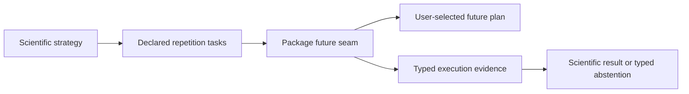

# Resampling and execution architecture

The scientific resampling design and the compute backend are separate
authorities. ADRs and frozen specifications decide what constitutes a valid
resample; this module executes those declared repetitions reproducibly.

## Dependency direction

Modules migrated to the shared repetition contract define stable task
identities, shared immutable inputs, the per-task calculation, and the accepted
failure policy. Those modules call the future-backed repetition seam rather
than `lapply()`, `vapply()`, or a private parallel loop. The execution module
owns deterministic stream derivation, future dispatch,
requested/completed/failed accounting, ordered result collection, and
execution provenance. This currently covers association resampling and
permutation plus Stage 1 summary bootstraps. Axis-identifiability execution has
not yet crossed this seam and must not be treated as governed by these
invariants until it is migrated.

The package never chooses the user's future plan. Sequential execution remains
the default future backend; local multisession, batchtools, and scheduler-backed
plans are external configuration. Nested callers may request sequential
internal execution to avoid accidental nested parallelism. Package functions
may expose scheduling controls but must not silently set workers or a cluster.

## Owned invariants

- A declared run seed and stable task identity determine each task stream.
- Results are returned in task order regardless of completion order.
- Task failures remain typed and counted; they are not silently dropped.
- Execution provenance records the compute tier, RNG kind and derivation,
  task identities, and completion account.
- Adapters may serialize and report execution evidence but may not reinterpret
  the scientific resampling unit or acceptance threshold.
- Backend equivalence is tested at accepted workloads before a migration is
  claimed; runtime and serialization are measured before defaults change.

Detailed contributor rules and current future controls are documented in
[`execution-reproducibility.md`](../agents/execution-reproducibility.md). This
architecture record does not select an HPC scheduler or define a scientific
bootstrap; those decisions remain outside the module.
