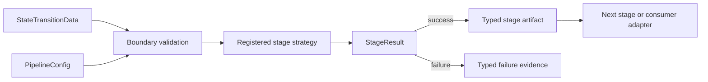

# Stage pipeline architecture

The pipeline separates validated data, registered scientific strategies, typed
stage outcomes, and orchestration. ADRs decide scientific algorithms; this
document records the dependency direction common to every stage.

## Dependency direction

`StateTransitionData` is the single inter-stage container. `PipelineConfig`
declares strategy choices. Boundary validation runs before computation, and
the registry resolves a strategy through its VIRTUAL interface. A stage always
returns `StageResult`: success carries the stage's typed artifact and failure
carries structured evidence. Raw exceptions and untyped values do not cross a
stage boundary.

Downstream code reads stored Stage 1 and Stage 2 artifacts through
`stage_artifact()` and `has_stage_artifact()` rather than indexing container
metadata directly. Plot preparation adapts stored stage evidence through the
visual-evidence architecture; it is not part of the scientific stage and
cannot change stage success. Artifact migration policy remains separately
scheduled work and is not invented here.

## Ownership boundaries

- Stage contracts own accepted input and output types, not concrete algorithms.
- Registered strategies own scientific computation and strategy-specific
  validation.
- Stage wrappers own boundary validation, typed failure conversion, provenance,
  and attachment of validated artifacts.
- `run_pipeline()` is the sequential development runner. Production DAG,
  checkpoint, retry, and scheduler policy belongs to external orchestration.
- A later stage may depend on an earlier typed artifact but must not reach into
  another strategy's private helpers or storage layout.

The constructor and provenance details are documented in
[`core-construction-and-provenance.md`](core-construction-and-provenance.md).
Current support and next work remain in [`ROADMAP.md`](../../ROADMAP.md), not in
this architecture record.
