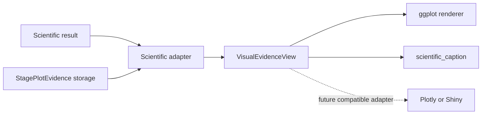

# Typed visual evidence

`VisualEvidenceView` is the single consumer contract for user-facing scientific
figures. Scientific result adapters return a validated view with a named
surface, structured state, stored observations and summaries, diagnostics,
display-ready values, and the caption facts describing those same values.

`StagePlotEvidence` remains the digest-bound storage payload for Stage 1 and
Stage 2, preserving serialized-object compatibility. It is not a parallel
consumer API: `visual_evidence()` adapts it to `VisualEvidenceView`, and Stage
renderers consume that view. The adapter validates its payload and the
`StateTransitionData` adapter also checks the stored source digest. Invalid,
stale, absent, or failed automatic preparation becomes a view with state
`missing` and an explicit reason.

## Authority boundary

Adapters may validate stored evidence, align declared display metadata, and
shape already-computed values for a named surface. Renderers may choose marks,
scales and layout. Neither may refit scientific models, smooth observations,
rank components, invent thresholds, or change the scientific result.

Automatic display preparation is best-effort. Its failure is stored as display
unavailability and cannot convert a successful scientific stage into failure.
Explicit `prepare_plot_evidence()` remains strict because its requested action
is evidence preparation itself.

Static ggplot output and the separate `scientific_caption()` text are canonical.
Future interactive adapters must consume the same view and receive no new
scientific authority.
