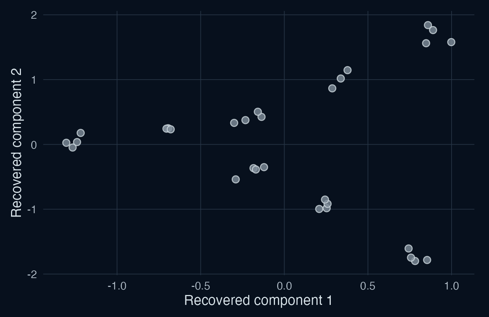
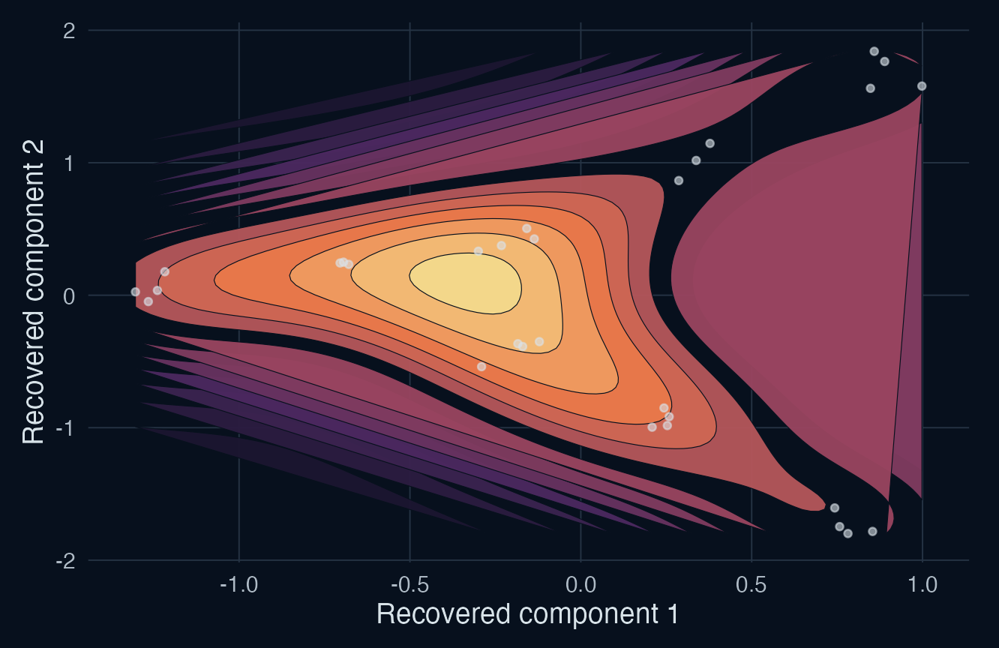
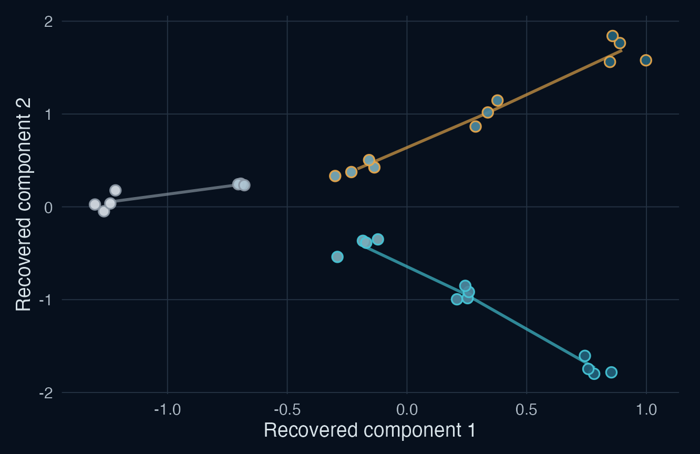
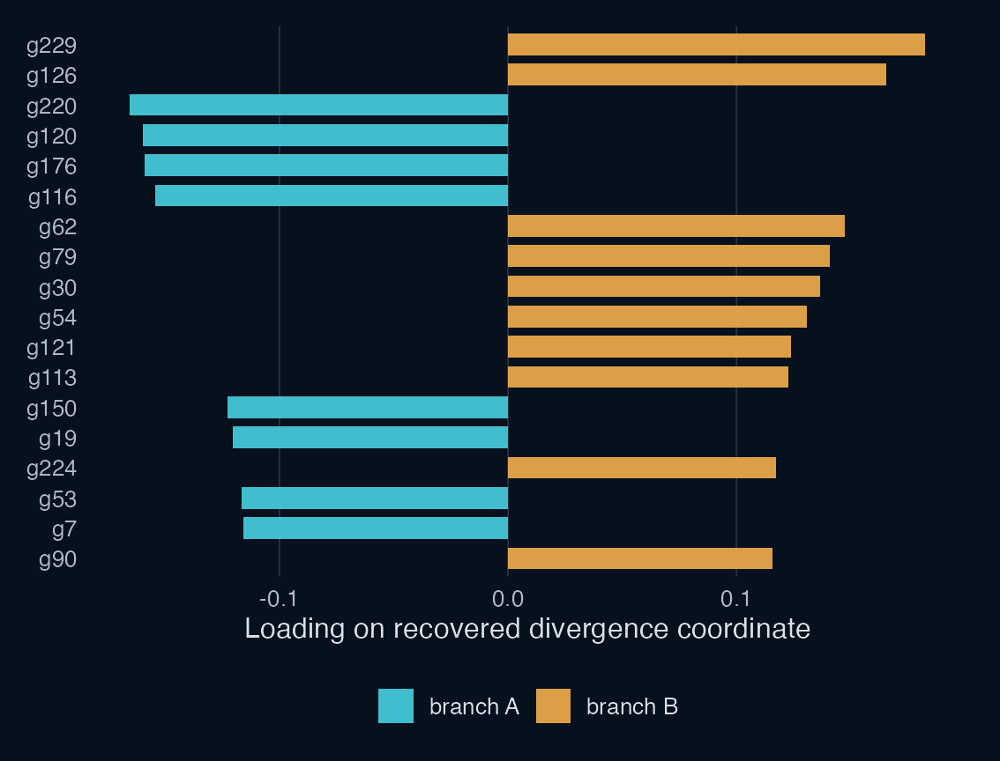

AN R PACKAGE IN DEVELOPMENT

# landscapeR

## Mapping biological state transitions from molecular data

<em>Pogona</em> sex development as one example

Denis O'Meally City of Hope 22 July 2026

<!--
About 40 seconds. Introduce landscapeR as a general package for mapping biological state transitions from high-dimensional molecular data. Pogona is the motivating developmental example, not the sole intended application.
-->

---

# Study design sets the interpretation

<svg viewBox="0 0 260 118" role="img" aria-label="Independent embryos sampled across developmental stages">
  <g class="sample"><circle cx="42" cy="45" r="7"/><circle cx="42" cy="63" r="7"/><circle cx="91" cy="39" r="7"/><circle cx="91" cy="57" r="7"/><circle cx="91" cy="75" r="7"/><circle cx="145" cy="36" r="7"/><circle cx="145" cy="56" r="7"/><circle cx="145" cy="76" r="7"/></g>
  <g class="branch-a"><circle cx="201" cy="32" r="7"/><circle cx="221" cy="32" r="7"/></g><g class="branch-b"><circle cx="201" cy="72" r="7"/><circle cx="221" cy="72" r="7"/></g>
  <text x="24" y="17">independent cohorts</text><text x="182" y="21">later states</text>
  <path d="M45 106 C96 94 158 114 222 100 M216 96 L224 100 L217 106" class="time-arrow"/><text x="8" y="108">Time</text>
</svg>
<h2><em>Pogona</em></h2><strong>Developmental divergence</strong>
Independent embryos sampled at observed stages
<small>Group structure, not tracked embryo paths</small>

<svg viewBox="0 0 260 118" role="img" aria-label="Repeated measurements within subjects">
  <path d="M45 26 C96 17 151 30 216 18 M45 54 C97 66 151 43 216 55 M45 82 C101 73 154 89 216 76" class="subject-line"/>
  <g class="sample"><circle cx="45" cy="26" r="7"/><circle cx="128" cy="24" r="7"/><circle cx="216" cy="18" r="7"/><circle cx="45" cy="54" r="7"/><circle cx="128" cy="52" r="7"/><circle cx="216" cy="55" r="7"/><circle cx="45" cy="82" r="7"/><circle cx="128" cy="80" r="7"/><circle cx="216" cy="76" r="7"/></g>
  <text x="8" y="30">1</text><text x="8" y="58">2</text><text x="8" y="86">3</text>
  <path d="M45 106 C96 94 158 114 222 100 M216 96 L224 100 L217 106" class="time-arrow"/><text x="8" y="108">Time</text>
</svg>
<h2>AML</h2><strong>Disease progression</strong>
Repeated measurements within mice across time
<small>Subject-aware trajectories</small>

<svg viewBox="0 0 260 118" role="img" aria-label="Independent donors sampled across ordered clinical states">
  <g class="sample"><circle cx="46" cy="46" r="7"/><circle cx="46" cy="66" r="7"/><circle cx="112" cy="40" r="7"/><circle cx="112" cy="60" r="7"/><circle cx="112" cy="80" r="7"/><circle cx="190" cy="46" r="7"/><circle cx="190" cy="66" r="7"/></g>
  <text x="25" y="18">state 1</text><text x="93" y="18">state 2</text><text x="171" y="18">state 3</text>
  <path d="M45 106 C96 94 158 114 222 100 M216 96 L224 100 L217 106" class="time-arrow"/><text x="8" y="108">Time</text>
</svg>
<h2>Type 1 diabetes</h2><strong>Ordered clinical states</strong>
Independent donors sampled across declared states
<small>Cross-sectional progression structure</small>

The independent sampling unit, observed time and repeated structure remain explicit.

<!--
About 70 seconds. Contrast three familiar designs. Pogona has destructive sampling of independent embryos across observed developmental stages. The AML work follows the same subjects through time. Type 1 diabetes samples independent donors across ordered clinical states. Emphasize that these designs support different claims and resampling schemes.
-->

---

LANDSCAPER SYNTHETIC CONTROL
# Molecular data define the coordinate system

  
genes
● ● ● ● ● ● ● ● ● ● ● ● ● ● ● ● ● ● ● ● ● ● ● ● ● ● ● ● ● ●
<i>samples</i>

  
→

  
<b>Outcome-blind decomposition</b>
Sex, stage and temperature are not used to fit the axes.
<small>Known-truth branching control, about four independent animals per visible cluster and 240 features</small>

<!--
About 65 seconds. This is an executable landscapeR synthetic control, not a drawing. The generator creates independent samples at five stages, embeds a two-dimensional branching structure in 240 expression features, and the registered SVD recovers a low-dimensional coordinate system. Labels were withheld while fitting the axes.
-->

---

SAME SYNTHETIC CONTROL
# Sample density defines a descriptive landscape

  
U(x) = -log p(x)

  
Dense regions correspond to frequently observed states.

  
Sparse regions correspond to higher terrain between them.

  
This describes sample occupancy. It is not physical energy and it does not establish a developmental path.

Rockne et al. 2020, <em>Cancer Res.</em> &nbsp; Frankhouser et al. 2024, <em>Leukemia</em>

<!--
About 65 seconds. Explain the equation in plain language. Density becomes height after applying minus log. Frequently occupied states are low; sparse regions are high. State the caveat clearly: destructive cross-sectional samples do not demonstrate that an embryo moved along a plotted route.
-->

---

SAME SYNTHETIC CONTROL
# Metadata gives the geometry biological meaning

  
<strong>Observed stage</strong>
Orders independent cohorts in developmental time.

  
<strong>Terminal state</strong>
Interprets the later divergence after the axes are fitted.

  
<strong>Temperature and genotype</strong>
Remain separate variables for later comparison.

  
The lines summarize group means. They are not embryo trajectories.

<!--
About 60 seconds. Add observed stage and terminal state after decomposition. Stage orders the cohorts. Terminal state interprets the late split. Temperature and genotype remain explicit variables. The lines are summaries of group means, not tracked trajectories.
-->

---

LOADINGS FROM THE SAME SVD
# Loadings connect coordinates to genes and pathways

  

    
<svg class="concept-icon landscape-icon" viewBox="0 0 56 44" aria-hidden="true"><path d="M3 34 C12 23 19 42 28 28 C37 14 45 32 53 17 M3 25 C12 14 19 33 28 19 C37 5 45 23 53 8 M8 38 L8 22 M18 39 L18 18 M28 34 L28 14 M38 30 L38 10 M48 25 L48 6"/></svg><b>coordinate landscape</b>
<i>↓</i>
    
<svg class="concept-icon helix-icon" viewBox="0 0 56 44" aria-hidden="true"><path d="M12 3 C45 13 45 31 12 41 M44 3 C11 13 11 31 44 41 M18 8 L38 8 M13 16 L43 16 M13 28 L43 28 M18 36 L38 36"/></svg><b>ranked genes</b>
<i>↓</i>
    
<svg class="concept-icon network-icon" viewBox="0 0 56 44" aria-hidden="true"><path d="M10 11 L27 7 L45 15 L38 35 L17 37 Z M10 11 L38 35 M27 7 L17 37 M45 15 L17 37"/><circle cx="10" cy="11" r="3"/><circle cx="27" cy="7" r="3"/><circle cx="45" cy="15" r="3"/><circle cx="38" cy="35" r="3"/><circle cx="17" cy="37" r="3"/></svg><b>pathways and modules</b>

  

  
Loadings identify genes that contribute strongly to a coordinate.

  
Ranked gene lists can support enrichment, module analysis and comparison with stage-specific expression.

  
A large loading supports interpretation and candidate generation. It does not establish causality.

Rockne et al. 2020, <em>Cancer Res.</em> &nbsp; Frankhouser et al. 2024, <em>Leukemia</em>

<!--
About 70 seconds. These bars are the actual feature loadings from the same recovered divergence component. In real data, ranked genes can be examined directly and used for GSEA, modules, or comparison with stage-specific differential expression. This is how the landscape becomes biologically interpretable. Loadings nominate contributors but do not prove causal drivers.
-->

---

CURRENT IMPLEMENTED OUTPUT
# The one-dimensional path runs end to end

  <strong>Working now</strong>
  
Known-truth data generation

Registered SVD decomposition

Kernel density estimation

Quasi-potential plotting

Provenance at every stage

  <small>Regenerated for this talk with public landscapeR functions.</small>

<!--
About 55 seconds. Distinguish implemented capability from the two-dimensional example. The one-dimensional double well runs end to end today through public functions: known-truth generation, SVD, density estimation, quasi-potential plotting and provenance. The figure was regenerated for this talk.
-->

---

# Coordinate interpretation follows a declared analysis

01<strong>Decompose</strong><small>Fit axes without outcome labels</small>
<i>→</i>
02<strong>Describe</strong><small>Show all candidate coordinates</small>
<i>→</i>
03<strong>Associate</strong><small>Use declared targets and nuisance fields</small>
<i>→</i>
04<strong>Resample</strong><small>Preserve biological sampling units</small>
<i>→</i>
05<strong>Confirm</strong><small>Record a decision or abstain</small>

Effect is declared before candidate axes are ranked

Axis and subspace instability remain visible

A failed model is reported rather than silently replaced

<!--
About 65 seconds. Explain that decomposition is outcome-blind but interpretation is not casual browsing. The biological target, nuisance variables, association and sampling design are declared. Resampling preserves the biological unit. A person records the final decision or abstains.
-->

---

# Known truth defines the operating limits

1<strong>Known-truth controls</strong>
Can the pipeline recover the planted axis, subspace and landscape?
<small>Including null, nuisance, weak-signal and near-degenerate cases</small>

2<strong>Domain-grounded simulations</strong>
Do the rules survive realistic sampling designs, noise and confounding?
<small>Thresholds are calibrated, frozen, then tested on held-out simulations</small>

3<strong>Biological examples</strong>
Does the result make biological sense and reproduce across evidence sources?
<small>Useful for interpretation and feasibility, not latent ground truth</small>

The package should also be able to conclude that no coordinate is identifiable.

<!--
About 65 seconds. Known-truth controls answer whether the method recovers what was planted. Domain-grounded simulation adds realistic confounding, noise and sampling. Biological examples show feasibility and interpretation but cannot reveal latent truth. A valid result can be no identifiable coordinate.
-->

---

# LLM alignment comes before implementation

We spend substantial time establishing shared language, assumptions, failure conditions and scientific boundaries before asking the agent to build.

  
01<strong>Align</strong><small>Vocabulary, intent and scope</small>
<i>→</i>
  
02<strong>Grill</strong><small>Resolve ambiguity and expose assumptions</small>
<i>→</i>
  
03<strong>Formalise</strong><small>ADRs, contracts and explicit abstention</small>
<i>→</i>
  
04<strong>Test</strong><small>Known truth, adversarial review and CI</small>
<i>→</i>
  
05<strong>Record</strong><small>Durable rationale and provenance</small>

<small>WORKFLOW INFLUENCE</small><strong>Matt Pocock skills</strong><code>/grill-me</code> and <code>/grill-with-docs</code>

github.com/mattpocock/skills

The aim is not faster code generation. It is a scientific argument that remains inspectable after the AI session ends.

<!--
About 80 seconds. This is the part that differs most from casual vibe coding. We spend a long time establishing shared vocabulary, assumptions, failure conditions and scope before implementation. Matt Pocock's grilling skills influenced the structure, particularly `/grill-me` and `/grill-with-docs`. The project then adds scientific contracts, adversarial consultation, known-truth simulations, explicit abstention, ADRs and provenance. The goal is not simply to generate code faster. It is to leave an inspectable scientific argument that persists after the AI session.
-->

---

# landscapeR is general; <em>Pogona</em> is a demanding next case

<strong>Implemented</strong>
One-dimensional decomposition and quasi-potential estimation, synthetic controls, projection, provenance and descriptive component views

<strong>In development</strong>
Metadata association, reproducible component proposals, design-aware stability and recorded human confirmation

<strong>Required for <em>Pogona</em></strong>
Validated two-dimensional branching dynamics and a principled comparison across temperature regimes

A framework for developmental, disease and other biological state transitions.

github.com/drejom/landscapeR

<!--
About 45 seconds. Summarize the current boundary. The general architecture exists and the one-dimensional path works. Metadata association and stability are being formalized. Pogona demands a validated two-dimensional branching model and comparison across temperature regimes. Close by inviting the audience to recognize other biological state-transition problems that fit the framework.
-->

---

REAL MATRICES NOW IN HAND
# <em>Pogona</em> sampling spans stage, genotype and temperature

  <small>EXPERIMENT 1</small><strong>Two-day sampling through the sex-determining window</strong>
  
28 °C ZW

<i></i><i></i><i></i><i></i><i></i><i></i>

  
28 °C ZZ

<i></i><i></i><i></i><i></i><i></i><i></i>

  
7911131517

  <b>35 libraries</b>Two sample labels require clarification

  <small>EXPERIMENT 2</small><strong>Developmental series with crossed biological conditions</strong>
  
whole embryodissected gonad

  

    <b></b><b>S1</b><b>S2</b><b>S4</b><b>S6</b><b>S12</b><b>S15</b>
    <strong>28 °C ZW</strong><i class="zw"></i><i class="zw"></i><i class="zw"></i><i class="zw"></i><i class="zw"></i><i class="zw"></i>
    <strong>28 °C ZZ</strong><i class="zz"></i><i class="zz"></i><i class="zz"></i><i class="zz"></i><i class="zz"></i><i class="zz"></i>
    <strong>36 °C ZZ</strong><i class="empty"></i><i class="empty"></i><i class="empty"></i><i class="hot"></i><i class="hot"></i><i class="hot"></i>
  

  <b>17 whole-embryo and 70 mapped gonad libraries</b>Ten additional gonads need metadata

Counts and TPM matrices are consolidated and checksum-verified. No decomposition is shown yet.

<!--
About 45 seconds, optional. These are the real expression matrices received today, not synthetic data and not an analysis result. One experiment samples days 7 through 17 at 28 °C in ZZ and ZW animals. The second spans stages 1, 2, 4, 6, 12, and 15. Whole embryos are consumed at the early stages because organs are not yet discernible; gonads are dissected later. The 28 °C ZZ and ZW cohorts span all stages, while the 36 °C ZZ cohort covers stages 6, 12, and 15. Counts and TPM matrices are consolidated locally. Two time-course labels and ten additional gonad samples still need metadata clarification, so no decomposition is shown tonight.
-->
