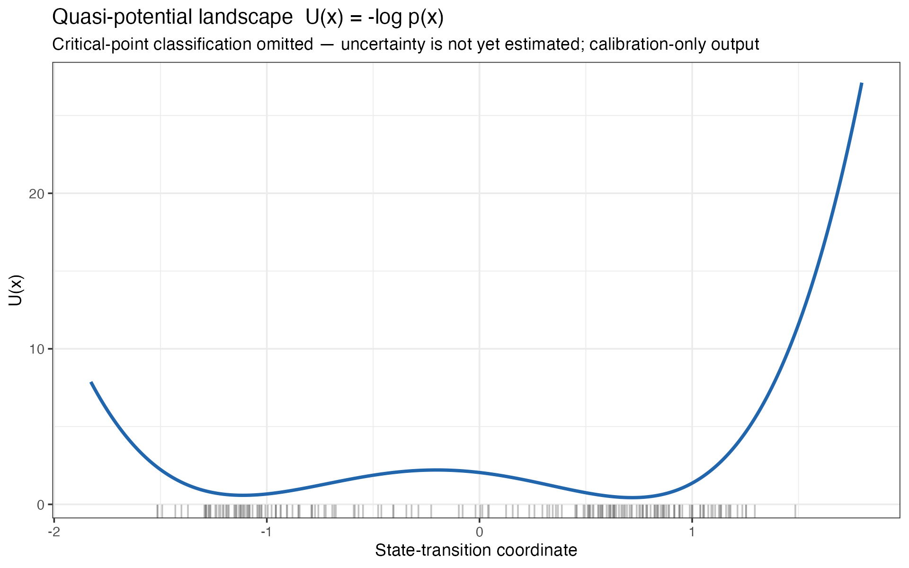

AN R PACKAGE IN DEVELOPMENT

# landscapeR

## Mapping biological state transitions from molecular data

<em>Pogona</em> sex development as one example

Denis O'Meally City of Hope 22 July 2026

---

# Biological state transitions arise from different study designs

●──┬──● &nbsp;&nbsp;&nbsp;&nbsp;└──●
<h2><em>Pogona</em></h2><strong>Developmental divergence</strong>
Independent embryos sampled across observed developmental time
<small>Shared early state, later sex-associated states</small>

●&nbsp;&nbsp;●&nbsp;&nbsp;● │&nbsp;&nbsp;│&nbsp;&nbsp;│ ●&nbsp;&nbsp;●&nbsp;&nbsp;●
<h2>AML</h2><strong>Disease progression</strong>
Repeated measurements within mice across time
<small>Subject-aware disease trajectories</small>

● ── ● ── ●
<h2>Type 1 diabetes</h2><strong>Ordered clinical states</strong>
Independent donors sampled across predeclared states
<small>Cross-sectional progression structure</small>

The sampling unit and the meaning of time determine what the analysis can support.

---

CONCEPTUAL, NOT FITTED DATA
# Molecular measurements define a state space

<b>1</b>
Each sample contains thousands of molecular measurements.

The decomposition learns a small number of coordinates without using sex or stage labels to fit the axes.

<StateSpaceBuild :stage="1" />

---

CONCEPTUAL, NOT FITTED DATA
# Sample density defines a descriptive quasi-potential

<b>2</b>
U(x) = -log p(x)

Frequently observed states form wells.

Sparsely occupied regions form higher terrain.

A descriptive landscape of sample occupancy, not physical energy.

<StateSpaceBuild :stage="2" />

Rockne et al. 2020, <em>Cancer Res.</em> &nbsp; Frankhouser et al. 2024, <em>Leukemia</em>

---

CONCEPTUAL, NOT FITTED DATA
# Developmental metadata helps interpret the state space

<b>3</b>
Observed stage provides developmental ordering.

Phenotypic sex helps interpret later divergence.

Temperature, genotype and other variables remain separate evidence.

Independent embryos show group-level structure, not tracked individual paths.

<StateSpaceBuild :stage="3" />

---

# Coordinates connect the landscape to genes and pathways

<strong>Biological coordinate</strong><small>stable and direction oriented</small>
<b>→</b>
▂▅█▄▆<strong>Gene loadings</strong><small>ranked contribution to the coordinate</small>
<b>→</b>
●╲●╱● &nbsp;&nbsp;●<strong>Pathways and modules</strong><small>enrichment and stage-specific expression</small>

<strong>Supports interpretation</strong>Which molecular programmes vary along the state direction?

<strong>Generates candidates</strong>Which genes and pathways merit closer study?

<strong>Does not establish causality</strong>Large loadings alone do not prove that a gene drives the transition.

Rockne et al. 2020, <em>Cancer Res.</em> &nbsp; Frankhouser et al. 2024, <em>Leukemia</em>

---

# Interpretation depends on design, stability and prior declarations

01<strong>Decompose</strong><small>Fit axes without outcome labels</small>
<i>→</i>
02<strong>Describe</strong><small>Show every candidate coordinate</small>
<i>→</i>
03<strong>Associate</strong><small>Use declared targets and nuisance fields</small>
<i>→</i>
04<strong>Resample</strong><small>Preserve biological sampling units</small>
<i>→</i>
05<strong>Confirm</strong><small>Human decision or explicit abstention</small>

No axis chosen because its p-value looks best

No unstable axis made convincing by rotation

No weaker model substituted after failure

---

# AI-assisted scientific development

<strong>Generation</strong>Designs, code, tests, alternatives
<b>→</b>
<strong>Evaluation</strong>Adversarial review, primary literature, synthetic truth
<b>→</b>
<strong>Acceptance</strong>Recorded decision, human ownership, visible limitations

<small>DECISION RECORD</small><strong>ADR 0020</strong>Statistical strategy accepted provisionally

<small>EXECUTABLE EVIDENCE</small><strong>565 tests passed</strong>0 failures, 0 warnings

<small>REVIEW SURFACE</small><strong>PR #77</strong>Research, rationale and landing proof together

AI output is working material. Scientific support comes from evidence and explicit decisions.

---

# Current landscapeR scope

IMPLEMENTED SYNTHETIC OUTPUT

<i class="done"></i><strong>Working now</strong>
K=1 decomposition, provenance, projection, descriptive component views and synthetic controls

<i class="next"></i><strong>Being built next</strong>
Metadata association, reproducible component proposals, stability and human confirmation

<i class="later"></i><strong>Later Pogona capability</strong>
Validated two-dimensional bifurcation topology and comparison across temperature regimes

github.com/drejom/landscapeR

